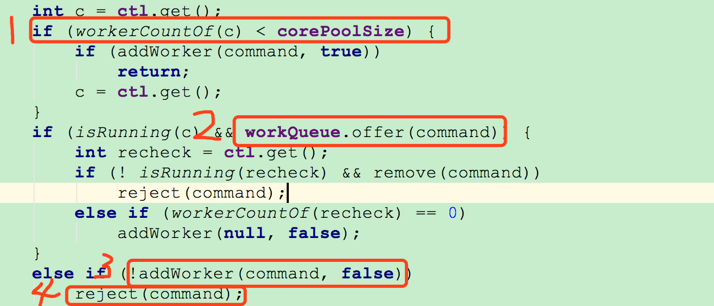

# 线程池的工作原理与源码解读[转]

随着cpu核数越来越多，不可避免的利用多线程技术以充分利用其计算能力。所以，多线程技术是服务端开发人员必须掌握的技术。

 

线程的创建和销毁，都涉及到系统调用，比较消耗系统资源，所以就引入了线程池技术，避免频繁的线程创建和销毁。

 

在Java用有一个Executors工具类，可以为我们创建一个线程池，其本质就是new了一个ThreadPoolExecutor对象。线程池几乎也是面试必考问题。本节结合源代码，说说ThreadExecutor的工作原理

 

**一、线程池创建**

先看一下ThreadPoolExecutor参数最全的构造方法：

①corePoolSize：线程池的核心线程数，说白了就是，即便是线程池里没有任何任务，也会有corePoolSize个线程在候着等任务。

②maximumPoolSize:最大线程数，不管你提交多少任务，线程池里最多工作线程数就是maximumPoolSize。

③keepAliveTime:线程的存活时间。当线程池里的线程数大于corePoolSize时，如果等了keepAliveTime时长还没有任务可执行，则线程退出。

⑤unit：这个用来指定keepAliveTime的单位，比如秒:TimeUnit.SECONDS。

⑥workQueue：一个阻塞队列，提交的任务将会被放到这个队列里。

⑦threadFactory：线程工厂，用来创建线程，主要是为了给线程起名字，默认工厂的线程名字：pool-1-thread-3。

⑧handler：拒绝策略，当线程池里线程被耗尽，且队列也满了的时候会调用。

以上就是创建线程池时用到的参数，面试中经常会有面试官问道这个问题。

 

**二、线程池执行流程**

这里用一个图来说明线程池的执行流程

任务被提交到线程池，会先判断当前线程数量是否小于corePoolSize，如果小于则创建线程来执行提交的任务，否则将任务放入workQueue队列，如果workQueue满了，则判断当前线程数量是否小于maximumPoolSize,如果小于则创建线程执行任务，否则就会调用handler，以表示线程池拒绝接收任务。

 

这里以jdk1.8.0_111的源代码为例，看一下具体实现。

**1、先看一下线程池的executor方法**

①：判断当前活跃线程数是否小于corePoolSize,如果小于，则调用addWorker创建线程执行任务

②：如果不小于corePoolSize，则将任务添加到workQueue队列。

③：如果放入workQueue失败，则创建线程执行任务，如果这时创建线程失败(当前线程数不小于maximumPoolSize时)，就会调用reject(内部调用handler)拒绝接受任务。

 

**2、再看下addWorker的方法实现**

这块代码是在创建非核心线程时，即core等于false。判断当前线程数是否大于等于maximumPoolSize，如果大于等于则返回false，即上边说到的③中创建线程失败的情况。

 

addWorker方法的下半部分：

①创建Worker对象，同时也会实例化一个Thread对象。

②启动启动这个线程

 

**3、再到Worker里看看其实现**

可以看到在创建Worker时会调用threadFactory来创建一个线程。上边的②中启动一个线程就会触发Worker的run方法被线程调用。

 

**4、接下来咱们看看runWorker方法的逻辑**

线程调用runWoker，会while循环调用getTask方法从workerQueue里读取任务，然后执行任务。只要getTask方法不返回null,此线程就不会退出。

 

**5、最后在看看getTask方法实现**

①咱们先不管allowCoreThreadTimeOut，这个变量默认值是false。wc>corePoolSize则是判断当前线程数是否大于corePoolSize。

②如果当前线程数大于corePoolSize，则会调用workQueue的poll方法获取任务，超时时间是keepAliveTime。如果超过keepAliveTime时长，poll返回了null，上边提到的while循序就会退出，线程也就执行完了。

如果当前线程数小于corePoolSize，则会调用workQueue的take方法阻塞在当前。