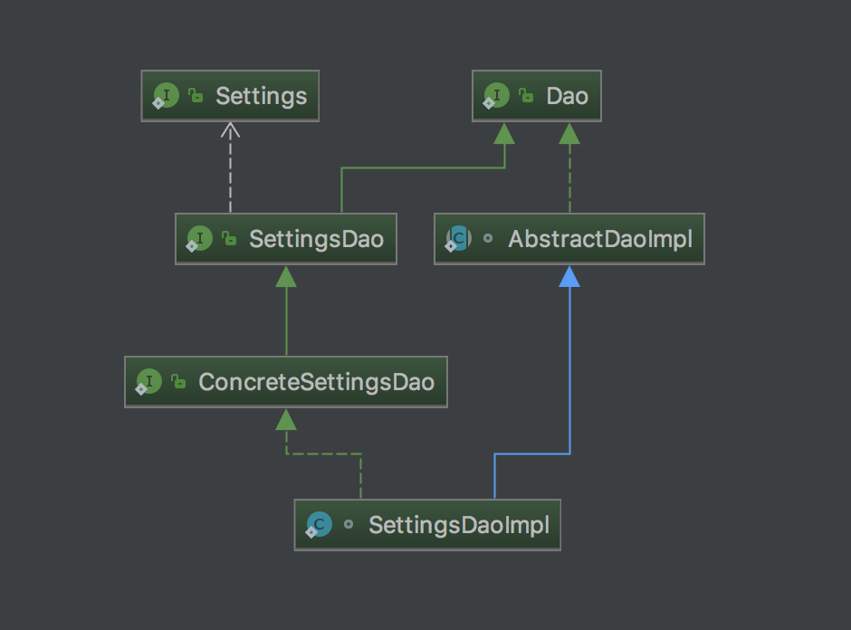

# Bridge方法解析工具——BridgeMethodResolver

## 背景介绍
在看spring-mvc的源码的时候，看到在解析handler方法时，有关于获取桥接方法代码，不明白什么是桥接方法，经过查找资料，终于理解了什么是桥接方法。

### 什么是桥接方法

桥接方法是 JDK 1.5 引入泛型后，为了使Java的泛型方法生成的字节码和 1.5 版本前的字节码相兼容，由编译器自动生成的方法。

我们可以通过 `Method.isBridge()` 方法来判断一个方法是否是桥接方法，在字节码中桥接方法会被标记为 **ACC_BRIDGE**和**ACC_SYNTHETIC**，其中**ACC_BRIDGE** 用于说明这个方法是由编译生成的桥接方法，**ACC_SYNTHETIC** 说明这个方法是由编译器生成，并且不会在源代码中出现。可以查看jvm规范中对这两个access_flag的解释 http://docs.oracle.com/javase/specs/jvms/se7/html/jvms-4.html#jvms-4.6。

有如下3个问题：
* 什么时候会生成桥接方法
* 为什么要生成桥接方法
* 如何通过桥接方法获取实际的方法

### 什么时候会生成桥接方法

那什么时候编译器会生成桥接方法呢？可以查看JLS中的描述 http://docs.oracle.com/javase/specs/jls/se7/html/jls-15.html#jls-15.12.4.5。

就是说一个子类在继承（或实现）一个父类（或接口）的泛型方法时，在子类中明确指定了泛型类型，那么在编译时编译器会自动生成桥接方法（当然还有其他情况会生成桥接方法，这里只是列举了其中一种情况）。如下所示：

```java
package com.mikan;
 
/**
 * @author Mikan
 * @date 2015-08-05 16:22
 */
public interface SuperClass<T> {
 
    T method(T param);
 
}
 
package com.mikan;
 
/**
 * @author Mikan
 * @date 2015-08-05 17:05
 */
public class SubClass implements SuperClass<String> {
    public String method(String param) {
        return param;
    }
}
```

来看一下SubClass的字节码：

```bash
localhost:mikan mikan$ javap -c SubClass.class
Compiled from "SubClass.java"
public class com.mikan.SubClass implements com.mikan.SuperClass<java.lang.String> {
  public com.mikan.SubClass();
    flags: ACC_PUBLIC
    Code:
      stack=1, locals=1, args_size=1
         0: aload_0
         1: invokespecial #1                  // Method java/lang/Object."<init>":()V
         4: return
      LineNumberTable:
        line 7: 0
      LocalVariableTable:
        Start  Length  Slot  Name   Signature
               0       5     0  this   Lcom/mikan/SubClass;

  public java.lang.String method(java.lang.String);
    flags: ACC_PUBLIC
    Code:
      stack=1, locals=2, args_size=2
         0: aload_1
         1: areturn
      LineNumberTable:
        line 11: 0
      LocalVariableTable:
        Start  Length  Slot  Name   Signature
               0       2     0  this   Lcom/mikan/SubClass;
               0       2     1 param   Ljava/lang/String;

  public java.lang.Object method(java.lang.Object);
    flags: ACC_PUBLIC, ACC_BRIDGE, ACC_SYNTHETIC
    Code:
      stack=2, locals=2, args_size=2
         0: aload_0
         1: aload_1
         2: checkcast     #2                  // class java/lang/String
         5: invokevirtual #3                  // Method method:(Ljava/lang/String;)Ljava/lang/String;
         8: areturn
      LineNumberTable:
        line 7: 0
      LocalVariableTable:
        Start  Length  Slot  Name   Signature
               0       9     0  this   Lcom/mikan/SubClass;
               0       9     1    x0   Ljava/lang/Object;
}
localhost:mikan mikan$
```

SubClass只声明了一个方法，而从字节码可以看到有三个方法，第一个是无参的构造方法（代码中虽然没有明确声明，但是编译器会自动生成），第二个是我们实现的接口中的方法，第三个就是编译器自动生成的桥接方法。可以看到flags包括了**ACC_BRIDGE**和**ACC_SYNTHETIC**，表示是编译器自动生成的方法，参数类型和返回值类型都是Object。再看这个方法的字节码，它把Object类型的参数强制转换成了String类型，再调用在SubClass类中声明的方法，转换过来其实就是：
```java
    public Object method(Object param) {
        return this.method(((String) param));
    }
```
也就是说，桥接方法实际是是调用了实际的泛型方法，来看看下面的测试代码：

```java
package com.mikan;
 
/**
 * @author Mikan
 * @date 2015-08-07 16:33
 */
public class BridgeMethodTest {
 
    public static void main(String[] args) throws Exception {
        SuperClass superClass = new SubClass();
        System.out.println(superClass.method("abc123"));// 调用的是实际的方法
        System.out.println(superClass.method(new Object()));// 调用的是桥接方法
    }
 
}
```

这里声明了SuperClass类型的变量指向SubClass类型的实例，典型的多态。在声明SuperClass类型的变量时，不指定泛型类型，那么在方法调用时就可以传任何类型的参数，因为SuperClass中的方法参数实际上是Object类型，而且编译器也不能发现错误。在运行时当参数类型不是SubClass声明的类型时，会抛出类型转换异常，因为这时调用的是桥接方法，而在桥接方法中会进行强制类型转换，所以才会抛出类型转换异常。上面的代码输出结果如下：
```java
abc123
Exception in thread "main" java.lang.ClassCastException: java.lang.Object cannot be cast to java.lang.String
	at com.mikan.SubClass.method(SubClass.java:7)
	at com.mikan.BridgeMethodTest.main(BridgeMethodTest.java:27)
	at sun.reflect.NativeMethodAccessorImpl.invoke0(Native Method)
	at sun.reflect.NativeMethodAccessorImpl.invoke(NativeMethodAccessorImpl.java:57)
	at sun.reflect.DelegatingMethodAccessorImpl.invoke(DelegatingMethodAccessorImpl.java:43)
	at java.lang.reflect.Method.invoke(Method.java:606)
	at com.intellij.rt.execution.application.AppMain.main(AppMain.java:140)
```

如果我们在声明SuperClass类型的变量就指定了泛型类型：
```java
SuperClass<String> superClass = new SubClass();
```
当然这里类型只能是String，因为SubClass的泛型类型声明是String类型的，如果指定其他类型，那么在编译时就会错误，这样就把类型检查从运行时提前到了编译时。这就是泛型的好处。

### 为什么要生成桥接方法

上面看到了编译器在什么时候会生成桥接方法，那为什么要生成桥接方法呢？

在java1.5以前，比如声明一个集合类型：
```java
List list = new ArrayList();
```
那么往list中可以添加任何类型的对象，但是在从集合中获取对象时，无法确定获取到的对象是什么具体的类型，所以在1.5的时候引入了泛型，在声明集合的时候就指定集合中存放的是什么类型的对象：
```java
List<String> list = new ArrayList<String>();
```
那么在获取时就不必担心类型的问题，因为泛型在编译时编译器会检查往集合中添加的对象的类型是否匹配泛型类型，如果不正确会在编译时就会发现错误，而不必等到运行时才发现错误。因为泛型是在1.5引入的，为了向前兼容，所以会在编译时去掉泛型（泛型擦除），但是我们还是可以通过反射API来获取泛型的信息，在编译时可以通过泛型来保证类型的正确性，而不必等到运行时才发现类型不正确。由于java泛型的擦除特性，如果不生成桥接方法，那么与1.5之前的字节码就不兼容了。如前面的SuperClass中的方法，实际在编译后的字节码如下：
```bash
localhost:mikan mikan$ javap -c -v SuperClass.class
Classfile /Users/mikan/Documents/workspace/project/algorithm/target/classes/com/mikan/SuperClass.class
  Last modified 2015-8-7; size 251 bytes
  MD5 checksum 2e2530041f1f83aaf416a2ca3af9b7e3
  Compiled from "SuperClass.java"
public interface com.mikan.SuperClass<T extends java.lang.Object>
  Signature: #7                           // <T:Ljava/lang/Object;>Ljava/lang/Object;
  SourceFile: "SuperClass.java"
  minor version: 0
  major version: 51
  flags: ACC_PUBLIC, ACC_INTERFACE, ACC_ABSTRACT
Constant pool:
   #1 = Class              #10            //  com/mikan/SuperClass
   #2 = Class              #11            //  java/lang/Object
   #3 = Utf8               method
   #4 = Utf8               (Ljava/lang/Object;)Ljava/lang/Object;
   #5 = Utf8               Signature
   #6 = Utf8               (TT;)TT;
   #7 = Utf8               <T:Ljava/lang/Object;>Ljava/lang/Object;
   #8 = Utf8               SourceFile
   #9 = Utf8               SuperClass.java
  #10 = Utf8               com/mikan/SuperClass
  #11 = Utf8               java/lang/Object
{
  public abstract T method(T);
    flags: ACC_PUBLIC, ACC_ABSTRACT
    Signature: #6                           // (TT;)TT;
}
localhost:mikan mikan$
```
通过Signature: #7   // <T:Ljava/lang/Object;>Ljava/lang/Object;可以看到，在编译完成后泛型实际上就成了Object了，所以方法实际上成了
```java
public abstract Object method(Object param);
```
而SubClass实现了SuperClass这个接口，如果不生成桥接方法，那么SubClass就没有实现接口中声明的方法，语义就不正确了，所以编译器才会自动生成桥接方法，来保证兼容性。
如何通过桥接方法获取实际的方法

我们在通过反射进行方法调用时，如果获取到桥接方法对应的实际的方法呢？可以查看spring中 `org.springframework.core.BridgeMethodResolver` 类的源码。实际上是通过判断方法名、参数的个数以及泛型类型参数来获取的。


## `org.springframework.core.BridgeMethodResolver` 方法说明
`org.springframework.core.BridgeMethodResolver` 是一个工具方法，不提供实例化方法。只提供静态方法来调用。解析**桥接方法**对应的实际方法。

### <span id="findBridgedMethod">org.springframework.core.BridgeMethodResolver#findBridgedMethod(..)</span>
入参：
* bridgeMethod: `java.lang.reflect.Method`，桥接的方法。
出参：
* 返回入参 **bridgeMethod** 桥接方法对应的实际方法，如果找不到更具体的方法，则直接返回其原始方法。

### <span id="isBridgeMethodFor">org.springframework.core.BridgeMethodResolver#isBridgeMethodFor(..)</span>
判断 **bridgeMethod** 桥接方法，是不是 **candidateMethod** 候选方法的桥方法。即原始泛型方法。
入参：
* bridgeMethod: `java.lang.reflect.Method`，桥接的方法。
* candidateMethod: `java.lang.reflect.Method`，候选方法。
* declaringClass: `java.lang.Class`，申明的 class 类。
**bridgeMethod** 从 class 中提取，包含了 class、interface、superClass 等信息，`java.lang.Class#getDeclaredMethod` 方法调用时，会根据其方法所在 class 类声明，根据方法名和参数列表，匹配出合适的方法。

`org.springframework.core.BridgeMethodResolverTests#testFindBridgedMethodFromParent`
```java
	@Test
	public void testFindBridgedMethodFromParent() throws Exception {
    // public java.lang.String org.springframework.core.BridgeMethodResolverTests$SettingsDaoImpl.loadFromParent()
		Method loadFromParentBridge = SettingsDaoImpl.class.getMethod("loadFromParent");
		assertTrue(loadFromParentBridge.isBridge());

    // public java.lang.Object org.springframework.core.BridgeMethodResolverTests$AbstractDaoImpl.loadFromParent()
		Method loadFromParent = AbstractDaoImpl.class.getMethod("loadFromParent");
		assertFalse(loadFromParent.isBridge());

		assertEquals(loadFromParent, BridgeMethodResolver.findBridgedMethod(loadFromParentBridge));
	}

	static class SettingsDaoImpl extends AbstractDaoImpl<ConcreteSettings, String>
			implements ConcreteSettingsDao {

		protected SettingsDaoImpl(ConcreteSettings object) {
			super(object, "From Parent");
		}

		// @Transactional(readOnly = true)
		@Override
		public ConcreteSettings load() {
			return super.object;
		}
	}

	static abstract class AbstractDaoImpl<T, S> implements Dao<T, S> {

		protected T object;

		protected S otherObject;

		protected AbstractDaoImpl(T object, S otherObject) {
			this.object = object;
			this.otherObject = otherObject;
		}

		// @Transactional(readOnly = true)
		@Override
		public S loadFromParent() {
			return otherObject;
		}
	}

  public interface ConcreteSettingsDao extends SettingsDao<ConcreteSettings, String> {

		@Override
		String loadFromParent();
	}

	public interface SettingsDao<T extends Settings, S> extends Dao<T, S> {

		@Override
		T load();
	}

	public interface Dao<T, S> {

		T load();

		S loadFromParent();
	}
```

**SettingsDaoImpl** 类的继承关系如下图所示:
