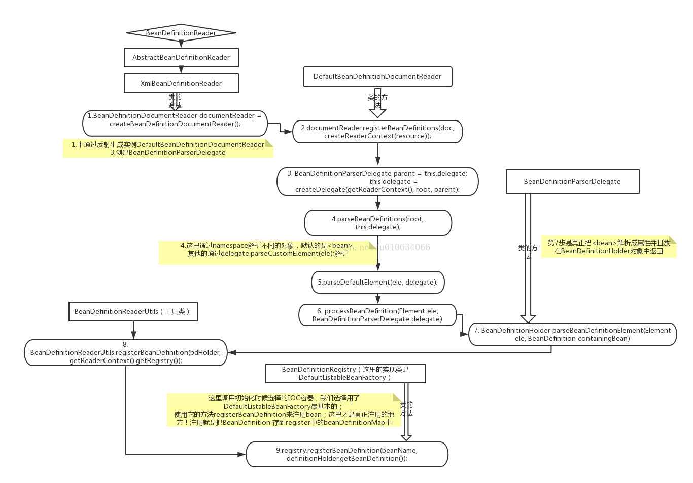
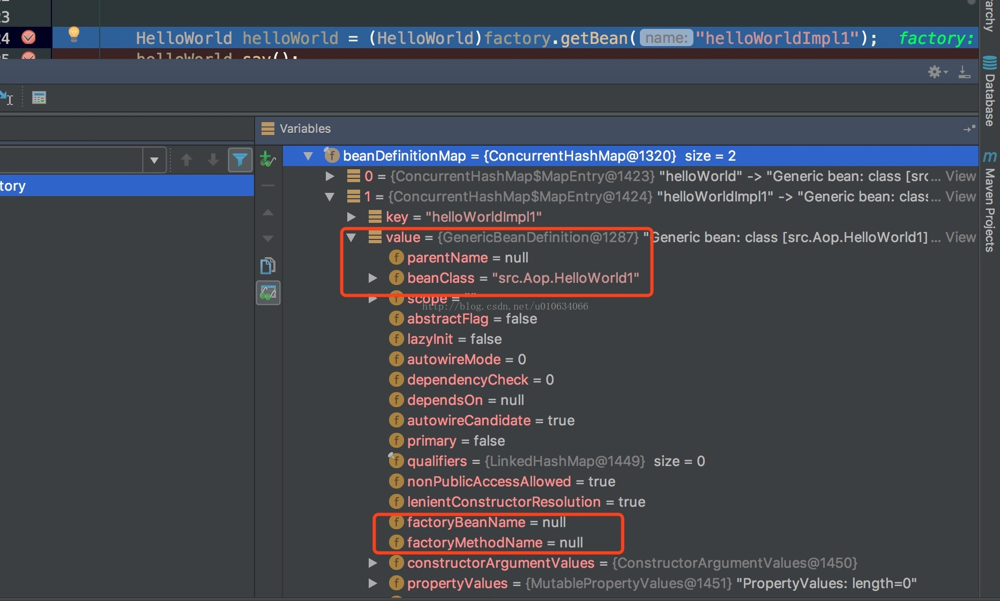

# (转)spring源码分析(一)IOC管理Bean

通过最简单的IOC 容器来跟踪一下 IOC是怎么管理Bean的；Spring IoC容器对Bean定义资源文件的定位，载入、解析和依赖注入的分析

方法调用图：不知道用什么画比较好，凑合看吧 ，长方形是类，椭圆是执行方法，箭头 方法调用顺序



## IOC加载、解析、注册
### A. 使用简单IOC容器
```java
//初始化path 和classLoader,没有传自定义加载器则给默认加载器       
 ClassPathResource resource = new ClassPathResource("SpringContextConfig.xml");
        DefaultListableBeanFactory factory = new DefaultListableBeanFactory();
        XmlBeanDefinitionReader reader = new XmlBeanDefinitionReader(factory);
        reader.loadBeanDefinitions(resource);
        HelloWorld helloWorld = (HelloWorld)factory.getBean("helloWorldImpl1");
        helloWorld.say();
```
第4行构造器 调用了它的父类抽象类AbstractBeanDefinitionReader的构造方法，初始化化了父类的registry(就是factory)、和Environment并且根据类型选择ResourceLoader资源加载器


### B.第5行loadBeanDefinitions(Resource resource)  
```java
public int loadBeanDefinitions(EncodedResource encodedResource) throws BeanDefinitionStoreException {
		
		//取当前正在被加载的所有资源final ThreadLocal<Set<EncodedResource>> resourcesCurrentlyBeingLoaded 
		Set<EncodedResource> currentResources = this.resourcesCurrentlyBeingLoaded.get();
		if (currentResources == null) {
			currentResources = new HashSet<EncodedResource>(4);
			//set进去值，表示当前正在加载
			this.resourcesCurrentlyBeingLoaded.set(currentResources);
		}
		//将当前要被加载的 Resource 放到当前的 Resources中
		if (!currentResources.add(encodedResource)) {
			throw new BeanDefinitionStoreException(
					"Detected cyclic loading of " + encodedResource + " - check your import definitions!");
		}
		try {
			InputStream inputStream = encodedResource.getResource().getInputStream();
			try {
				InputSource inputSource = new InputSource(inputStream);
				if (encodedResource.getEncoding() != null) {
					inputSource.setEncoding(encodedResource.getEncoding());
				}
				//这里是加载xml文件并且解析的方法
				return doLoadBeanDefinitions(inputSource, encodedResource.getResource());
			}
			finally {
				inputStream.close();
			}
		}
		catch (IOException ex) {
			throw new BeanDefinitionStoreException(
					"IOException parsing XML document from " + encodedResource.getResource(), ex);
		}
		finally {
			//load完成 从中remove中，spring中 很多类似这样的形式代码
			currentResources.remove(encodedResource);
			if (currentResources.isEmpty()) {
				this.resourcesCurrentlyBeingLoaded.remove();
			}
		}
	}
```

### C.继续进入doLoadBeanDefinitions 看XmlBeanDefinitionReader.doLoadBeanDefinitions(InputSource,Resource)
```java
try {
		//验证xml文件并且返回Document	
		Document doc = doLoadDocument(inputSource, resource);
		//下面  注册bean  并且返回注册成功的数量 来 我们进去看一下
			return registerBeanDefinitions(doc, resource);
		}


D.进去 XmlBeanDefinitionReader.registerBeanDefinitions(Document doc, Resource resource) ：注册并且返回注册成功数量
public int registerBeanDefinitions(Document doc, Resource resource) throws BeanDefinitionStoreException {
		//1.创建一个document阅读器,通过反射得到的实例
		BeanDefinitionDocumentReader documentReader = createBeanDefinitionDocumentReader();
		//得到register值是A.中第4行的new XmlBeanDefinitionReader(factory)中的factory；也就是DefaultListableBeanFactory
		//2.....
		int countBefore = getRegistry().getBeanDefinitionCount();
		//3.....
		documentReader.registerBeanDefinitions(doc, createReaderContext(resource));
		return getRegistry().getBeanDefinitionCount() - countBefore;
	}
```

#### D.1说明：这里创建哪个BeanDefinitionDocumentReader是根据XmlBeanDefinitionReader中的一个参数来决定的，但是spring中也只有下面的实现了BeanDefinitionDocumentReader接口
```java
private Class<?> documentReaderClass = DefaultBeanDefinitionDocumentReader.class;
```

#### D.中2 解释：得到register值是A.中第4行的new XmlBeanDefinitionReader(factory)中的factory；也就是DefaultListableBeanFactory，factory中有个hashmap专门存放注册后的bean
```java
/** Map of bean definition objects, keyed by bean name */
	private final Map<String, BeanDefinition> beanDefinitionMap = new ConcurrentHashMap<String, BeanDefinition>(256);
```

### E..  D.3 中 调用的最终是DefaultBeanDefinitionDocumentReader中parseBeanDefinitions(Element,BeanDefinitionParserDelegate);看看里面的代码
```java
protected void parseBeanDefinitions(Element root, BeanDefinitionParserDelegate delegate) {
		// 1..判断root的NamespaceURI是不是默认的命名空间URI=http://www.springframework.org/schema/beans
		if (delegate.isDefaultNamespace(root)) {
			NodeList nl = root.getChildNodes();
			for (int i = 0; i < nl.getLength(); i++) {
				Node node = nl.item(i);
				if (node instanceof Element) {
					Element ele = (Element) node;
					if (delegate.isDefaultNamespace(ele)) {
					//2..... 当以<bean id=""..>标签会执行这个
						parseDefaultElement(ele, delegate);
					}
					else {//3......其他的会执行这个  这个另外分析TODO
						delegate.parseCustomElement(ele);
					}
				}
			}
		}
		else {
			delegate.parseCustomElement(root);
		}
	}
```

#### E.2 是解析 <bean 格式的方法
#### E.3是除了<bean 格式的方法  ，Aop标签就是在这里面加载解析的


### F. DefaultBeanDefinitionDocumentReader.parseDefaultElement
我们主要进入E.2 中的代码看看DefaultBeanDefinitionDocumentReader.parseDefaultElement(Element,BeanDefinitionParserDelegate)

根据标签的不同选择不同的解析注册方法 bean、import、alias、beans
```java
private void parseDefaultElement(Element ele, BeanDefinitionParserDelegate delegate) {
		if (delegate.nodeNameEquals(ele, IMPORT_ELEMENT)) {
			importBeanDefinitionResource(ele);
		}
		else if (delegate.nodeNameEquals(ele, ALIAS_ELEMENT)) {
			processAliasRegistration(ele);
		}
		else if (delegate.nodeNameEquals(ele, BEAN_ELEMENT)) {
			//1........bean     
			processBeanDefinition(ele, delegate);
		}
		else if (delegate.nodeNameEquals(ele, NESTED_BEANS_ELEMENT)) {
			// recurse
			doRegisterBeanDefinitions(ele);
		}
	}
```

### G... 进入F.1 看DefaultBeanDefinitionDocumentReader.processBeanDefinition(Element ele, BeanDefinitionParserDelegate delegate)
```java
protected void processBeanDefinition(Element ele, BeanDefinitionParserDelegate delegate) {
		//1.....
		BeanDefinitionHolder bdHolder = delegate.parseBeanDefinitionElement(ele);
		if (bdHolder != null) {
//2........... 下面这行我在下篇博文来单独讲 ，暂时不去看它  TODO...
			bdHolder = delegate.decorateBeanDefinitionIfRequired(ele, bdHolder);
			try {
				//3...... Register the final decorated instance.
				BeanDefinitionReaderUtils.registerBeanDefinition(bdHolder, getReaderContext().getRegistry());
			}
			catch (BeanDefinitionStoreException ex) {
				getReaderContext().error("Failed to register bean definition with name '" +
						bdHolder.getBeanName() + "'", ele, ex);
			}
			// 4....Send registration event.发送注册事件  这里不在本篇分析中 ，另外分析 TODO
			getReaderContext().fireComponentRegistered(new BeanComponentDefinition(bdHolder));
		}
	}
```

#### G.1 说明：代码我就不进去看了，大概里面做了下面这些事情:
1. 得到Element 中的 id 和 name属性，也就是 <bean id="" name="" ..>

2. 如果有name属性有值，则将值按照字符串 " ,;"分割成数组放到aliases list中  List<String> aliases = new ArrayList<String>()

3. 如果id没有值&&aliases有值，则把beanName = aliases.remove(0); 

4. 检查id值的唯一性

5. 取 class 、parent、去AbstractBeanDefinition createBeanDefinition(
String parentName, String className, ClassLoader classLoader) 返回一个设置了parentName、be an ClassName、 beanClass值的AbstractBeanDefinition对象 他的实际类型是它的实现类GenericBeanDefinition（ioc容器在未实例化之前保存的对象就是这个），然后这个对象当作参数传到parseBeanDefinitionAttributes() 中，这个方法才是真正的将Element元素解析成bean对象属性的方法

//AbstractBeanDefinition  extends BeanMetadataAttributeAccessorimplements BeanDefinition, Cloneable 这部分需要单独来讲TODO；
```java
public static AbstractBeanDefinition createBeanDefinition(
			String parentName, String className, ClassLoader classLoader) throws ClassNotFoundException {

		GenericBeanDefinition bd = new GenericBeanDefinition();
		bd.setParentName(parentName);
		if (className != null) {
			if (classLoader != null) {
				bd.setBeanClass(ClassUtils.forName(className, classLoader));
			}
			else {
				bd.setBeanClassName(className);
			}
		}
		return bd;
	}
```

6. 然后再查其他属性，什么abstract、lazy-init等等所有<bean ....>的属性 设置到第5步传进来的GenericBeanDefinition对象属性中

7. 下面的代码就是  5.6步做的事情
```java
AbstractBeanDefinition bd = createBeanDefinition(className, parent);
//解析<bean ...> 里面的属性
			parseBeanDefinitionAttributes(ele, beanName, containingBean, bd);
```

8. 接下来解析的是 <lookup,meta,property 等等  这里省略，我们只要知道 他们的解析操作在BeanDefinitionParserDelegate.parseBeanDefinitionElement()的方法中，并且返回的是第5步生成的对象GenericBeanDefinition，所有解析出来的属性都放在这个对象中GenericBeanDefinition
```xml
<bean id="helloWorld" class="src.HelloWorld"  >
        <lookup-method></lookup-method>
        <replaced-method></replaced-method>
        <meta key="" value=""></meta>
        <property name=""></property>
        <constructor-arg></constructor-arg>
        <property name="name" value="shirenchuang" ></property>
    </bean>
```
9. 如果id 和 name 都没有设置， spring会自动生成一个beanname
10. 所有的准备数据都拿到了，beanname、aliases、GenericBeanDefinition、把它们当成参数生成一个 BeanDefinitionHolder，就是G.1 中的那个holder
```java
	public BeanDefinitionHolder(BeanDefinition beanDefinition, String beanName, String[] aliases) {
		Assert.notNull(beanDefinition, "BeanDefinition must not be null");
		Assert.notNull(beanName, "Bean name must not be null");
		this.beanDefinition = beanDefinition;
		this.beanName = beanName;
		this.aliases = aliases;
	}
```

自此 基本的解析工作已经完成了，我们来看看最好是怎么注册的；代码回到G.3  BeanDefinitionReaderUtils这个类有几个方法
1. AbstractBeanDefinition createBeanDefinition(
String parentName, String className, ClassLoader classLoader) 这个方法在 G.1 第5步调用了，生成了解析后的AbstractBeanDefinition对象

2. public static String generateBeanName(BeanDefinition beanDefinition, BeanDefinitionRegistry registry)这个方法在G.1 第9步骤

3. public static void registerBeanDefinition(
BeanDefinitionHolder definitionHolder, BeanDefinitionRegistry registry)这个方法就是G.3中调用的方法，方法中的参数registry 就是刚开始时候的DefaultListableBeanFactory，因为它是继承了BeanDefinitionRegistry的；我们进去看看

### H.... registerBeanDefinition(
BeanDefinitionHolder definitionHolder, BeanDefinitionRegistry registry)
```java
public static void registerBeanDefinition(
			BeanDefinitionHolder definitionHolder, BeanDefinitionRegistry registry)
			throws BeanDefinitionStoreException {

	// 1.Register bean definition under primary name. 这个name一般是id，没有id就是第一个别名，如果也没有别名，就是spring自动生成的
		String beanName = definitionHolder.getBeanName();
//2....正在注册的地方，一个beanName对应一个BeanDefinition 
		registry.registerBeanDefinition(beanName, definitionHolder.getBeanDefinition());

		// Register aliases for bean name, if any.
		String[] aliases = definitionHolder.getAliases();
		if (aliases != null) {
			for (String alias : aliases) {
				registry.registerAlias(beanName, alias);
			}
		}
	}
```

#### H...2 中的方法其实是DefaultListableBeanFactory实现了BeanDefinitionRegistry接口中的 registerBeanDefinition；不同的register有自己不同的实现，这里我们一开始用的就是DefaultListableBeanFactory作为register；这个方法最终做了以下操作；把beanName，和beanDefinition (这个是G.1 的第五步的GenericBeanDefinition)存放到 ConcurrentHashMap中；
```java
	// Still in startup registration phase
				this.beanDefinitionMap.put(beanName, beanDefinition);
				this.beanDefinitionNames.add(beanName);
				this.manualSingletonNames.remove(beanName);

至此，<bean 的解析和加载工作已经完成（但是还没有初始化，除非设置了lazy-init = true）...  那怎么使用这些bean呢  A. 中 HelloWorld helloWorld = (HelloWorld)factory.getBean("helloWorldImpl1");
```
我们来分析一下 getBean()；


我们在factory里面拿到的beanDefinitionMap并不是我们需要的实例对象；那我们对象在哪里呢？ 实际上这个时候还没有实例化bean对象；实例化的操作都在getBean()里面，

这个方法也很复杂，我不去单独分析了，但是推荐去这里看它的分析，http://www.cnblogs.com/ITtangtang/p/3978349.html ，找到getBean()方法看


## IOC容器的依赖注入
### 1.依赖注入发生的时间
(1).用户第一次通过getBean方法向IoC容索要Bean时，IoC容器触发依赖注入。
(2).当用户在Bean定义资源中为<Bean>元素配置了lazy-init属性，即让容器在解析注册Bean定义时进行预实例化，触发依赖注入。

BeanFactory接口定义了Spring IoC容器的基本功能规范，在BeanFactory中我们看到getBean（String…）函数，它的具体实现在AbstractBeanFactory中

### 2.AbstractBeanFactory通过getBean向IoC容器获取被管理的Bean（源码略）
通过上面对向IoC容器获取Bean方法的分析，我们可以看到在Spring中，如果Bean定义的单态模式(Singleton)，则容器在创建之前先从缓存中查找，以确保整个容器中只存在一个实例对象。如果Bean定义的是原型模式(Prototype)，则容器每次都会创建一个新的实例对象。除此之外，Bean定义还可以扩展为指定其生命周期范围。
上面的源码只是定义了根据Bean定义的模式，采取的不同创建Bean实例对象的策略，具体的Bean实例对象的创建过程由实现了ObejctFactory接口的匿名内部类的createBean方法完成，ObejctFactory使用委派模式，具体的Bean实例创建过程交由其实现类AbstractAutowireCapableBeanFactory完成，我们继续分析AbstractAutowireCapableBeanFactory的createBean方法的源码，理解其创建Bean实例的具体实现过程

### 3、AbstractAutowireCapableBeanFactory创建Bean实例对象：（源码略）
AbstractAutowireCapableBeanFactory类实现了ObejctFactory接口，创建容器指定的Bean实例对象，同时还对创建的Bean实例对象进行初始化处理通过对方法源码的分析，我们看到具体的依赖注入实现在以下两个方法中：

(1).createBeanInstance：生成Bean所包含的java对象实例。

(2).populateBean ：对Bean属性的依赖注入进行处理。

### 4、createBeanInstance方法创建Bean的java实例对象：
```java
在createBeanInstance方法中，根据指定的初始化策略，使用静态工厂、工厂方法或者容器的自动装配特性生成java实例对象，创建对象的源码如下：
//创建Bean的实例对象  
   protected BeanWrapper createBeanInstance(String beanName, RootBeanDefinition mbd, Object[] args) {  
       //检查确认Bean是可实例化的  
       Class beanClass = resolveBeanClass(mbd, beanName);  
       //使用工厂方法对Bean进行实例化  
       if (beanClass != null && !Modifier.isPublic(beanClass.getModifiers()) && !mbd.isNonPublicAccessAllowed()) {  
           throw new BeanCreationException(mbd.getResourceDescription(), beanName,  
                   "Bean class isn't public, and non-public access not allowed: " + beanClass.getName());  
       }  
       if (mbd.getFactoryMethodName() != null)  {  
           //调用工厂方法实例化  
           return instantiateUsingFactoryMethod(beanName, mbd, args);  
       }  
       //使用容器的自动装配方法进行实例化  
       boolean resolved = false;  
       boolean autowireNecessary = false;  
       if (args == null) {  
           synchronized (mbd.constructorArgumentLock) {  
               if (mbd.resolvedConstructorOrFactoryMethod != null) {  
                   resolved = true;  
                   autowireNecessary = mbd.constructorArgumentsResolved;  
               }  
           }  
       }  
       if (resolved) {  
           if (autowireNecessary) {  
               //配置了自动装配属性，使用容器的自动装配实例化  
               //容器的自动装配是根据参数类型匹配Bean的构造方法  
               return autowireConstructor(beanName, mbd, null, null);  
           }  
           else {  
               //使用默认的无参构造方法实例化  
               return instantiateBean(beanName, mbd);  
           }  
       }  
       //使用Bean的构造方法进行实例化  
       Constructor[] ctors = determineConstructorsFromBeanPostProcessors(beanClass, beanName);  
       if (ctors != null ||  
               mbd.getResolvedAutowireMode() == RootBeanDefinition.AUTOWIRE_CONSTRUCTOR ||  
               mbd.hasConstructorArgumentValues() || !ObjectUtils.isEmpty(args))  {  
           //使用容器的自动装配特性，调用匹配的构造方法实例化  
           return autowireConstructor(beanName, mbd, ctors, args);  
       }  
       //使用默认的无参构造方法实例化  
       return instantiateBean(beanName, mbd);  
   }   
   //使用默认的无参构造方法实例化Bean对象  
   protected BeanWrapper instantiateBean(final String beanName, final RootBeanDefinition mbd) {  
       try {  
           Object beanInstance;  
           final BeanFactory parent = this;  
           //获取系统的安全管理接口，JDK标准的安全管理API  
           if (System.getSecurityManager() != null) {  
               //这里是一个匿名内置类，根据实例化策略创建实例对象  
               beanInstance = AccessController.doPrivileged(new PrivilegedAction<Object>() {  
                   public Object run() {  
                       return getInstantiationStrategy().instantiate(mbd, beanName, parent);  
                   }  
               }, getAccessControlContext());  
           }  
           else {  
               //将实例化的对象封装起来  
               beanInstance = getInstantiationStrategy().instantiate(mbd, beanName, parent);  
           }  
           BeanWrapper bw = new BeanWrapperImpl(beanInstance);  
           initBeanWrapper(bw);  
           return bw;  
       }  
       catch (Throwable ex) {  
           throw new BeanCreationException(mbd.getResourceDescription(), beanName, "Instantiation of bean failed", ex);  
       }  
   }
```

经过对上面的代码分析，我们可以看出，对使用工厂方法和自动装配特性的Bean的实例化相当比较清楚，调用相应的工厂方法或者参数匹配的构造方法即可完成实例化对象的工作，但是对于我们最常使用的默认无参构造方法就需要使用相应的初始化策略(JDK的反射机制或者CGLIB)来进行初始化了，在方法getInstantiationStrategy().instantiate中就具体实现类使用初始策略实例化对象

### 5、SimpleInstantiationStrategy类使用默认的无参构造方法创建Bean实例化对象：
在使用默认的无参构造方法创建Bean的实例化对象时，方法getInstantiationStrategy().instantiate调用了SimpleInstantiationStrategy类中的实例化Bean的方法，其源码如下：
```java
//使用初始化策略实例化Bean对象  
   public Object instantiate(RootBeanDefinition beanDefinition, String beanName, BeanFactory owner) {  
       //如果Bean定义中没有方法覆盖，则就不需要CGLIB父类类的方法  
       if (beanDefinition.getMethodOverrides().isEmpty()) {  
           Constructor<?> constructorToUse;  
           synchronized (beanDefinition.constructorArgumentLock) {  
               //获取对象的构造方法或工厂方法  
               constructorToUse = (Constructor<?>) beanDefinition.resolvedConstructorOrFactoryMethod;  
               //如果没有构造方法且没有工厂方法  
               if (constructorToUse == null) {  
                   //使用JDK的反射机制，判断要实例化的Bean是否是接口  
                   final Class clazz = beanDefinition.getBeanClass();  
                   if (clazz.isInterface()) {  
                       throw new BeanInstantiationException(clazz, "Specified class is an interface");  
                   }  
                   try {  
                       if (System.getSecurityManager() != null) {  
                       //这里是一个匿名内置类，使用反射机制获取Bean的构造方法  
                           constructorToUse = AccessController.doPrivileged(new PrivilegedExceptionAction<Constructor>() {  
                               public Constructor run() throws Exception {  
                                   return clazz.getDeclaredConstructor((Class[]) null);  
                               }  
                           });  
                       }  
                       else {  
                           constructorToUse =  clazz.getDeclaredConstructor((Class[]) null);  
                       }  
                       beanDefinition.resolvedConstructorOrFactoryMethod = constructorToUse;  
                   }  
                   catch (Exception ex) {  
                       throw new BeanInstantiationException(clazz, "No default constructor found", ex);  
                   }  
               }  
           }  
           //使用BeanUtils实例化，通过反射机制调用”构造方法.newInstance(arg)”来进行实例化  
           return BeanUtils.instantiateClass(constructorToUse);  
       }  
       else {  
           //使用CGLIB来实例化对象  
           return instantiateWithMethodInjection(beanDefinition, beanName, owner);  
       }  
    }
```
通过上面的代码分析，我们看到了如果Bean有方法被覆盖了，则使用JDK的反射机制进行实例化，否则，使用CGLIB进行实例化。
instantiateWithMethodInjection方法调用SimpleInstantiationStrategy的子类CglibSubclassingInstantiationStrategy使用CGLIB来进行初始化，其源码如下：
```java
//使用CGLIB进行Bean对象实例化  
   public Object instantiate(Constructor ctor, Object[] args) {  
           //CGLIB中的类  
           Enhancer enhancer = new Enhancer();  
           //将Bean本身作为其基类  
           enhancer.setSuperclass(this.beanDefinition.getBeanClass());  
           enhancer.setCallbackFilter(new CallbackFilterImpl());  
           enhancer.setCallbacks(new Callback[] {  
                   NoOp.INSTANCE,  
                   new LookupOverrideMethodInterceptor(),  
                   new ReplaceOverrideMethodInterceptor()  
           });  
           //使用CGLIB的create方法生成实例对象  
           return (ctor == null) ?   
                   enhancer.create() :   
                   enhancer.create(ctor.getParameterTypes(), args);  
       }
```
CGLIB是一个常用的字节码生成器的类库，它提供了一系列API实现java字节码的生成和转换功能。我们在学习JDK的动态代理时都知道，JDK的动态代理只能针对接口，如果一个类没有实现任何接口，要对其进行动态代理只能使用CGLIB。

### 6、populateBean方法对Bean属性的依赖注入：

在第3步的分析中我们已经了解到Bean的依赖注入分为以下两个过程：
(1).createBeanInstance：生成Bean所包含的java对象实例。
(2).populateBean ：对Bean属性的依赖注入进行处理。
第4、5步中我们已经分析了容器初始化生成Bean所包含的Java实例对象的过程，现在我们继续分析生成对象后，Spring IoC容器是如何将Bean的属性依赖关系注入Bean实例对象中并设置好的，属性依赖注入的代码 （略..）

分析上述代码，我们可以看出，对属性的注入过程分以下两种情况：
(1).属性值类型不需要转换时，不需要解析属性值，直接准备进行依赖注入。
(2).属性值需要进行类型转换时，如对其他对象的引用等，首先需要解析属性值，然后对解析后的属性值进行依赖注入。

对属性值的解析是在BeanDefinitionValueResolver类中的resolveValueIfNecessary方法中进行的，对属性值的依赖注入是通过bw.setPropertyValues方法实现的，在分析属性值的依赖注入之前，我们先分析一下对属性值的解析过程。

### 7、BeanDefinitionValueResolver解析属性值：
当容器在对属性进行依赖注入时，如果发现属性值需要进行类型转换，如属性值是容器中另一个Bean实例对象的引用，则容器首先需要根据属性值解析出所引用的对象，然后才能将该引用对象注入到目标实例对象的属性上去，对属性进行解析的由resolveValueIfNecessary方法实现，其源码（略）
通过上面的代码分析，我们明白了Spring是如何将引用类型，内部类以及集合类型等属性进行解析的，属性值解析完成后就可以进行依赖注入了，依赖注入的过程就是Bean对象实例设置到它所依赖的Bean对象属性上去，在第7步中我们已经说过，依赖注入是通过bw.setPropertyValues方法实现的，该方法也使用了委托模式，在BeanWrapper接口中至少定义了方法声明，依赖注入的具体实现交由其实现类BeanWrapperImpl来完成，下面我们就分析依BeanWrapperImpl中赖注入相关的源码。

### 8、BeanWrapperImpl对Bean属性的依赖注入：
BeanWrapperImpl类主要是对容器中完成初始化的Bean实例对象进行属性的依赖注入，即把Bean对象设置到它所依赖的另一个Bean的属性中去，依赖注入的相关源码（略）
通过对上面注入依赖代码的分析，我们已经明白了Spring IoC容器是如何将属性的值注入到Bean实例对象中去的：
(1).对于集合类型的属性，将其属性值解析为目标类型的集合后直接赋值给属性。
(2).对于非集合类型的属性，大量使用了JDK的反射和内省机制，通过属性的getter方法(reader method)获取指定属性注入以前的值，同时调用属性的setter方法(writer method)为属性设置注入后的值。看到这里相信很多人都明白了Spring的setter注入原理。
至此Spring IoC容器对Bean定义资源文件的定位，载入、解析和依赖注入已经全部分析完毕，现在Spring IoC容器中管理了一系列靠依赖关系联系起来的Bean，程序不需要应用自己手动创建所需的对象，Spring IoC容器会在我们使用的时候自动为我们创建，并且为我们注入好相关的依赖，这就是Spring核心功能的控制反转和依赖注入的相关功能。


太要命了  明天再写
