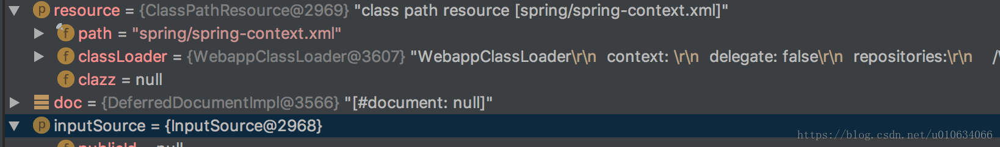

# (转)Sring源码解析(一)Spring是怎么读取配置Xml文件的

## Spring读取配置文件
## Document
在 `XmlBeanDefinitionReader.doLoadBeanDefinitions(InputSource inputSource, Resource resource)` 方法中将Xml文件转换成Document对象; 
`Document doc = doLoadDocument(inputSource, resource);`


## Element
org.w3c.dom.Element 是一个接口 `public interface Element extends Node`
Spring 中 **DefaultBeanDefinitionDocumentReader** 中
```java
    @Override
    public void registerBeanDefinitions(Document doc, XmlReaderContext readerContext) {
        this.readerContext = readerContext;
        logger.debug("Loading bean definitions");
        // 从Document中获取Element
        Element root = doc.getDocumentElement();
        //注册BeanDefinitions
        doRegisterBeanDefinitions(root);
    }
```
在 `DefaultBeanDefinitionDocumentReader.doRegisterBeanDefinitions(Element root)` 中
```java
protected void doRegisterBeanDefinitions(Element root) {
        BeanDefinitionParserDelegate parent = this.delegate;

        /**
        1.根据Element root创建**BeanDefinitionParserDelegate**对象
        2.解析Xml文件头中的一些属性配置到 BeanDefinitionParserDelegate属性（DocumentDefaultsDefinition）defaults；
        **/
        this.delegate = createDelegate(getReaderContext(), root, parent);
        //根据root查询 xml文件的命名空间是不是public static final String BEANS_NAMESPACE_URI = "http://www.springframework.org/schema/beans";
        if (this.delegate.isDefaultNamespace(root)) {
            //省略.....
        }
        //默认空实现 子类可以重写这个方法来处理自定义xml文件
        preProcessXml(root);
        parseBeanDefinitions(root, this.delegate);
        //默认空实现 子类可以重写这个方法来处理自定义xml文件
        postProcessXml(root);
    
        this.delegate = parent;
    }
```
`this.delegate = createDelegate(getReaderContext(), root, parent);` 里面调用 **BeanDefinitionParserDelegate.initDefaults** 方法 
1. 初始化属性值 `private final DocumentDefaultsDefinition defaults = new DocumentDefaultsDefinition();`
2. TODO…
```java
public void initDefaults(Element root, BeanDefinitionParserDelegate parent) {
        // this.defaults 是一个DocumentDefaultsDefinition对象；
        populateDefaults(this.defaults, (parent != null ? parent.defaults : null), root);
        this.readerContext.fireDefaultsRegistered(this.defaults);
    }
```
**BeanDefinitionParserDelegate.populateDefaults** 方法主要是讲 xml 文件中的一些命名空间的基本配置转换成 **DocumentDefaultsDefinition** 对象； 
例如
```xml
<beans xmlns="http://www.springframework.org/schema/beans"
    xmlns:xsi="http://www.w3.org/2001/XMLSchema-instance" xmlns:context="http://www.springframework.org/schema/context"
    xsi:schemaLocation="http://www.springframework.org/schema/beans http://www.springframework.org/schema/beans/spring-beans-3.2.xsd
    http://www.springframework.org/schema/context http://www.springframework.org/schema/context/spring-context-3.2.xsd"
    default-autowire="byName" default-lazy-init="false" default-dependency-check="all" >
```
```java
//parentDefaults是父类的DocumentDefaultsDefinition对象
protected void populateDefaults(DocumentDefaultsDefinition defaults, DocumentDefaultsDefinition parentDefaults, Element root) {
        //查看xml文件中默认的default-lazy-init 值；(如果xml没有显示配置 则它的值为 default)懒加载的默认值
        String lazyInit = root.getAttribute(DEFAULT_LAZY_INIT_ATTRIBUTE);
        if (DEFAULT_VALUE.equals(lazyInit)) {
            //如果有父类,则以父类的为准，否则将返回false。
            lazyInit = (parentDefaults != null ? parentDefaults.getLazyInit() : FALSE_VALUE);
        }
        defaults.setLazyInit(lazyInit);
        //default-autowire-candidates
        String merge = root.getAttribute(DEFAULT_MERGE_ATTRIBUTE);
        if (DEFAULT_VALUE.equals(merge)) {
            // Potentially inherited from outer <beans> sections, otherwise falling back to false.
            merge = (parentDefaults != null ? parentDefaults.getMerge() : FALSE_VALUE);
        }
        defaults.setMerge(merge);
        //default-autowire
        String autowire = root.getAttribute(DEFAULT_AUTOWIRE_ATTRIBUTE);
        if (DEFAULT_VALUE.equals(autowire)) {
            // Potentially inherited from outer <beans> sections, otherwise falling back to 'no'.
            autowire = (parentDefaults != null ? parentDefaults.getAutowire() : AUTOWIRE_NO_VALUE);
        }
        defaults.setAutowire(autowire);

        // Don't fall back to parentDefaults for dependency-check as it's no longer supported in
        // <beans> as of 3.0. Therefore, no nested <beans> would ever need to fall back to it.
        defaults.setDependencyCheck(root.getAttribute(DEFAULT_DEPENDENCY_CHECK_ATTRIBUTE));
    
        if (root.hasAttribute(DEFAULT_AUTOWIRE_CANDIDATES_ATTRIBUTE)) {
            defaults.setAutowireCandidates(root.getAttribute(DEFAULT_AUTOWIRE_CANDIDATES_ATTRIBUTE));
        }
        else if (parentDefaults != null) {
            defaults.setAutowireCandidates(parentDefaults.getAutowireCandidates());
        }
    
        if (root.hasAttribute(DEFAULT_INIT_METHOD_ATTRIBUTE)) {
            defaults.setInitMethod(root.getAttribute(DEFAULT_INIT_METHOD_ATTRIBUTE));
        }
        else if (parentDefaults != null) {
            defaults.setInitMethod(parentDefaults.getInitMethod());
        }
    
        if (root.hasAttribute(DEFAULT_DESTROY_METHOD_ATTRIBUTE)) {
            defaults.setDestroyMethod(root.getAttribute(DEFAULT_DESTROY_METHOD_ATTRIBUTE));
        }
        else if (parentDefaults != null) {
            defaults.setDestroyMethod(parentDefaults.getDestroyMethod());
        }
        //这里是？？？
        defaults.setSource(this.readerContext.extractSource(root));
    }
```

## DocumentDefaultsDefinition
> DocumentDefaultsDefinition(文档的默认值定义)保存了 标准的Spring Xml文件中的 {@code beans} 层级的属性，这些属性是当前Xml配置中的默认全局属性值，例如 { @code default-lazy-init },{ @code default-autowire },等等。

例如:
```xml
<beans xmlns="http://www.springframework.org/schema/beans"
    xmlns:xsi="http://www.w3.org/2001/XMLSchema-instance" xmlns:context="http://www.springframework.org/schema/context"
    xsi:schemaLocation="http://www.springframework.org/schema/beans http://www.springframework.org/schema/beans/spring-beans-3.2.xsd
    http://www.springframework.org/schema/context http://www.springframework.org/schema/context/spring-context-3.2.xsd"
    default-autowire="byName" default-lazy-init="false" default-dependency-check="all" >
```

## DefaultsDefinition
> 默认定义的标记接口，没有任何定义 ，只是单纯的标记一下；继承BeanMetadataElement类；通常具体的实现（例如DocumentDefaultsDefinition）是基于文档的默认值，例如在一个XML文档根标记级别来进行设置默认值

## BeanMetadataElement
> 需要被实现的元数据接口，这个接口定义了Object getSource()方法，返回一个配置源对象
```java
public class DocumentDefaultsDefinition implements DefaultsDefinition {
    //初始化懒加载
    private String lazyInit;
    //
    private String merge;
    // 自动装载的类型 
    private String autowire;
    //
    private String dependencyCheck;

    private String autowireCandidates;
    //初始化方法
    private String initMethod;
    //销毁方法
    private String destroyMethod;
    //返回配置源对象
    private Object source;
    //省略 get set ......
}
```
default-autowire和autowire的可选值

| 可选值      | 功能说明                                                     |
| ----------- | ------------------------------------------------------------ |
| no          | 默认不使用autowiring。 必须显示的使用”“标签明确地指定bean。  |
| byName      | 根据属性名自动装配。此选项将检查容器并根据名字查找与属性完全一致的bean，并将其与属性自动装配。 |
| byType      | 如果容器中存在一个与指定属性类型相同的bean，那么将与该属性自动装配。如果存在多个该类型的bean，那么将会抛出异常，并指出不能使用byType方式进行自动装配。若没有找到相匹配的bean，则什么事都不发生，属性也不会被设置。如果你不希望这样，那么可以通过设置 dependency-check=”objects”让Spring抛出异常。 |
| constructor | 与byType的方式类似，不同之处在于它应用于构造器参数。如果在容器中没有找到与构造器参数类型一致的bean，那么将会抛出异常。 |
| autodetect  | 通过bean类的自省机制（introspection）来决定是使用constructor还是byType方式进行自动装配。如果发现默认的构造器，那么将使用byType方式。 |

解析完了一些xml中Element的默认属性,接下来就是解析Element中的子属性了 
`DefaultBeanDefinitionDocumentReader.parseBeanDefinitions(root, this.delegate);`
这个方法里我们主要看 `delegate.parseCustomElement(ele);`
```java
    public BeanDefinition parseCustomElement(Element ele, BeanDefinition containingBd) {
        //获取命名空间
        String namespaceUri = getNamespaceURI(ele);
        //根据命名空间得到命名空间的处理类handler  如果是dubbo的uri 则返回的就是DubboNamespaceHandler
        //他们都继承自NamespaceHandlerSupport implements NamespaceHandler 
        //里面有调用了hander的init()...
        NamespaceHandler handler = this.readerContext.getNamespaceHandlerResolver().resolve(namespaceUri);
        if (handler == null) {
            error("Unable to locate Spring NamespaceHandler for XML schema namespace [" + namespaceUri + "]", ele);
            return null;
        }
        //1.根据Element的getLocalName()得到Element的name，然后根据这个name去NamespaceHandlerSupport中的一个属性为private final Map<String, BeanDefinitionParser> parsers ;中查找对应的解析器；这个解析器是什么时候被放到这个map里面的呢？TODO...
        //2.根据对应的解析器调用  .parse(element,parserContext)进行解析   
        return handler.parse(ele, new ParserContext(this.readerContext, this, containingBd));
    }
```
让我们来单独解析一下 
`NamespaceHandler handler = this.readerContext.getNamespaceHandlerResolver().resolve(namespaceUri)`
首先了解一下 `this.readerContext是BeanDefinitionParserDelegate` 中的一个属性 
`private final XmlReaderContext readerContext;`

## XmlReaderContext
> 继承了ReaderContext类，并且提供了 对XmlBeanDefinitionReader 和 NamespaceHandlerResolver的访问权限；

```java
public class XmlReaderContext extends ReaderContext {
    //可以看到 方法权限是private 的
    private final XmlBeanDefinitionReader reader;
    private final NamespaceHandlerResolver namespaceHandlerResolver;
    public XmlReaderContext(
            Resource resource, ProblemReporter problemReporter,
            ReaderEventListener eventListener, SourceExtractor sourceExtractor,
            XmlBeanDefinitionReader reader, NamespaceHandlerResolver namespaceHandlerResolver) {

        super(resource, problemReporter, eventListener, sourceExtractor);
        this.reader = reader;
        this.namespaceHandlerResolver = namespaceHandlerResolver;
    }
    //但是提供了一些访问的方法
    public final XmlBeanDefinitionReader getReader() {
        return this.reader;
    }
    public final BeanDefinitionRegistry getRegistry() {
        return this.reader.getRegistry();
    }
    public final ResourceLoader getResourceLoader() {
        return this.reader.getResourceLoader();
    }
    public final ClassLoader getBeanClassLoader() {
        return this.reader.getBeanClassLoader();
    }
    public final Environment getEnvironment() {
        return this.reader.getEnvironment();
    }
    public final NamespaceHandlerResolver getNamespaceHandlerResolver() {
        return this.namespaceHandlerResolver;
    }
        public String generateBeanName(BeanDefinition beanDefinition) {
        return this.reader.getBeanNameGenerator().generateBeanName(beanDefinition, getRegistry());
    }
    public String registerWithGeneratedName(BeanDefinition beanDefinition) {
        String generatedName = generateBeanName(beanDefinition);
        getRegistry().registerBeanDefinition(generatedName, beanDefinition);
        return generatedName;
    }
    public Document readDocumentFromString(String documentContent) {
        InputSource is = new InputSource(new StringReader(documentContent));
        try {
            return this.reader.doLoadDocument(is, getResource());
        }
        catch (Exception ex) {
            throw new BeanDefinitionStoreException("Failed to read XML document", ex);
        }
    }
```

1.那XmlReaderContext是什么时候被赋值的呢？我们顺着XmlReaderContext了解一下 
①. XmlBeanDefinitionReader.registerBeanDefinitions中被创建
```java
public int registerBeanDefinitions(Document doc, Resource resource) throws BeanDefinitionStoreException {
        BeanDefinitionDocumentReader documentReader = createBeanDefinitionDocumentReader();
        int countBefore = getRegistry().getBeanDefinitionCount();
        //创建XmlReaderContext，然后赋值给BeanDefinitionDocumentReader中readerContext属性中
        documentReader.registerBeanDefinitions(doc, createReaderContext(resource));
        return getRegistry().getBeanDefinitionCount() - countBefore;
    }
public XmlReaderContext createReaderContext(Resource resource) {
        //this 最后就是 XmlReaderContext中的XmlBeanDefinitionReader属性
        return new XmlReaderContext(resource, this.problemReporter, this.eventListener,
                this.sourceExtractor, this, getNamespaceHandlerResolver());
    }
    public NamespaceHandlerResolver getNamespaceHandlerResolver() {
        if (this.namespaceHandlerResolver == null) {
            this.namespaceHandlerResolver = createDefaultNamespaceHandlerResolver();
        }
        return this.namespaceHandlerResolver;
    }
    /**
    *如果没有具体的实现类，则创建 默认的实现类返回
    * 默认的实现类DefaultNamespaceHandlerResolver中的handlerMappingsLocation属性（Resource location to search for）=META-INF/spring.handlers
    */
    protected NamespaceHandlerResolver createDefaultNamespaceHandlerResolver() {
        return new DefaultNamespaceHandlerResolver(getResourceLoader().getClassLoader());
    }
```

②.创建后的XmlReaderContext被当做 BeanDefinitionParserDelegate 构造函数的参数来创建BeanDefinitionParserDelegate对象
```java
protected void doRegisterBeanDefinitions(Element root) {
        BeanDefinitionParserDelegate parent = this.delegate;
        this.delegate = createDelegate(getReaderContext(), root, parent); 
        //省略.....

}
```