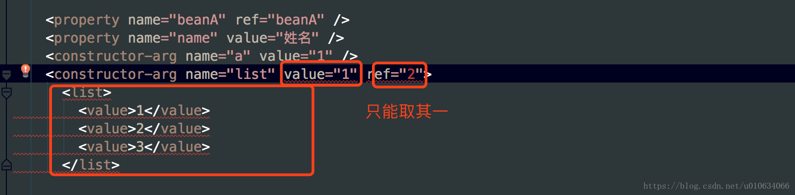

# (转)Spring源码分析(三)Spring是如何把元素解析成BeanDefinition对象的

spring中解析元素最重要的一个对象应该就属于 BeanDefinition了；这个Spring容器中最基本的内部数据结构；它让xml文件中所有的配置有了一个归属的地方；在xml中存在的配置都能在BeanDefinition找到对应的属性；我们今天来看看BeanDefinition是如何被创建的

## 1.BeanDefinition
> Spring 容器中的内部数据结构，是转换为容器中bean实例的最小接口，其中包含了 属性值、构造函数的参数值等等；

```java
public interface BeanDefinition extends AttributeAccessor, BeanMetadataElement {
    /**
     * 作用域标识符。
     */
    String SCOPE_SINGLETON = ConfigurableBeanFactory.SCOPE_SINGLETON;   // singleton作用域
    String SCOPE_PROTOTYPE = ConfigurableBeanFactory.SCOPE_PROTOTYPE;   // prototype作用域

    /**
     * 角色提示
     */
    int ROLE_APPLICATION = 0;   // 表明BeanDefinition是应用程序的主要部分。通常对应于用户定义的Bean
    int ROLE_SUPPORT = 1;   // 表明BeanDefinition是支持大部分配置。通常是外部的ComponentDefinition
    int ROLE_INFRASTRUCTURE = 2;    // 表明BeanDefinition提供了一个完全后台角色，与最终用户无关。这个提示是在注册bean时使用的，这些bean完全是组件定义的内部工作的一部分


    /**
     * 获取、设置该BeanDefinition的父Bean的名称
     */
    String getParentName();     
    void setParentName(String parentName);

    /**
     * 获取、设置当前Bean的类名
     * 
     */
    String getBeanClassName();      // 注意：这并不一定是运行时真正的类名，如果有一个子定义覆盖/继承父类的名称。
    void setBeanClassName(String beanClassName);    // 注意：类名可以在bean工厂的后处理器中进行修改，通常用它的解析变量替换原来的类名

    /**
     * 获取、设置工厂Bean或工厂方法（如果有）
     */
    String getFactoryBeanName();
    void setFactoryBeanName(String factoryBeanName);
    String getFactoryMethodName();
    void setFactoryMethodName(String factoryMethodName);    // 注意：该方法由指定工厂Bean调用或者作为本地bean类的静态方法

    /**
     * 获取、设置当前Bean的作用域或者为null（还不明确时）
     */
    String getScope();
    void setScope(String scope);

    /**
     * 获取、设置懒初始化
     */
    boolean isLazyInit();
    void setLazyInit(boolean lazyInit);

    /**
     * 获取、设置该Bean所依赖的Bean名称列表
     */
    String[] getDependsOn();
    void setDependsOn(String... dependsOn);

    /**
     * 获取、设置该Bean是否为其他Bean自动装配的候选者
     */
    boolean isAutowireCandidate
    void setAutowireCandidate(boolean autowireCandidate);

    /**
     * 获取、设置该Bean是否为自动装配的主要候选者
     */
    boolean isPrimary();
    void setPrimary(boolean primary);

    /**
     * 获取该Bean的构造器参数值
     */
    ConstructorArgumentValues getConstructorArgumentValues();

    /**
     * 获取该Bean的可运用于新实例的属性值
     */
    MutablePropertyValues getPropertyValues();

    /**
     * 判断该Bean是否为单例、原型、抽象Bean
     */
    boolean isSingleton();
    boolean isPrototype();
    boolean isAbstract();

    /**
     * 获取该Bean所扮演的角色（ROLE_APPLICATION、ROLE_SUPPORT、ROLE_INFRASTRUCTURE）
     */
    int getRole();

    /**
     * 获取该Bean、资源的可读性描述
     */
    String getDescription();
    String getResourceDescription();

    /**
     * 获取原始的BeanDefinition
     */
    BeanDefinition getOriginatingBeanDefinition();
}
```

## 2.BeanDefinitionParserDelegate
> BeanDefinitionParserDelegate是一个非常重要的类；spring将所有的解析操作都委托给了这个类；所有我们今天分析 
> BeanDefinition的创建，都是在这个类里面;

那么我们进一起进入探个究竟把；创建BeanDefinition的入口

### 2.1.parseBeanDefinitionElement
```java
    /**                     解析元素
     *1.containingBean 还不清楚作用，回头分析 TODO...
     *2.解析 id，name属性放入List<String> aliases中；aliases持有所有别名
     *3.检查beanName，和aliases是否跟之前有重复；因为当前的对象BeanDefinitionParserDelegate中属性 Set<String> usedNames 会持有所有解析出来的beanName 和 aliases；
     *4.解析元素，将xml中的所有元素解析成AbstractBeanDefinition中对应的属性；
     *5.解析完了拿到AbstractBeanDefinition的实例之后；创建一个BeanDefinitionHolder实例对象；
        这个实例对象持有 AbstractBeanDefinition，beanName，aliases；这些属性；并且返回holder实例对象；
     */
    public BeanDefinitionHolder parseBeanDefinitionElement(Element ele, BeanDefinition containingBean) {
        //获取id
        String id = ele.getAttribute(ID_ATTRIBUTE);
        //获取name属性；例如：<bean id="simpleProducer" name="aliases1,;aliases2,;aliases3" > 这样就设置了多个别名了
        String nameAttr = ele.getAttribute(NAME_ATTRIBUTE);
        List<String> aliases = new ArrayList<String>();
        if (StringUtils.hasLength(nameAttr)) {
        //解析别名；上面的例子就解析成了  三个别名了aliases1,;aliases2,;aliases3
            String[] nameArr = StringUtils.tokenizeToStringArray(nameAttr, MULTI_VALUE_ATTRIBUTE_DELIMITERS);
            aliases.addAll(Arrays.asList(nameArr));
        }

        String beanName = id;
        //如果没有设置id，但是设置了name ；那么就把name别名中的第一个当做 bean的名字；并且从别名中remove掉
        if (!StringUtils.hasText(beanName) && !aliases.isEmpty()) {
            beanName = aliases.remove(0);
            if (logger.isDebugEnabled()) {
                logger.debug("No XML 'id' specified - using '" + beanName +
                        "' as bean name and " + aliases + " as aliases");
            }
        }

        if (containingBean == null) {
            /**
            *检查当前的beanName是否唯一
            *1.先判断this.usedNames 是否包含beanName(this.usedNames是一个 set集合，专门保存所有的beanName)
            *2.如果this.usedNames不包含，再判断当前aliase是否已经被set到this.usedNames集合中了;
            *3.如果上述beanName或者aliase中被发现已注册则抛出异常，否则将beanName和aliase一起add到this.usedNames中去
            *4.就算beanName与别名aliase有重复也没有关系，set会自动去重
            */
            checkNameUniqueness(beanName, aliases, ele);
        }
        /**
        *1.解析Element，返回解析后的对象 AbstractBeanDefinition；很多属性例如：class、parent、scope、abstract、lazy-init、meta、lookup-method、replaced-method、constructor-arg、property、qualifier等；
        *2.这个beanName作为参数只是用作 异常信息记录
        *3.看下文详细
        */
        AbstractBeanDefinition beanDefinition = parseBeanDefinitionElement(ele, beanName, containingBean);
        if (beanDefinition != null) {
            //如果没有设置 id 也没有设置name属性；则spring生成一个beanName
            if (!StringUtils.hasText(beanName)) {
                try {
                    //TODO... 这个containingBean还不知道是干啥用的
                    if (containingBean != null) {
                        //自动生成beanName;生成规则我就不赘述了
                        beanName = BeanDefinitionReaderUtils.generateBeanName(
                                beanDefinition, this.readerContext.getRegistry(), true);
                    }
                    else {
                        beanName = this.readerContext.generateBeanName(beanDefinition);
                        // Register an alias for the plain bean class name, if still possible,
                        // if the generator returned the class name plus a suffix.
                        // This is expected for Spring 1.2/2.0 backwards compatibility.
                        String beanClassName = beanDefinition.getBeanClassName();
                        if (beanClassName != null &&
                                beanName.startsWith(beanClassName) && beanName.length() > beanClassName.length() &&
                                !this.readerContext.getRegistry().isBeanNameInUse(beanClassName)) {
                            aliases.add(beanClassName);
                        }
                    }
                    if (logger.isDebugEnabled()) {
                        logger.debug("Neither XML 'id' nor 'name' specified - " +
                                "using generated bean name [" + beanName + "]");
                    }
                }
                catch (Exception ex) {
                    error(ex.getMessage(), ele);
                    return null;
                }
            }
            String[] aliasesArray = StringUtils.toStringArray(aliases);
            //
            /**
            *1.返回一个BeanDefinitionHolder对象，继承子 implements BeanMetadataElement ；这个对象持有
            *   this.beanDefinition = beanDefinition;
                this.beanName = beanName;
                this.aliases = aliases;
            */
            return new BeanDefinitionHolder(beanDefinition, beanName, aliasesArray);
        }

        return null;
    }
```

### 2.2.parseBeanDefinitionElement
```java
    /**
     * 解析bean definition ,不包括名称或别名(因为上面已经解析过名称和别名了),当解析异常的时候回返回null；
     * 返回的是一个GenericBeanDefinition对象
     */
    public AbstractBeanDefinition parseBeanDefinitionElement(
            Element ele, String beanName, BeanDefinition containingBean) {
        /**
        * 1.BeanEntry是一个 bean的实体类，它implements了 ParseState.Entry接口；Entry是一个标志接口，什么都没有做；
        * BeanEntry 只有一个private String beanDefinitionName;属性
        * 2.ParseState类里面有一个private final Stack<Entry> state;栈；存放的对象类型是 Entry
        * 3.ParseState简单的栈结构来跟踪逻辑位置中解析过程，主要是记录异常信息；在异常的时候 Spring调用error方法，会把ParseState栈中的信息一起抛出
        */
        this.parseState.push(new BeanEntry(beanName));
        //获取element中有 class属性；
        String className = null;
        if (ele.hasAttribute(CLASS_ATTRIBUTE)) {
            className = ele.getAttribute(CLASS_ATTRIBUTE).trim();
        }

        try {
            //获取parent属性
            String parent = null;
            if (ele.hasAttribute(PARENT_ATTRIBUTE)) {
                parent = ele.getAttribute(PARENT_ATTRIBUTE);
            }
            /**
            *1.AbstractBeanDefinition extends BeanMetadataAttributeAccessor
        implements BeanDefinition, Cloneable ;它实现了部分BeanDefinition；
            *2.实现上创建的是一个GenericBeanDefinition对象；这个对象继承了AbstractBeanDefinition；并且新增了属性private String parentName;还实现了cloneBeanDefinition()等方法
            *3.父类类名路径，自身全类名路径,和当前XmlReaderContext的类加载器为参数创建 AbstractBeanDefinition
                return BeanDefinitionReaderUtils.createBeanDefinition(
                parentName, className, this.readerContext.getBeanClassLoader())；
            *4.如果ClassLoader为null；则 bd.setBeanClassName(className);设置全类名路径；
            *  如果不为null；则bd.setBeanClass(ClassUtils.forName(className, classLoader));直接利用反射得到类的Class类型;最种调用的是 ClassLoader.loadClass(name)
            */
            AbstractBeanDefinition bd = createBeanDefinition(className, parent);
            /**
            *1.解析 <bean >里面的所有属性值；例如:scope,abstract,lazy-init,autowire,primary,depends-on等
            *2.所有的属性都设置到了 AbstractBeanDefinition bd中
            */
            parseBeanDefinitionAttributes(ele, beanName, containingBean, bd);
            //设置description值；例如<description>test</description>
            bd.setDescription(DomUtils.getChildElementValueByTagName(ele, DESCRIPTION_ELEMENT));
            /**
            *1.解析元数据 Meta； Meta在Element中是 <meta key="test" value="testvalue" ></meta>
            *2.方法参数类型是 BeanMetadataAttributeAccessor；bd是有继承BeanMetadataAttributeAccessor的；
            *3.解析了meta中的key和value；放入到BeanMetadataAttribute attribute = new BeanMetadataAttribute(key, value);然后bd调用attributeAccessor.addMetadataAttribute(attribute);就不meta元数据放入到bd中去了；
            */
            parseMetaElements(ele, bd);
            /**
            *重写特定的方法返回 指定 的实例对象
            *1.Spring有一种机制，可以动态的实现或重写bean容器中指定bean的指定方法，然后将返回值指定为bean容器中的另一个bean
            *2.使用的时候 
                <bean id="beanB" class="com.app.BeanB" scope="prototype"/>
                    <bean id="beanA" class="com.app.BeanA">
                    <!-- 表示将由Spring重写getBeanB()方法，并返回名为beanB的bean -->
                    <lookup-method name="getBeanB" bean="beanB"/>
                </bean>
            *3.bd中的属性private MethodOverrides methodOverrides = new MethodOverrides();专门存放这个
            *4.解析到bd中 
                LookupOverride override = new LookupOverride(methodName, beanRef);
                override.setSource(extractSource(ele));
                overrides.addOverride(override);

            *5.详细：[这里写链接内容](https://blog.csdn.net/elim168/article/details/74939012)
            */
            parseLookupOverrideSubElements(ele, bd.getMethodOverrides());
            /**
            *1.跟上面类似
            *2.replaced method注入是spring动态改变bean里方法的实现。需要改变的方法，使用spring内原有其他类（需要继承接口org.springframework.beans.factory.support.MethodReplacer）的逻辑，替换这个方法。通过改变方法执行逻辑来动态改变方法。内部实现为使用cglib方法，重新生成子类，重写配置的方法和返回对象，达到动态改变的效果。
            3.ReplaceOverride replaceOverride = new ReplaceOverride(name, callback);
                // Look for arg-type match elements.
                List<Element> argTypeEles = DomUtils.getChildElementsByTagName(replacedMethodEle, ARG_TYPE_ELEMENT);
                for (Element argTypeEle : argTypeEles) {
                    String match = argTypeEle.getAttribute(ARG_TYPE_MATCH_ATTRIBUTE);
                    match = (StringUtils.hasText(match) ? match : DomUtils.getTextValue(argTypeEle));
                    if (StringUtils.hasText(match)) {
                        replaceOverride.addTypeIdentifier(match);
                    }
                }
                replaceOverride.setSource(extractSource(replacedMethodEle));
                overrides.addOverride(replaceOverride);

            */
            parseReplacedMethodSubElements(ele, bd.getMethodOverrides());
            //
            /**
            *1.解析构造函数中的参数 constructor-arg；放入bd中的 ConstructorArgumentValues constructorArgumentValues属性中Map<Integer, ValueHolder> indexedArgumentValues map中;
            *2.解析的是 <constructor-arg index="0" value="1" />这种的
            */
            parseConstructorArgElements(ele, bd);
            /**
            *1.set方法注入的处理(比较常用的注入)；格式是<property name="application" value="${myApplicationCode}"/>
            *2.与上面的构造函数不一样的是；这里解析出来的值是个PropertyValue对象
            *3.show the code
                //解析出来属性值
                Object val = parsePropertyValue(ele, bd, propertyName);
                //构造PropertyValue实例
                PropertyValue pv = new PropertyValue(propertyName, val);
                //解析元数据 meta数据 ；属性下也可以配置meta
                
                parseMetaElements(ele, pv);
                pv.setSource(extractSource(ele));
                //将PropertyValue设置到bd的MutablePropertyValues propertyValues;属性中；
                bd.getPropertyValues().addPropertyValue(pv);
            */
            parsePropertyElements(ele, bd);
            /**
            *1.解析qualifier元素；存放在 Map<String, AutowireCandidateQualifier> qualifiers
            */
            parseQualifierElements(ele, bd);

            bd.setResource(this.readerContext.getResource());
            bd.setSource(extractSource(ele));

            return bd;
        }
        catch (ClassNotFoundException ex) {
            error("Bean class [" + className + "] not found", ele, ex);
        }
        catch (NoClassDefFoundError err) {
            error("Class that bean class [" + className + "] depends on not found", ele, err);
        }
        catch (Throwable ex) {
            error("Unexpected failure during bean definition parsing", ele, ex);
        }
        finally {
            this.parseState.pop();
        }

        return null;
    }
```

### 2.3 parseBeanDefinitionAttributes
```java
     //解析bean的属性值
    public AbstractBeanDefinition parseBeanDefinitionAttributes(Element ele, String beanName,
            BeanDefinition containingBean, AbstractBeanDefinition bd) {
        /**singleton 属性是1.x的时候的东西，现在已经废弃，用scope代替了;例如 scope="singleton"**/
        if (ele.hasAttribute(SINGLETON_ATTRIBUTE)) {
            error("Old 1.x 'singleton' attribute in use - upgrade to 'scope' declaration", ele);
        }
        /**
        *设置作用域；private String scope = SCOPE_DEFAULT;是AbstractBeanDefinition中的属性，默认是 "" ;
        */
        else if (ele.hasAttribute(SCOPE_ATTRIBUTE)) {
            bd.setScope(ele.getAttribute(SCOPE_ATTRIBUTE));
        }
        /** 这个containingBean 暂时不清楚作用，等会分析 TODO.. **/
        else if (containingBean != null) {
            // Take default from containing bean in case of an inner bean definition.
            bd.setScope(containingBean.getScope());
        }
        //设置 abstract属性，默认是 false
        if (ele.hasAttribute(ABSTRACT_ATTRIBUTE)) {
            bd.setAbstract(TRUE_VALUE.equals(ele.getAttribute(ABSTRACT_ATTRIBUTE)));
        }
        //如果当前元素没有设置 lazyInit 懒加载；则去 this.defaults.getLazyInit()；这个defaults是上一篇分析过的；整个xml文件全局的默认值；
        String lazyInit = ele.getAttribute(LAZY_INIT_ATTRIBUTE);
        if (DEFAULT_VALUE.equals(lazyInit)) {
            lazyInit = this.defaults.getLazyInit();
        }
        bd.setLazyInit(TRUE_VALUE.equals(lazyInit));
        // 设置注入方式，有 byName byType 等等，如果当前没有设置，则取this.defaults.getAutowire()的值；
        //然后将其转换为对应的int类型；例如byName是int AUTOWIRE_BY_NAME = 1;
        String autowire = ele.getAttribute(AUTOWIRE_ATTRIBUTE);
        bd.setAutowireMode(getAutowireMode(autowire));
        //这个dependency-check字面意义是依赖检查的类型；具体一会分析；如果当前没有设置，则取this.defaults.getDependencyCheck()的值；TODO...
        String dependencyCheck = ele.getAttribute(DEPENDENCY_CHECK_ATTRIBUTE);
        bd.setDependencyCheck(getDependencyCheck(dependencyCheck));
        /**
        * 1.设置depends-on属性；
        * 2.depends-on="commonService,;redisComponent"可以用 ，；来设置多个；所以AbstractBeanDefinition中的dependsOn是一个数组类型
        * 3.depends-on是指指定Bean初始化及销毁时的顺序，使用depends-on属性指定的Bean要先初始化完毕后才初始化当前Bean
        */
        if (ele.hasAttribute(DEPENDS_ON_ATTRIBUTE)) {
            String dependsOn = ele.getAttribute(DEPENDS_ON_ATTRIBUTE);
            bd.setDependsOn(StringUtils.tokenizeToStringArray(dependsOn, MULTI_VALUE_ATTRIBUTE_DELIMITERS));
        }
        //这个autowireCandidate不是很清楚  回头分析TODo..
        String autowireCandidate = ele.getAttribute(AUTOWIRE_CANDIDATE_ATTRIBUTE);
        if ("".equals(autowireCandidate) || DEFAULT_VALUE.equals(autowireCandidate)) {
            String candidatePattern = this.defaults.getAutowireCandidates();
            if (candidatePattern != null) {
                String[] patterns = StringUtils.commaDelimitedListToStringArray(candidatePattern);
                bd.setAutowireCandidate(PatternMatchUtils.simpleMatch(patterns, beanName));
            }
        }
        else {
            bd.setAutowireCandidate(TRUE_VALUE.equals(autowireCandidate));
        }
        //设置primary 装配时当出现多个Bean候选者时，被标记为Primary的Bean将作为首选者，否则将抛出异常 ；默认为false
        //https://blog.csdn.net/qq_16055765/article/details/78833260
        if (ele.hasAttribute(PRIMARY_ATTRIBUTE)) {
            bd.setPrimary(TRUE_VALUE.equals(ele.getAttribute(PRIMARY_ATTRIBUTE)));
        }
        //设置初始化方法
        if (ele.hasAttribute(INIT_METHOD_ATTRIBUTE)) {
            String initMethodName = ele.getAttribute(INIT_METHOD_ATTRIBUTE);
            if (!"".equals(initMethodName)) {
                bd.setInitMethodName(initMethodName);
            }
        }
        else {
            //如果 当前元素没有设置 init_method 属性，则判断 xml全局配置有没有设置；this.defaults是全局设置
            if (this.defaults.getInitMethod() != null) {
                bd.setInitMethodName(this.defaults.getInitMethod());
                bd.setEnforceInitMethod(false);
            }
        }
        //与上面初始化无二
        if (ele.hasAttribute(DESTROY_METHOD_ATTRIBUTE)) {
            String destroyMethodName = ele.getAttribute(DESTROY_METHOD_ATTRIBUTE);
            bd.setDestroyMethodName(destroyMethodName);
        }
        else {
            if (this.defaults.getDestroyMethod() != null) {
                bd.setDestroyMethodName(this.defaults.getDestroyMethod());
                bd.setEnforceDestroyMethod(false);
            }
        }
        //设置factoryMethodName； spring通过工厂方法配置Bean
        //https://blog.csdn.net/mrwuyi/article/details/51578654
        if (ele.hasAttribute(FACTORY_METHOD_ATTRIBUTE)) {
            bd.setFactoryMethodName(ele.getAttribute(FACTORY_METHOD_ATTRIBUTE));
        }
        //设置factoryBeanName   spring通过工厂方法配置Bean
        //https://blog.csdn.net/mrwuyi/article/details/51578654
        if (ele.hasAttribute(FACTORY_BEAN_ATTRIBUTE)) {
            bd.setFactoryBeanName(ele.getAttribute(FACTORY_BEAN_ATTRIBUTE));
        }

        return bd;
    }
```

### 2.4 parseConstructorArgElement
```java
    /**
     * 解析 构造函数的参数
     */
    public void parseConstructorArgElement(Element ele, BeanDefinition bd) {
        String indexAttr = ele.getAttribute(INDEX_ATTRIBUTE);
        String typeAttr = ele.getAttribute(TYPE_ATTRIBUTE);
        String nameAttr = ele.getAttribute(NAME_ATTRIBUTE);
        //如果xml配置了index
        if (StringUtils.hasLength(indexAttr)) {
            try {
                int index = Integer.parseInt(indexAttr);
                if (index < 0) {
                    error("'index' cannot be lower than 0", ele);
                }
                else {
                    try {
                        /**
                        *1.构造参数实体类继承子ParseState.Entry ConstructorArgumentEntry implements ParseState.Entry;有个int index;属性
                        *2.上面解析beanName和aliaes的时候也有个BeanEntry实体类继承自ParseState.Entry，它有个属性是beanDefinitionName
                        *3.同样的，将这个实体类push到 parseState中存放；
                        */
                        this.parseState.push(new ConstructorArgumentEntry(index));
                            /**
                             * Get the value of a property element. May be a list etc.
                             * Also used for constructor arguments, "propertyName" being null in this case.
                             * 获取属性值
                             */
                        Object value = parsePropertyValue(ele, bd, null);
                        //新建一个ValueHolder实例，这个专门存放构造参数的一些 属性值的
                        ConstructorArgumentValues.ValueHolder valueHolder = new ConstructorArgumentValues.ValueHolder(value);
                        //设置类型
                        if (StringUtils.hasLength(typeAttr)) {
                            valueHolder.setType(typeAttr);
                        }
                        //设置name
                        if (StringUtils.hasLength(nameAttr)) {
                            valueHolder.setName(nameAttr);
                        }
                        valueHolder.setSource(extractSource(ele));
                        //验证index是否设置正确
                        if (bd.getConstructorArgumentValues().hasIndexedArgumentValue(index)) {
                            error("Ambiguous constructor-arg entries for index " + index, ele);
                        }
                        else {
                        //ConstructorArgumentValues有个 Map<Integer, ValueHolder> indexedArgumentValues = new LinkedHashMap<Integer, ValueHolder>(0)来hold参数
                            bd.getConstructorArgumentValues().addIndexedArgumentValue(index, valueHolder);
                        }
                    }
                    finally {
                        //出栈；简单的栈结构来跟踪逻辑位置中解析过程，主要是记录异常信息的吧
                        this.parseState.pop();
                    }
                }
            }
            catch (NumberFormatException ex) {
                error("Attribute 'index' of tag 'constructor-arg' must be an integer", ele);
            }
        }
        else {
            try {
                //与上无二
                this.parseState.push(new ConstructorArgumentEntry());
                Object value = parsePropertyValue(ele, bd, null);
                ConstructorArgumentValues.ValueHolder valueHolder = new ConstructorArgumentValues.ValueHolder(value);
                if (StringUtils.hasLength(typeAttr)) {
                    valueHolder.setType(typeAttr);
                }
                if (StringUtils.hasLength(nameAttr)) {
                    valueHolder.setName(nameAttr);
                }
                valueHolder.setSource(extractSource(ele));
                bd.getConstructorArgumentValues().addGenericArgumentValue(valueHolder);
            }
            finally {
                this.parseState.pop();
            }
        }
    }
```

再着重分析一下Object value = parsePropertyValue(ele, bd, null); 
1. 解析属性值,解析property 或者 constructor-arg;如下
```xml
    <bean class="src.HelloWorld">
    <property name="beanA" ref="beanA" />
    <property name="name" value="姓名" />
    <constructor-arg name="a" value="1" />
    <constructor-arg name="list">
      <list>
        <value>1</value>
        <value>2</value>
        <value>3</value>
      </list>
    </constructor-arg>
    <meta key="meta1" value="meta1value"/>
  </bean>
```

这个方法只有两个地方调用 
①.解析属性property元素的时候parsePropertyValue(ele, bd, propertyName) 
②.解析构造参数constructor-arg元素的时候 parsePropertyValue(ele, bd, null)

检查配置是否正确 最多只能有其中一个元素：ref，value,子元素(ref，value,list,set array 等等形式的元素) ；

解析子元素，ref，value,list,set array…..等等
```java
public Object parsePropertyValue(Element ele, BeanDefinition bd, String propertyName) {
        String elementName = (propertyName != null) ?
                        "<property> element for property '" + propertyName + "'" :
                        "<constructor-arg> element";

        // 最多只能有其中一个元素：ref，value,子元素(ref，value,list,set array 等等形式的元素) 等等
        /**
        *<constructor-arg name="a" >
        *<value >1</value>
        *</constructor-arg>
        */
        NodeList nl = ele.getChildNodes();
        Element subElement = null;
        /**如果写法是下面这样的嵌套子元素的话 就要进入parsePropertySubElement解析嵌套子元素了
        *<constructor-arg name="a" >
        *<value >1</value>
        *</constructor-arg>
        */
        for (int i = 0; i < nl.getLength(); i++) {
            Node node = nl.item(i);
            if (node instanceof Element && !nodeNameEquals(node, DESCRIPTION_ELEMENT) &&
                    !nodeNameEquals(node, META_ELEMENT)) {
                // Child element is what we're looking for.
                if (subElement != null) {
                    error(elementName + " must not contain more than one sub-element", ele);
                }
                else {
                    subElement = (Element) node;
                }
            }
        }

        boolean hasRefAttribute = ele.hasAttribute(REF_ATTRIBUTE);
        boolean hasValueAttribute = ele.hasAttribute(VALUE_ATTRIBUTE);
        //1.如果 ref 和 value都存在  抛异常
        //2.如果ref或者value存在 一个并且 subElement也存在  抛异常
        if ((hasRefAttribute && hasValueAttribute) ||
                ((hasRefAttribute || hasValueAttribute) && subElement != null)) {
            error(elementName +
                    " is only allowed to contain either 'ref' attribute OR 'value' attribute OR sub-element", ele);
        }

//如果是ref；返回RuntimeBeanReference implements BeanReference；有beanName，toParent，source等属性
        if (hasRefAttribute) {
            String refName = ele.getAttribute(REF_ATTRIBUTE);
            if (!StringUtils.hasText(refName)) {
                error(elementName + " contains empty 'ref' attribute", ele);
            }
            RuntimeBeanReference ref = new RuntimeBeanReference(refName);
            ref.setSource(extractSource(ele));
            return ref;
        }
        //如果是value；返回TypedStringValue；设置属性 value和source 
        else if (hasValueAttribute) {
            TypedStringValue valueHolder = new TypedStringValue(ele.getAttribute(VALUE_ATTRIBUTE));
            valueHolder.setSource(extractSource(ele));
            return valueHolder;
        }
        //如果是list；解析一下子元素
        else if (subElement != null) {
            return parsePropertySubElement(subElement, bd);
        }
        else {
            // Neither child element nor "ref" or "value" attribute found.
            error(elementName + " must specify a ref or value", ele);
            return null;
        }
    }
//解析子元素
public Object parsePropertySubElement(Element ele, BeanDefinition bd, String defaultValueType) {
        //如果不是默认的命名空间，则最终调用public BeanDefinition parseCustomElement(Element ele, BeanDefinition containingBd) 来解析；
        //第一篇文章分析过 根据元素选择不同的解析器来解析；
        if (!isDefaultNamespace(ele)) {
            return parseNestedCustomElement(ele, bd);
        }
        //解析<bean>元素；这里就是我们本文正在分析的方法，所以不概述了
        else if (nodeNameEquals(ele, BEAN_ELEMENT)) {
            BeanDefinitionHolder nestedBd = parseBeanDefinitionElement(ele, bd);
            if (nestedBd != null) {
                nestedBd = decorateBeanDefinitionIfRequired(ele, nestedBd, bd);
            }
            return nestedBd;
        }
        //如果是ref 元素 RuntimeBeanReference
        else if (nodeNameEquals(ele, REF_ELEMENT)) {
            // A generic reference to any name of any bean.
            String refName = ele.getAttribute(BEAN_REF_ATTRIBUTE);
            boolean toParent = false;
            if (!StringUtils.hasLength(refName)) {
                // A reference to the id of another bean in the same XML file.
                refName = ele.getAttribute(LOCAL_REF_ATTRIBUTE);
                if (!StringUtils.hasLength(refName)) {
                    // A reference to the id of another bean in a parent context.
                    refName = ele.getAttribute(PARENT_REF_ATTRIBUTE);
                    toParent = true;
                    if (!StringUtils.hasLength(refName)) {
                        error("'bean', 'local' or 'parent' is required for <ref> element", ele);
                        return null;
                    }
                }
            }
            if (!StringUtils.hasText(refName)) {
                error("<ref> element contains empty target attribute", ele);
                return null;
            }
            RuntimeBeanReference ref = new RuntimeBeanReference(refName, toParent);
            ref.setSource(extractSource(ele));
            return ref;
        }
        //解析idref
        else if (nodeNameEquals(ele, IDREF_ELEMENT)) {
            return parseIdRefElement(ele);
        }
        //解析value
        else if (nodeNameEquals(ele, VALUE_ELEMENT)) {
            /**解析 下面这种形式的
            * <constructor-arg name="a" >
            *       <value  type="java.lang.Integer"  >1</value>
            * </constructor-arg>
            * <property name="name">
            *      <value   >姓名</value>
            * </property>
            * 1.如果没有设置type属性，则返回new TypedStringValue(value)；SpecifiedTypeName是空串；
            * 2.如果设置了type，再判断当前readerContext是否有ClassLoader，如果有，则利用反射生成targetTypeName类型的 Class对象；再返回new TypedStringValue(value, targetType)；这个targetType就是Class对象
            * 3.否则的话，返回new TypedStringValue(value, targetTypeName);targetType就是全类名路径
            */
            return parseValueElement(ele, defaultValueType);
        }
        //解析null
        else if (nodeNameEquals(ele, NULL_ELEMENT)) {
            // It's a distinguished null value. Let's wrap it in a TypedStringValue
            // object in order to preserve the source location.
            TypedStringValue nullHolder = new TypedStringValue(null);
            nullHolder.setSource(extractSource(ele));
            return nullHolder;
        }
        //解析array
        else if (nodeNameEquals(ele, ARRAY_ELEMENT)) {
            return parseArrayElement(ele, bd);
        }
        //list
        else if (nodeNameEquals(ele, LIST_ELEMENT)) {
            return parseListElement(ele, bd);
        }
        //set
        else if (nodeNameEquals(ele, SET_ELEMENT)) {
            return parseSetElement(ele, bd);
        }
        //map
        else if (nodeNameEquals(ele, MAP_ELEMENT)) {
            return parseMapElement(ele, bd);
        }
        //props
        else if (nodeNameEquals(ele, PROPS_ELEMENT)) {
            return parsePropsElement(ele);
        }
        else {
            error("Unknown property sub-element: [" + ele.getNodeName() + "]", ele);
            return null;
        }
    }
```




3 总结
至此，BeanDefinition就已经解析完成了！ 
我们一起总结一下整个流程

1. 解析 id，name属性放入List aliases中；aliases持有所有别名
2. 检查beanName，和aliases是否跟之前有重复；因为当前的对象BeanDefinitionParserDelegate中属性 Set usedNames 会持有所有解析出来的beanName 和 aliases；
3. 解析元素，将xml中的所有元素解析成AbstractBeanDefinition中对应的属性；
4. 解析完了拿到AbstractBeanDefinition的实例之后；创建一个BeanDefinitionHolder实例对象； 这个实例对象持有 AbstractBeanDefinition，beanName，aliases；这些属性；并且返回holder实例对象；

我们现在对BeanDefinition就有了一个初步的概念了；那么拿到了BeanDefinition之后有什么用呢？请看下一篇文章
