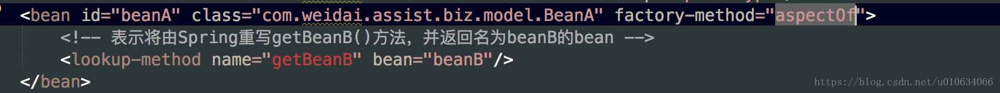

# (转)Spring源码解析(四)Spring是怎么处理BeanDefinition的？

上一篇文章中分析了 BeanDefinition是怎么被解析出来的，在这一篇文章中我们主要看下 解析完了之后所做的事情；

## 一、DefaultBeanDefinitionDocumentReader
源码入口

### processBeanDefinition(Element ele, BeanDefinitionParserDelegate delegate)
```java
    /**
     * Process the given bean element, parsing the bean definition
     * and registering it with the registry.
     */
    protected void processBeanDefinition(Element ele, BeanDefinitionParserDelegate delegate) {
        //这个bdHoder就是被解析完成之后的BeanDefinition；上篇分析了，这里不再赘述
        BeanDefinitionHolder bdHolder = delegate.parseBeanDefinitionElement(ele);
        if (bdHolder != null) {
            //这里是修饰一下BeanDefinition，这里以后再单独分析；TODO...
            bdHolder = delegate.decorateBeanDefinitionIfRequired(ele, bdHolder);
            try {

                /**注册BeanDefinition;
                *1.DefaultBeanDefinitionDocumentReader里面持有XmlReaderContext readerContext;
                *2.XmlReaderContext extends AbstractBeanDefinitionReader，这个类里面持有BeanDefinitionRegistry registry;注册器;registry默认实现 DefaultListableBeanFactory
                */
                BeanDefinitionReaderUtils.registerBeanDefinition(bdHolder, getReaderContext().getRegistry());
            }
            catch (BeanDefinitionStoreException ex) {
                getReaderContext().error("Failed to register bean definition with name '" +
                        bdHolder.getBeanName() + "'", ele, ex);
            }
            // 通知 注册事件已经完成；但是这个好像是个空实现，那么这个到底哪些场景会用到呢？TODO...
            getReaderContext().fireComponentRegistered(new BeanComponentDefinition(bdHolder));
        }
    }
```

## 二、BeanDefinitionReaderUtils
> TODO…


### registerBeanDefinition(BeanDefinitionHolder definitionHolder, BeanDefinitionRegistry registry)
```java
public static void registerBeanDefinition(
            BeanDefinitionHolder definitionHolder, BeanDefinitionRegistry registry)
            throws BeanDefinitionStoreException {

        // Register bean definition under primary name.
        String beanName = definitionHolder.getBeanName();
        registry.registerBeanDefinition(beanName, definitionHolder.getBeanDefinition());

        // Register aliases for bean name, if any.
        String[] aliases = definitionHolder.getAliases();
        if (aliases != null) {
            for (String alias : aliases) {
                registry.registerAlias(beanName, alias);
            }
        }
    }
```

## 三、DefaultListableBeanFactory
> TODO

```java
registerBeanDefinition(String beanName, BeanDefinition beanDefinition)
    /** 缓存所有的BeanDefinition */
    private final Map<String, BeanDefinition> beanDefinitionMap = new ConcurrentHashMap<String, BeanDefinition>(256);

    /** 已注册的所有 BeanDefinition name*/
    private volatile List<String> beanDefinitionNames = new ArrayList<String>(256);
    /** List of names of manually registered singletons, in registration order */
    /** 单例对象注册清单 */
    private volatile Set<String> manualSingletonNames = new LinkedHashSet<String>(16);

    /** Cached array of bean definition names in case of frozen configuration */
    private volatile String[] frozenBeanDefinitionNames;

@Override
    public void registerBeanDefinition(String beanName, BeanDefinition beanDefinition)
            throws BeanDefinitionStoreException {

        Assert.hasText(beanName, "Bean name must not be empty");
        Assert.notNull(beanDefinition, "BeanDefinition must not be null");

        if (beanDefinition instanceof AbstractBeanDefinition) {
            try {
                /**
                *1.验证definition,如果getMethodOverrides().isNotEmpty() && getFactoryMethodName() != null 就抛异常；
                MethodOverrides在我们上一篇文章中的LookupOverride、ReplaceOverride被设置过；这行代码意思是如果设置了 MethodOverrides效果，则不能同时存在工厂方法；如下图中同时设置就会报错了
                *2.if (hasBeanClass()) {
                        prepareMethodOverrides();
                    }
                如果(this.beanClass instanceof Class) 这个beanClass在上一篇了解到，创建BeanDefinition的时候如果有ClassLoader就通过返回拿到Class对象；
                *3.bd的overrides做一些处理；
                */

                ((AbstractBeanDefinition) beanDefinition).validate();
            }
            catch (BeanDefinitionValidationException ex) {
                throw new BeanDefinitionStoreException(beanDefinition.getResourceDescription(), beanName,
                        "Validation of bean definition failed", ex);
            }
        }

        BeanDefinition oldBeanDefinition;

        oldBeanDefinition = this.beanDefinitionMap.get(beanName);
        if (oldBeanDefinition != null) {
            if (!isAllowBeanDefinitionOverriding()) {
                throw new BeanDefinitionStoreException(beanDefinition.getResourceDescription(), beanName,
                        "Cannot register bean definition [" + beanDefinition + "] for bean '" + beanName +
                        "': There is already [" + oldBeanDefinition + "] bound.");
            }
            else if (oldBeanDefinition.getRole() < beanDefinition.getRole()) {
                // e.g. was ROLE_APPLICATION, now overriding with ROLE_SUPPORT or ROLE_INFRASTRUCTURE
                if (this.logger.isWarnEnabled()) {
                    this.logger.warn("Overriding user-defined bean definition for bean '" + beanName +
                            "' with a framework-generated bean definition: replacing [" +
                            oldBeanDefinition + "] with [" + beanDefinition + "]");
                }
            }
            else if (!beanDefinition.equals(oldBeanDefinition)) {
                if (this.logger.isInfoEnabled()) {
                    this.logger.info("Overriding bean definition for bean '" + beanName +
                            "' with a different definition: replacing [" + oldBeanDefinition +
                            "] with [" + beanDefinition + "]");
                }
            }
            else {
                if (this.logger.isDebugEnabled()) {
                    this.logger.debug("Overriding bean definition for bean '" + beanName +
                            "' with an equivalent definition: replacing [" + oldBeanDefinition +
                            "] with [" + beanDefinition + "]");
                }
            }
            //覆盖注册
            this.beanDefinitionMap.put(beanName, beanDefinition);
        }
        else {
            //判断factory's 是否开始创建了;什么时候开始呢？TODO...回头单独分析
            if (hasBeanCreationStarted()) {
                // Cannot modify startup-time collection elements anymore (for stable iteration)
                synchronized (this.beanDefinitionMap) {
                    //注册beanDefinition到map中
                    this.beanDefinitionMap.put(beanName, beanDefinition);
                    //下面这种处理为什么不直接this.beanDefinitionNames.add(beanName)？
                    //大概是因为List是线程不安全的把；如果有线程在遍历，这里修改就会有问题了，所以直接新建一个list赋值过去
                    List<String> updatedDefinitions = new ArrayList<String>(this.beanDefinitionNames.size() + 1);
                    updatedDefinitions.addAll(this.beanDefinitionNames);
                    updatedDefinitions.add(beanName);
                    this.beanDefinitionNames = updatedDefinitions;
                    //判断 manualSingletonNames单例对象中是否存在相同的对象名，如果存在就表示不是单例对象了，就在manualSingletonNames中remove掉
                    if (this.manualSingletonNames.contains(beanName)) {
                        Set<String> updatedSingletons = new LinkedHashSet<String>(this.manualSingletonNames);
                        updatedSingletons.remove(beanName);
                        this.manualSingletonNames = updatedSingletons;
                    }
                }
            }
            else {
                // 还在启动注册阶段
                this.beanDefinitionMap.put(beanName, beanDefinition);
                this.beanDefinitionNames.add(beanName);
                this.manualSingletonNames.remove(beanName);
            }
            this.frozenBeanDefinitionNames = null;
        }

        if (oldBeanDefinition != null || containsSingleton(beanName)) {
            resetBeanDefinition(beanName);
        }
    }
```

### AbstractBeanDefinition validate()
```java
    public void validate() throws BeanDefinitionValidationException {
        if (!getMethodOverrides().isEmpty() && getFactoryMethodName() != null) {
            throw new BeanDefinitionValidationException(
                    "Cannot combine static factory method with method overrides: " +
                    "the static factory method must create the instance");
        }

        if (hasBeanClass()) {
            prepareMethodOverrides();
        }
    }
/**
     * Validate and prepare the method overrides defined for this bean.
     * Checks for existence of a method with the specified name.
     * @throws BeanDefinitionValidationException in case of validation failure
     */
    public void prepareMethodOverrides() throws BeanDefinitionValidationException {
        // Check that lookup methods exists. 查看是否有设置lookup
        MethodOverrides methodOverrides = getMethodOverrides();
        if (!methodOverrides.isEmpty()) {
            Set<MethodOverride> overrides = methodOverrides.getOverrides();
            synchronized (overrides) {
                for (MethodOverride mo : overrides) {
                    prepareMethodOverride(mo);
                }
            }
        }
    }
protected void prepareMethodOverride(MethodOverride mo) throws BeanDefinitionValidationException {
        //查找这个beanClass的所有跟mo.getMethodName()相等的描述方法、接口数量
        int count = ClassUtils.getMethodCountForName(getBeanClass(), mo.getMethodName());
        if (count == 0) {
            throw new BeanDefinitionValidationException(
                    "Invalid method override: no method with name '" + mo.getMethodName() +
                    "' on class [" + getBeanClassName() + "]");
        }
        //如果只有一个 则更新overloaded的属性为false；
        else if (count == 1) {
            // Mark override as not overloaded, to avoid the overhead of arg type checking.
            //标记这个mo不是 重载，而是覆盖；避免参数类型检查的开销。默认是true
            mo.setOverloaded(false);
        }
    }   
```




## 四、总结
上面只是简单的分析了一下BeanDefinition的去处，发现BeanDefinition后来是注册到了DefaultListableBeanFactory中；这个存放了所有的BeanDefinition引用； 
上面还有一些问题没有说清楚； 
1. delegate.decorateBeanDefinitionIfRequired 修饰BeanDefinition分析？ 
2. hasBeanCreationStarted() 判断是否有bean一句开始创建了？ 
3. registerSingleton 注册单例分析？ 
4. getReaderContext().fireComponentRegistered(new BeanComponentDefinition(bdHolder)); 这个通知事件怎么使用呢？

上面等下次有时间再单独分析；
