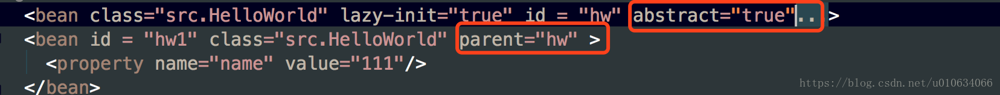

# (转)Spring源码解析(五)Spring 加载bean 依赖注入

在开始这篇文章之前，我们简单回顾一下前面几篇文章的内容

至此，我们分析过后，可以简单的归纳一下Spring IOC容器的过程 
**一、Resource定位过程**；这个Resource定位指的的是BeanDefinition的资源定位，他由ResourceLoader通过统一的Resource接口来完成，这个Resource对各种形式的BeanDefinition的使用都提供了统一接口，对于这些BeanDefinition的存在形式，相信大家都不会感到陌生，比如，在类路径中的Bean定义信息可以使用FileSystemResouce来进行抽象；在类路径中的Bean定义信息可以使用前面提到的ClassPathResource来使用，等待；这个定位过程类似于容器寻找数据的过程，就像用水桶装水先要把水找到一样；

**二、BeanDefinition的载入**，这个载入过程是把用户定义好的Bean表示成IOC容易内部的数据结构，而这个容器内部的数据结构就是BeanDefinition，这个BeanDefinition实际上就是POJO对象在IOC容器中的抽象，通过这个BeanDefinition定义的数据结构，使IOC容器能够方便的对POJO对象也就是bean进行管理，

**三、向IOC容器中注册这些BeanDefinition的过程**。这个过程通过调用BeanDefinitionRegistery接口的实现来完成的;例如DefaultListableBeanFactory就实现了BeanDefinitionRegistry接口，这个注册过程把载入的BeanDefinition向Ioc容器中注册；可以看到，BeanDefinition是载入到了一个ConcurrentHashMap中；

**四、IOC容器的依赖注入**；这个过程一般发生在应用第一次通过getBean方法向容器中索取bean的时候，但是有一个例外需要注意，在Ioc容器中有一个预实例化的配置，也就是lazy-init ；用户可以对容器的初始化过程做一个微小的控制，从而改变这个设置了lazy-init属性的bean的依赖注入过程。 
[Lazy-init是怎么控制加载的](springSourceCode_analysis_9_80299451.md)

那么今天这篇文章我们主要来分析一下,IOC容器是如何将我们的内部数据BeanDefinition加载成我们正在在程序中需要的实例对象的；


### AbstractBeanFactory

代码分析入口:

```java
 public static void main(String[] args){
        ClassPathResource resource = new ClassPathResource("SpringContextConfig.xml");
        DefaultListableBeanFactory factory = new DefaultListableBeanFactory();
        XmlBeanDefinitionReader reader = new XmlBeanDefinitionReader(factory);
        //解析和注册阶段 
        reader.loadBeanDefinitions(resource);
        //这里是加载阶段
        BeanA beanA = (BeanA)factory.getBean("beanA");
        System.out.print("beanA");
    }
```
我们用了最简单的BeanFactory来加载并且分析，像那些更高级的例如WebApplicationContext等容器我们回头再来分析。
加载阶段是在用户第一次调用的时候才会去加载; 
show the code:
```java
    /** 存放所有至少创建过一次 的所有beanName */
    private final Set<String> alreadyCreated =
            Collections.newSetFromMap(new ConcurrentHashMap<String, Boolean>(256));
    /** Map from bean name to merged RootBeanDefinition */
    private final Map<String, RootBeanDefinition> mergedBeanDefinitions =
            new ConcurrentHashMap<String, RootBeanDefinition>(256);

protected <T> T doGetBean(
            final String name, final Class<T> requiredType, final Object[] args, boolean typeCheckOnly)
            throws BeansException {
        /**
        * 1.转换一下beanName，主要是如果有  & 开头的给去掉
        * 2.如果name是别名的话，则this.aliasMap.get(canonicalName)取出beanName
        */
        final String beanName = transformedBeanName(name);
        Object bean;

        //根据beanName得到单例实例化对象，检查单例对象是否实例化并且
        // 在创建单例对象的时候允许提前引用（这个主要是用于解决循环引用；这个回头单独分析TODO...）
        /**
        *根据beanName得到单例实例化对象，检查单例对象是否实例化并且
        * 在创建单例对象的时候允许提前引用
        * spring解决循环引用就是利用三级缓存实现的；
        * 这里会提前返回引用对象的
        */
        Object sharedInstance = getSingleton(beanName);
```
跳转到这个方法去[Object sharedInstance = getSingleton(beanName);](#getSingleton)

```java
        if (sharedInstance != null && args == null) {
            if (logger.isDebugEnabled()) {
                if (isSingletonCurrentlyInCreation(beanName)) {
                    logger.debug("Returning eagerly cached instance of singleton bean '" + beanName +
                            "' that is not fully initialized yet - a consequence of a circular reference");
                }
                else {
                    logger.debug("Returning cached instance of singleton bean '" + beanName + "'");
                }
            }
            /**
            *处理FactoryBean类型的bean;
            *1.不是FactoryBean或者是FactoryBean但是name有前缀& 直接返回sharedInstanc；
            *2.如果是FactoryBean并且name没有前缀& 则返回FactoryBean.getObject()方法生成的对象；
            *  2.1 如果是2的情况，还有执行一下所有BeanPostProcessors类型后置处理器的postProcessAfterInitialization()方法;注意：只执行了这个方法，没有执行postProcessBeforeInitialization方法；
            * 3.关于 BeanPostProcessor 详见 博文https://blog.csdn.net/u010634066/article/details/80289441 
            */
            bean = getObjectForBeanInstance(sharedInstance, name, beanName, null);
        }
    
        else {//如果是第一次创建，或者args!=null ，或者不是单例对象
            //如果我们创建对象失败了，我们很可能在循环引用里面了
            //TODO ....
            if (isPrototypeCurrentlyInCreation(beanName)) {
                throw new BeanCurrentlyInCreationException(beanName);
            }
    
            // 获取父容器 TODO....父子容器可以单独开一篇文章来讲解了；
            BeanFactory parentBeanFactory = getParentBeanFactory();
            //如果父容器存在，并且beanName在当前的容器不存在，那就去父容器查找
            if (parentBeanFactory != null && !containsBeanDefinition(beanName)) {
                // Not found -> check parent.
                /**
                *1.判断beanName 是否存在 & ；如果有的话去掉
                *2.检查是不是别名，如果是别名改成正真的beanName;
                *3.判断如果传进来的带有  &; 则给它重新加上
                */
                String nameToLookup = originalBeanName(name);
                if (args != null) {
                    // 委托父容器调用getBean操作 有参数;
                    return (T) parentBeanFactory.getBean(nameToLookup, args);
                }
                else {
                    // 去父容器调用getBean操作;无参数
                    return parentBeanFactory.getBean(nameToLookup, requiredType);
                }
            }
    
            //这个？？？
            if (!typeCheckOnly) {
                //标记这个bean被创建过 this.alreadyCreated.add(beanName);
                markBeanAsCreated(beanName);
            }
    
            try {
            /*父子BeanDe合并；当给定的bean 是一个childe类型，它还有parent属性；则将parent的属性和childe属性合并一下；*/
                //看下文详细代码
                final RootBeanDefinition mbd = getMergedLocalBeanDefinition(beanName);
                //检查mbd是不是 设置了属性 abstract=true;类似于抽象类，不能去实例化；抛出异常
                checkMergedBeanDefinition(mbd, beanName, args);
    
                // Guarantee initialization of beans that the current bean depends on.
                /**是否有依赖的bean;例如：<bean id = "hw"  class="src.HelloWorld" lazy-init="true"  depends-on="beanA"> ;那么hw必须要在beanA之后实例化*/
                String[] dependsOn = mbd.getDependsOn();
                //注意这里只是  deponse-on 属性的依赖；跟bean内部依赖另外的bean不是一回事
                if (dependsOn != null) {
                    for (String dep : dependsOn) {
```
[跳转到isDependent](#isDependent)
```java
                    /**
                    *1.检查是否有循环依赖；例如：<bean id = "hw"  class="src.HelloWorld" lazy-init="true"  depends-on="beanA">这个hw依赖了 beanA
    然后beanA又依赖了hw；<bean id="beanA" class="src.lookupmethods.BeanA" depends-on="hw">这样就会抛出异常
                    */
                        if (isDependent(beanName, dep)) {
                            throw new BeanCreationException(mbd.getResourceDescription(), beanName,
                                    "Circular depends-on relationship between '" + beanName + "' and '" + dep + "'");
                        }
                        /**
                        *例子:<bean id = "hw"  class="src.HelloWorld" lazy-init="true"  depends-on="beanA">
                        *1.标记依赖bean；这里面做了两件事情；
                        *2.第一件是 this.dependentBeanMap.put(canonicalName, dependentBeans);这个dependentBeanMap表示的是 某个bean被哪些bean给依赖了;在上面的配置中；dependentBeanMap存了一个 key为beanA；value为 （Set<String>中有个hw；存了所有需要依赖beanA的beanName）
                        *3.第二件事是this.dependenciesForBeanMap.put(dependentBeanName, dependenciesForBean);
                        *这个跟2.想反，这个存的是hw需要依赖的所有beanName
                        */
                        registerDependentBean(dep, beanName);
                        //依赖注入！！！有依赖的情况，递归调用被依赖的beanName(这里是 去get beanA)
                        getBean(dep);
                    }
                }
```
跳转到[getSingleton(beanName, new ObjectFactory)](#getSingleton2)方法<br/>
跳转到[createBean](#createBean)方法
```java
                // 如果创建单例对象.
                if (mbd.isSingleton()) {
                    sharedInstance = getSingleton(beanName, new ObjectFactory<Object>() {
                        @Override
                        public Object getObject() throws BeansException {
                            try {
                                return createBean(beanName, mbd, args);
    
                            }
                            catch (BeansException ex) {
                                // Explicitly remove instance from singleton cache: It might have been put there
                                // eagerly by the creation process, to allow for circular reference resolution.
                                // Also remove any beans that received a temporary reference to the bean.
                                destroySingleton(beanName);
                                throw ex;
                            }
                        }
                    });
    
                    /**
            *处理FactoryBean类型的bean;
            *1.不是FactoryBean或者是FactoryBean但是name有前缀& 直接返回sharedInstanc；
            *2.如果是FactoryBean并且name没有前缀& 则返回FactoryBean.getObject()方法生成的对象；
            *  2.1 如果是2的情况，还有执行一下所有BeanPostProcessors类型后置处理器的postProcessAfterInitialization()方法;注意：只执行了这个方法，没有执行postProcessBeforeInitialization方法；
            * 3.关于 BeanPostProcessor 详见 博文https://blog.csdn.net/u010634066/article/details/80289441 
            */
                    bean = getObjectForBeanInstance(sharedInstance, name, beanName, mbd);
                }
    
                else if (mbd.isPrototype()) {
                    // It's a prototype -> create a new instance.
                    Object prototypeInstance = null;
                    try {
                        beforePrototypeCreation(beanName);
                        prototypeInstance = createBean(beanName, mbd, args);
                    }
                    finally {
                        afterPrototypeCreation(beanName);
                    }
                    bean = getObjectForBeanInstance(prototypeInstance, name, beanName, mbd);
                }
    
                else {
                    String scopeName = mbd.getScope();
                    final Scope scope = this.scopes.get(scopeName);
                    if (scope == null) {
                        throw new IllegalStateException("No Scope registered for scope name '" + scopeName + "'");
                    }
                    try {
                        Object scopedInstance = scope.get(beanName, new ObjectFactory<Object>() {
                            @Override
                            public Object getObject() throws BeansException {
                                beforePrototypeCreation(beanName);
                                try {
                                    return createBean(beanName, mbd, args);
                                }
                                finally {
                                    afterPrototypeCreation(beanName);
                                }
                            }
                        });
                        bean = getObjectForBeanInstance(scopedInstance, name, beanName, mbd);
                    }
                    catch (IllegalStateException ex) {
                        throw new BeanCreationException(beanName,
                                "Scope '" + scopeName + "' is not active for the current thread; consider " +
                                "defining a scoped proxy for this bean if you intend to refer to it from a singleton",
                                ex);
                    }
                }
            }
            catch (BeansException ex) {
                cleanupAfterBeanCreationFailure(beanName);
                throw ex;
            }
        }
    
        // Check if required type matches the type of the actual bean instance.
        if (requiredType != null && bean != null && !requiredType.isAssignableFrom(bean.getClass())) {
            try {
                return getTypeConverter().convertIfNecessary(bean, requiredType);
            }
            catch (TypeMismatchException ex) {
                if (logger.isDebugEnabled()) {
                    logger.debug("Failed to convert bean '" + name + "' to required type '" +
                            ClassUtils.getQualifiedName(requiredType) + "'", ex);
                }
                throw new BeanNotOfRequiredTypeException(name, requiredType, bean.getClass());
            }
        }
        return (T) bean;
    }
```

### getMergedBeanDefinition

> 当给定的bean 是一个childe类型，它还有parent；则将parent的属性和childe属性合并一下； 
> 例如:下图。hw1会继承hw的所有属性;
>
> 

```java
    /** 合并 RootBeanDefinition ；xml中，配置了 parent属性需要合并；详细parent怎么使用，看文末总结部分    */
    private final Map<String, RootBeanDefinition> mergedBeanDefinitions =
            new ConcurrentHashMap<String, RootBeanDefinition>(256);
    /** Whether to cache bean metadata or rather reobtain it for every access */
    private boolean cacheBeanMetadata = true;
/**
     * Return a RootBeanDefinition for the given bean, by merging with the
     * parent if the given bean's definition is a child bean definition.
     * @param beanName the name of the bean definition
     * @param bd the original bean definition (Root/ChildBeanDefinition)
     * @param containingBd the containing bean definition in case of inner bean,
     * or {@code null} in case of a top-level bean
     * @return a (potentially merged) RootBeanDefinition for the given bean
     * @throws BeanDefinitionStoreException in case of an invalid bean definition
     */
    protected RootBeanDefinition getMergedBeanDefinition(
            String beanName, BeanDefinition bd, BeanDefinition containingBd)
            throws BeanDefinitionStoreException {

        synchronized (this.mergedBeanDefinitions) {
            RootBeanDefinition mbd = null;
    
            // Check with full lock now in order to enforce the same merged instance.
            if (containingBd == null) {
                mbd = this.mergedBeanDefinitions.get(beanName);
            }
    
            if (mbd == null) {//如果之前没有合并过
                //如果没有配置parent属性
                if (bd.getParentName() == null) {
                    // Use copy of given root bean definition.
                    //什么情况下BeanDefinition是 RootBeanDefinition类型的？TODO....
                    if (bd instanceof RootBeanDefinition) {
                        //克隆新的实例
                        mbd = ((RootBeanDefinition) bd).cloneBeanDefinition();
                    }
                    else {
                        mbd = new RootBeanDefinition(bd);
                    }
                }
                else {//如果有设置parent属性；例如<bean id = "hw1" class="src.HelloWorld" parent="hw" >
                    // Child bean definition: needs to be merged with parent.
                    BeanDefinition pbd;
                    try {
                        String parentBeanName = transformedBeanName(bd.getParentName());
                        //根据父beanName获取父类的BeanDefinition；如果父类还有父类会递归调用
                        if (!beanName.equals(parentBeanName)) {
                            pbd = getMergedBeanDefinition(parentBeanName);
                        }
                        else {//我不知道什么时候会出现这种情况？？父beanName和当前bean相等的情况存在吗？
                            BeanFactory parent = getParentBeanFactory();
                            if (parent instanceof ConfigurableBeanFactory) {
                                pbd = ((ConfigurableBeanFactory) parent).getMergedBeanDefinition(parentBeanName);
                            }
                            else {
                                throw new NoSuchBeanDefinitionException(parentBeanName,
                                        "Parent name '" + parentBeanName + "' is equal to bean name '" + beanName +
                                        "': cannot be resolved without an AbstractBeanFactory parent");
                            }
                        }
                    }
                    catch (NoSuchBeanDefinitionException ex) {
                        throw new BeanDefinitionStoreException(bd.getResourceDescription(), beanName,
                                "Could not resolve parent bean definition '" + bd.getParentName() + "'", ex);
                    }
                    // Deep copy with overridden values.
                    //先根据父BeanDefinition创建ROOBeanDefinition
                    mbd = new RootBeanDefinition(pbd);
                    //然后将子BeanDefinition所有已经配置的数据覆盖父类的；那么就达到了合并的目的
                    mbd.overrideFrom(bd);
                }
    
                // 如果没有设置作用域 默认Singleton
                if (!StringUtils.hasLength(mbd.getScope())) {
                    mbd.setScope(RootBeanDefinition.SCOPE_SINGLETON);
                }
    
                // A bean contained in a non-singleton bean cannot be a singleton itself.
                // Let's correct this on the fly here, since this might be the result of
                // parent-child merging for the outer bean, in which case the original inner bean
                // definition will not have inherited the merged outer bean's singleton status.
                //一个bean中包含了一个非单例的bean，则它本身就不能够是单例的，下面的代码就是矫正它的左右域；
                if (containingBd != null && !containingBd.isSingleton() && mbd.isSingleton()) {
                    mbd.setScope(containingBd.getScope());
                }
    
                // Cache the merged bean definition for the time being
                // (it might still get re-merged later on in order to pick up metadata changes)
                //缓存合并之后的BeanDefinition； 为了支持metadata的更改，它之后可能仍然会重新合并 
                if (containingBd == null && isCacheBeanMetadata()) {
                    this.mergedBeanDefinitions.put(beanName, mbd);
                }
            }
    
            return mbd;
        }
    }
```

### DefaultSingletonBeanRegistry

> TODO

getSingleton
```java
/** 当前正在创建的bean; */
private final Set<String> singletonsCurrentlyInCreation =
            Collections.newSetFromMap(new ConcurrentHashMap<String, Boolean>(16));
/*************************下面是三级缓存，Spring也是利用他们解决循环引用的问题的********************/           
/** Cache of early singleton objects: bean name --> bean instance */
/** 提前暴光的单例对象的Cache  */
private final Map<String, Object> earlySingletonObjects = new HashMap<String, Object>(16);
/** Cache of singleton factories: bean name --> ObjectFactory */
/** 单例对象工厂的cache */
private final Map<String, ObjectFactory<?>> singletonFactories = new HashMap<String, ObjectFactory<?>>(16);
/** 单例对象的cache */
private final Map<String, Object> singletonObjects = new ConcurrentHashMap<String, Object>(256);

/** Flag that indicates whether we're currently within destroySingletons */
//是否正在销毁单例对象的标志；
private boolean singletonsCurrentlyInDestruction = false;

/** Names of beans that are currently in creation */
//所有正在创建的单例beanName集合
private final Set<String> singletonsCurrentlyInCreation =
            Collections.newSetFromMap(new ConcurrentHashMap<String, Boolean>(16));
/** Names of beans currently excluded from in creation checks */
//不需要检查的集合
private final Set<String> inCreationCheckExclusions =
            Collections.newSetFromMap(new ConcurrentHashMap<String, Boolean>(16));
```
<span id="getSingleton">跳转到这里： getSingleton(String beanName, boolean allowEarlyReference)</span>
```java
//根据beanName得到单例实例化对象，检查单例对象是否实例化并且
// 在创建单例对象的时候允许提前引用（这个主要是用于解决循环引用；）
protected Object getSingleton(String beanName, boolean allowEarlyReference) {
        Object singletonObject = this.singletonObjects.get(beanName);
        //如果单例对象还没有创建 并且 当前对象正在创建中；一级缓存不存在，再查二级缓存
        if (singletonObject == null && isSingletonCurrentlyInCreation(beanName)) {
            synchronized (this.singletonObjects) {

                //查二级缓存是否存在，设置二级缓存的地方在下面；如果存在直接返回
                //如果不存在并且允许提前引用；再去查三级缓存；
                singletonObject = this.earlySingletonObjects.get(beanName);
                if (singletonObject == null && allowEarlyReference) {
                    ObjectFactory<?> singletonFactory = this.singletonFactories.get(beanName);
                    //如果有三级缓存
                    if (singletonFactory != null) {
```
导航到[getEarlyBeanReference](#getEarlyBeanReference)
```java
                        //调用getEarlyBeanReference(beanName, mbd, bean);
                        singletonObject = singletonFactory.getObject();
                        //将三级缓存得到的实例存放到二级缓存；并且删除三级缓存；
                        //三级缓存的地方在 addSingletonFactory；
                        this.earlySingletonObjects.put(beanName, singletonObject);
                        this.singletonFactories.remove(beanName);
                    }
                }
            }
        }
        //返回创建的单例对象，如果还没有开始创建则返回NULL
        return (singletonObject != NULL_OBJECT ? singletonObject : null);
    }
```
<span id="getSingleton2"></span>
```java
/**
*1.返回单例对象
*2.
*/
public Object getSingleton(String beanName, ObjectFactory<?> singletonFactory) {
        Assert.notNull(beanName, "'beanName' must not be null");
        synchronized (this.singletonObjects) {
            Object singletonObject = this.singletonObjects.get(beanName);
            if (singletonObject == null) {
                //如果正在销毁单例对象则抛出异常；不能继续创建单例对象
                if (this.singletonsCurrentlyInDestruction) {
                    throw new BeanCreationNotAllowedException(beanName,
                            "Singleton bean creation not allowed while singletons of this factory are in destruction " +
                            "(Do not request a bean from a BeanFactory in a destroy method implementation!)");
                }
                if (logger.isDebugEnabled()) {
                    logger.debug("Creating shared instance of singleton bean '" + beanName + "'");
                }
                /**创建之前的一些操作；
                *1.将beanName放到singletonsCurrentlyInCreation集合中，表面这个bean正在创建中；
                *2.如果放进去失败，因为singletonsCurrentlyInCreation是个set；如果bean已经存在了，那add操作会返回false；如果放入失败了，并且inCreationCheckExclusions里面不包含这个bean(说明需要检查)；则抛出一个异常；
                */
                beforeSingletonCreation(beanName);
                boolean newSingleton = false;
                boolean recordSuppressedExceptions = (this.suppressedExceptions == null);
                if (recordSuppressedExceptions) {
                    this.suppressedExceptions = new LinkedHashSet<Exception>();
                }
                try {
                    /**
                    *调用getObject()方法；
                    *singletonFactory是一个接口，这里就要看传进来的实例是哪个了；我们分析的情况最终是调用了
                    *AbstractAutowireCapableBeanFactory的createBean方法
                    *这个createBean方法简要：
                    *1.RootBeanDefinition mbdToUse = mbd； 创建一个mbdTOUse指向mbd
                    *2.如果mbd的BeanClass没有被设置，则去获取bean对象的Class 类型resolvedClass;然后mbdToUse = new RootBeanDefinition(mbd)创建一个新的对象，这里是深度拷贝；然后新的对象setBeanClass(resolvedClass);
                    *3.准备overides数据；在之前第四篇的时候也调用过得方法prepareMethodOverrides()（https://blog.csdn.net/u010634066/article/details/80226375）
                    如果配置中有look-up 或者 replaced-method属性，则bd中就会有LookupOverride、ReplaceOverride属性，这里就是对这些Overrid做一些验证个处理的;
                    如果这个Class中；存在的方法对应方法数量是0个；抛出异常；如果是1个；则
                    // Mark override as not overloaded, to avoid the overhead of arg type checking.
                    //标记这个mo不是 重载，而是覆盖；避免参数类型检查的开销。这个参数默认是true
                    mo.setOverloaded(false);
                    */

                    singletonObject = singletonFactory.getObject();
                    newSingleton = true;
                }
                catch (IllegalStateException ex) {
                    // Has the singleton object implicitly appeared in the meantime ->
                    // if yes, proceed with it since the exception indicates that state.
                    singletonObject = this.singletonObjects.get(beanName);
                    if (singletonObject == null) {
                        throw ex;
                    }
                }
                catch (BeanCreationException ex) {
                    if (recordSuppressedExceptions) {
                        for (Exception suppressedException : this.suppressedExceptions) {
                            ex.addRelatedCause(suppressedException);
                        }
                    }
                    throw ex;
                }
                finally {
                    if (recordSuppressedExceptions) {
                        this.suppressedExceptions = null;
                    }
                    //结束创建bean;this.singletonsCurrentlyInCreation.remove(beanName)
                    afterSingletonCreation(beanName);
                }
                if (newSingleton) {
                    //如果是一个新的实例；则把这个实例放入到一级缓存singletonObjects中
                    //然后把二级，三级缓存都删除掉
                    //this.singletonObjects.put(beanName, (singletonObject != null ? singletonObject : NULL_OBJECT));
                   //this.singletonFactories.remove(beanName);
                   //this.earlySingletonObjects.remove(beanName);
                   //this.registeredSingletons.add(beanName);
                    addSingleton(beanName, singletonObject);
                }
            }
            return (singletonObject != NULL_OBJECT ? singletonObject : null);
        }
    }
```
<span id="isDependent"></span>
```java
/**
*1.检查是否有循环依赖；例如：<bean id = "hw"  class="src.HelloWorld" lazy-init="true"  depends-on="beanA">这个hw依赖了 beanA
    然后beanA又依赖了hw；<bean id="beanA" class="src.lookupmethods.BeanA" depends-on="hw">这样就会抛出异常
*2.
*/
private boolean isDependent(String beanName, String dependentBeanName, Set<String> alreadySeen) {
        //如果beanName已经检查过了就直接返回；
        if (alreadySeen != null && alreadySeen.contains(beanName)) {
            return false;
        }
        String canonicalName = canonicalName(beanName);
        //dependentBeanMap 保存的是 beanName 的所有依赖 的beanName；它是一个Map<String, Set<String>>
        Set<String> dependentBeans = this.dependentBeanMap.get(canonicalName);
        if (dependentBeans == null) {
            return false;
        }
        if (dependentBeans.contains(dependentBeanName)) {
            return true;
        }
        for (String transitiveDependency : dependentBeans) {
            if (alreadySeen == null) {
                alreadySeen = new HashSet<String>();
            }
            alreadySeen.add(beanName);
            if (isDependent(transitiveDependency, dependentBeanName, alreadySeen)) {
                return true;
            }
        }
        return false;
    }
```

```java
//设置二级缓存，删除三级缓存
protected void addSingletonFactory(String beanName, ObjectFactory<?> singletonFactory) {
        Assert.notNull(singletonFactory, "Singleton factory must not be null");
        synchronized (this.singletonObjects) {
            if (!this.singletonObjects.containsKey(beanName)) {
                this.singletonFactories.put(beanName, singletonFactory);
                this.earlySingletonObjects.remove(beanName);
                this.registeredSingletons.add(beanName);
            }
        }
    }
```

### AbstractAutowireCapableBeanFactory

> 一个抽象类，继承了AbstractBeanFactory;创建对象实例在这个类里面;

<span id="createBean"></span>
```java
/** Cache of unfinished FactoryBean instances: FactoryBean name --> BeanWrapper */
    private final Map<String, BeanWrapper> factoryBeanInstanceCache =
            new ConcurrentHashMap<String, BeanWrapper>(16);
    /**
     * 这个类的核心方法：创建bean的实例；
     * 填充bean的实例，以及后置处理器等待；
     * populates the bean instance, applies post-processors, etc.
     * @see #doCreateBean
     */
    @Override
    protected Object createBean(String beanName, RootBeanDefinition mbd, Object[] args) throws BeanCreationException {
        if (logger.isDebugEnabled()) {
            logger.debug("Creating instance of bean '" + beanName + "'");
        }
        RootBeanDefinition mbdToUse = mbd;
        Class<?> resolvedClass = resolveBeanClass(mbd, beanName);
        //这里主要就是填充一下BeanClass属性
        if (resolvedClass != null && !mbd.hasBeanClass() && mbd.getBeanClassName() != null) {
            mbdToUse = new RootBeanDefinition(mbd);
            mbdToUse.setBeanClass(resolvedClass);
        }

/**
*准备overides数据；
*在之前第四篇的时候也调用过得方法prepareMethodOverrides(（https://blog.csdn.net/u010634066/article/details/80226375）
*如果配置中有look-up 或者 replaced-method属性，则bd中就会有LookupOverride、ReplaceOverride属性，这里就是对这些Overrid做一些验证个处理的;
*如果这个Class中；存在的方法对应方法数量是0个；抛出异常；如果是1个；则
* Mark override as not overloaded, to avoid the overhead of arg type checking.
*标记这个mo不是 重载，而是覆盖；避免参数类型检查的开销。这个参数默认是true
            mo.setOverloaded(false);
*之所以这样做；是因为这个方法就是要被Spring重写的；
*例子：抽象类BeanA中定义一个抽象方法 public abstract BeanB getBeanB() ;
*然后Spring中配置 
* <bean id="beanA" class="src.lookupmethods.BeanA" >
    <!-- 表示将由Spring重写getBeanB()方法，并返回名为beanB的bean -->
    <lookup-method name="getBeanB" bean="beanB"/>
  </bean>
  看到了吧;最终是要被Spring重写的，所以这里要标记一下；等之后再来重写；那是怎么重写的呢？
* 我们打个TODO.... 等以后分析  
*/
        try {
            mbdToUse.prepareMethodOverrides();
        }
        catch (BeanDefinitionValidationException ex) {
            throw new BeanDefinitionStoreException(mbdToUse.getResourceDescription(),
                    beanName, "Validation of method overrides failed", ex);
        }

        try {
            // 给 BeanPostProcessors 一个机会返回一个代理对象;主要调用的是接口InstantiationAwareBeanPostProcessor里面的方法;
            //详解请看博文：https://blog.csdn.net/u010634066/article/details/80321854#resolveBeforeInstantiation
            Object bean = resolveBeforeInstantiation(beanName, mbdToUse);
            //如果这里不为null；说明上面的后置处理器生成了一个代理对象直接返回，就不用在走后面的流程了，不用doCreateBean来实例化对象
            if (bean != null) {
                return bean;
            }
        }
        catch (Throwable ex) {
            throw new BeanCreationException(mbdToUse.getResourceDescription(), beanName,
                    "BeanPostProcessor before instantiation of bean failed", ex);
        }
        //
        Object beanInstance = doCreateBean(beanName, mbdToUse, args);
        if (logger.isDebugEnabled()) {
            logger.debug("Finished creating instance of bean '" + beanName + "'");
        }
        return beanInstance;
    }

/**
     * 这里是真正实例化一个指定的bean. 在实例化之前的一些操作已经执行过了，例如上面resolveBeforeInstantiation方法就是执行实例化之前的一些操作；（就是postProcessBeforeInstantiation的回调方法执行的） 
     * <p>Differentiates between default bean instantiation, use of a
     * factory method, and autowiring a constructor.
     * @param beanName the name of the bean
     * @param mbd the merged bean definition for the bean
     * @param args explicit arguments to use for constructor or factory method invocation
     * @return a new instance of the bean
     * @throws BeanCreationException if the bean could not be created
     * @see #instantiateBean
     * @see #instantiateUsingFactoryMethod
     * @see #autowireConstructor
     */
    protected Object doCreateBean(final String beanName, final RootBeanDefinition mbd, final Object[] args)
            throws BeanCreationException {

        // Instantiate the bean.
        BeanWrapper instanceWrapper = null;
        if (mbd.isSingleton()) {
            //factoryBeanInstanceCache是缓存未完成的FactoryBean的实例对象的;
            instanceWrapper = this.factoryBeanInstanceCache.remove(beanName);
        }
        if (instanceWrapper == null) {
            /**
            *为指定的bean创建一个新的实例,使用一个合适的实例化策略:工厂方法,构造函数自动装配,或者简单的实例化
            *返回的是一个BeanWrapper包装类;
            *TODO....逐个分析一下不同情况的实例化策略
            */
            instanceWrapper = createBeanInstance(beanName, mbd, args);
        }
        //得到生成的实例；如果是cglib生成的，则是代理类；
        //例如我调试的时候生成的就是src.lookupmethods.BeanA$$EnhancerBySpringCGLIB$$446a9fa@50eac852
        //这是一个BeanA子类的实例对象,它主要是覆盖了BeanA中的某些方法；例如我们这里BeanA中有一个没有实现的抽象方法getBeanB();
        //既然是cglib生成的,所以注意getBeanB不能是final的；
        final Object bean = (instanceWrapper != null ? instanceWrapper.getWrappedInstance() : null);
        //src.lookupmethods.BeanA$$EnhancerBySpringCGLIB$$446a9fa@50eac852
        Class<?> beanType = (instanceWrapper != null ? instanceWrapper.getWrappedClass() : null);
        mbd.resolvedTargetType = beanType;
    
        // 允许 post-processors 修改 merged bean definition.
        synchronized (mbd.postProcessingLock) {
            //判断 PostProcessor后置处理器 是否被执行过
            if (!mbd.postProcessed) {
                try {
                    //修改一下 合并的BeanDefinition；后置处理器之类的已经分析过了，这个就不分析了
                    applyMergedBeanDefinitionPostProcessors(mbd, beanType, beanName);
                }
                catch (Throwable ex) {
                    throw new BeanCreationException(mbd.getResourceDescription(), beanName,
                            "Post-processing of merged bean definition failed", ex);
                }
                mbd.postProcessed = true;
            }
        }
    
        // Eagerly cache singletons to be able to resolve circular references
        // even when triggered by lifecycle interfaces like BeanFactoryAware.
        /**
        *1.提前暴露实例化的引用；主要是解决循环引用
        *2.判断是单例对象&&允许循环引用&&已经开始创建单例对象了
        *  2.1 allowCircularReferences是默认为true的;ApplicationContext有个customizeBeanFactory(beanFactory);可以设置；
        *3.在什么时候开始标志创建单例对象的？
        *在调用getSingleton方法的时候beforeSingletonCreation(beanName);标识了创建已经开始
        */
        boolean earlySingletonExposure = (mbd.isSingleton() && this.allowCircularReferences &&
                isSingletonCurrentlyInCreation(beanName));
        if (earlySingletonExposure) {
            if (logger.isDebugEnabled()) {
                logger.debug("Eagerly caching bean '" + beanName +
                        "' to allow for resolving potential circular references");
            }
            /**
            *这里主要做了三件事情
            *1.this.singletonFactories.put(beanName, singletonFactory);
            *singletonFactories相当于是三级缓存()；这个保存进来的singletonFactory是一个接口；它实现了getEarlyBeanReference(beanName, mbd, bean);
            *等以后从三级缓存获取实例的时候是调用了getEarlyBeanReference(beanName, mbd, bean);
            *3.this.registeredSingletons.add(beanName);将这个bean加入到已注册集合
            */
```
<span id="getEarlyBeanReference">锚点：</span>
```java
            addSingletonFactory(beanName, new ObjectFactory<Object>() {
                @Override
                public Object getObject() throws BeansException {
    
                    //获取提前暴露引用 https://blog.csdn.net/u010634066/article/details/80348253
                    return getEarlyBeanReference(beanName, mbd, bean);
                }
            });
        }
    
        // Initialize the bean instance.
        Object exposedObject = bean;
        try {
            //填充BeanTODO.....单独分析
            populateBean(beanName, mbd, instanceWrapper);
            if (exposedObject != null) {
                exposedObject = initializeBean(beanName, exposedObject, mbd);
            }
        }
        catch (Throwable ex) {
            if (ex instanceof BeanCreationException && beanName.equals(((BeanCreationException) ex).getBeanName())) {
                throw (BeanCreationException) ex;
            }
            else {
                throw new BeanCreationException(
                        mbd.getResourceDescription(), beanName, "Initialization of bean failed", ex);
            }
        }
    
        if (earlySingletonExposure) {
            Object earlySingletonReference = getSingleton(beanName, false);
            if (earlySingletonReference != null) {
                if (exposedObject == bean) {
                    exposedObject = earlySingletonReference;
                }
                else if (!this.allowRawInjectionDespiteWrapping && hasDependentBean(beanName)) {
                    String[] dependentBeans = getDependentBeans(beanName);
                    Set<String> actualDependentBeans = new LinkedHashSet<String>(dependentBeans.length);
                    for (String dependentBean : dependentBeans) {
                        if (!removeSingletonIfCreatedForTypeCheckOnly(dependentBean)) {
                            actualDependentBeans.add(dependentBean);
                        }
                    }
                    if (!actualDependentBeans.isEmpty()) {
                        throw new BeanCurrentlyInCreationException(beanName,
                                "Bean with name '" + beanName + "' has been injected into other beans [" +
                                StringUtils.collectionToCommaDelimitedString(actualDependentBeans) +
                                "] in its raw version as part of a circular reference, but has eventually been " +
                                "wrapped. This means that said other beans do not use the final version of the " +
                                "bean. This is often the result of over-eager type matching - consider using " +
                                "'getBeanNamesOfType' with the 'allowEagerInit' flag turned off, for example.");
                    }
                }
            }
        }
    
        // Register bean as disposable.
        try {
            registerDisposableBeanIfNecessary(beanName, bean, mbd);
        }
        catch (BeanDefinitionValidationException ex) {
            throw new BeanCreationException(
                    mbd.getResourceDescription(), beanName, "Invalid destruction signature", ex);
        }
    
        return exposedObject;
    }


    /**
     * 为指定的bean创建一个新的实例,使用一个合适的实例化策略:工厂方法,构造函数自动装配,或者简单的实例化
     * @param args 显示的参数供给 构造函数 工厂方法调用
     */
    protected BeanWrapper createBeanInstance(String beanName, RootBeanDefinition mbd, Object[] args) {
        // Make sure bean class is actually resolved at this point.
        Class<?> beanClass = resolveBeanClass(mbd, beanName);
    
        if (beanClass != null && !Modifier.isPublic(beanClass.getModifiers()) && !mbd.isNonPublicAccessAllowed()) {
            throw new BeanCreationException(mbd.getResourceDescription(), beanName,
                    "Bean class isn't public, and non-public access not allowed: " + beanClass.getName());
        }
        //如果配置了 factory-method 则用工厂方法去生成对象
        if (mbd.getFactoryMethodName() != null)  {
            return instantiateUsingFactoryMethod(beanName, mbd, args);
        }
    
        // Shortcut when re-creating the same bean...
        boolean resolved = false;
        boolean autowireNecessary = false;
        if (args == null) {
            synchronized (mbd.constructorArgumentLock) {
                if (mbd.resolvedConstructorOrFactoryMethod != null) {
                    resolved = true;
                    autowireNecessary = mbd.constructorArgumentsResolved;
                }
            }
        }
        if (resolved) {
            if (autowireNecessary) {
                //TODO ...单独分析
                return autowireConstructor(beanName, mbd, null, null);
            }
            else {
                return instantiateBean(beanName, mbd);
            }
        }
    
        // Need to determine the constructor...
        //TODO... BeanPostProcessor接口单独分析
        Constructor<?>[] ctors = determineConstructorsFromBeanPostProcessors(beanClass, beanName);
        if (ctors != null ||
                mbd.getResolvedAutowireMode() == RootBeanDefinition.AUTOWIRE_CONSTRUCTOR ||
                mbd.hasConstructorArgumentValues() || !ObjectUtils.isEmpty(args))  {
            return autowireConstructor(beanName, mbd, ctors, args);
        }
    
        // No special handling: simply use no-arg constructor.
        /**
        *使用默认的构造方法实例化对象
        *TODO..总结
        */
        return instantiateBean(beanName, mbd);
    }
    //使用默认的构造函数实例化bean；并且返回一个bean的包装类
protected BeanWrapper instantiateBean(final String beanName, final RootBeanDefinition mbd) {
        try {
            Object beanInstance;
            final BeanFactory parent = this;
            if (System.getSecurityManager() != null) {
                beanInstance = AccessController.doPrivileged(new PrivilegedAction<Object>() {
                    @Override
                    public Object run() {
                        return getInstantiationStrategy().instantiate(mbd, beanName, parent);
                    }
                }, getAccessControlContext());
            }
            else {
                /**
                * 默认使用的策略是Cglib；CglibSubclassingInstantiationStrategy();
                * 1. 判断是否设置lookup-method 或者replace-method，如果设置了则用Cglib策略实例化对象；
                *2. 如果都没有设置，则利用默认的构造函数 反射生成实例化对象； 里面调用了 ctor.newInstance(args);
                */
                beanInstance = getInstantiationStrategy().instantiate(mbd, beanName, parent);
            }
            //不分析
            BeanWrapper bw = new BeanWrapperImpl(beanInstance);
            initBeanWrapper(bw);
            return bw;
        }
        catch (Throwable ex) {
            throw new BeanCreationException(
                    mbd.getResourceDescription(), beanName, "Instantiation of bean failed", ex);
        }
    }
```

### SimpleInstantiationStrategy

> 简单 实例化策略类；

默认实例化对象实现: 
1. 判断是否设置lookup-method 或者replace-method，如果设置了则用Cglib策略实例化对象； 
2. 如果都没有设置，则利用默认的构造函数 反射生成实例化对象； 里面调用了 ctor.newInstance(args);

```java
@Override
    public Object instantiate(RootBeanDefinition bd, String beanName, BeanFactory owner) {
        // bd的MethodOverrides属性，只有在设置了 lookup-method replace-method的时候才会有；
        //这里是在没有设置这两个属性的情况下 就用反射来实例化对象
        if (bd.getMethodOverrides().isEmpty()) {
            Constructor<?> constructorToUse;
            synchronized (bd.constructorArgumentLock) {
                constructorToUse = (Constructor<?>) bd.resolvedConstructorOrFactoryMethod;
                if (constructorToUse == null) {
                    final Class<?> clazz = bd.getBeanClass();
                    if (clazz.isInterface()) {
                        throw new BeanInstantiationException(clazz, "Specified class is an interface");
                    }
                    try {
                        if (System.getSecurityManager() != null) {
                            constructorToUse = AccessController.doPrivileged(new PrivilegedExceptionAction<Constructor<?>>() {
                                @Override
                                public Constructor<?> run() throws Exception {
                                    return clazz.getDeclaredConstructor((Class[]) null);
                                }
                            });
                        }
                        else {
                            //获取默认的构造函数
                            constructorToUse =  clazz.getDeclaredConstructor((Class[]) null);
                        }
                        //resolvedConstructorOrFactoryMethod字段保存的是使用哪个构造器生成实例化的或者是使用工厂方法生成实例化的；
                        bd.resolvedConstructorOrFactoryMethod = constructorToUse;
                    }
                    catch (Throwable ex) {
                        throw new BeanInstantiationException(clazz, "No default constructor found", ex);
                    }
                }
            }
            //利用默认的构造函数 反射生成实例化对象 里面调用了 ctor.newInstance(args);
            return BeanUtils.instantiateClass(constructorToUse);
        }
        else {
            // 如果配置了lookup-method or replace-method ；
            //1.利用CGlib调用enhancer.createClass()生成了子类Class类型
            //2.通过生成的Class类型；调用BeanUtils.instantiateClass(subclass)反射生成实例对象instance
            //(Factory) instance.setCallbacks(new Callback[] {NoOp.INSTANCE,
            //      new LookupOverrideMethodInterceptor(this.beanDefinition, this.owner),
            //      new ReplaceOverrideMethodInterceptor(this.beanDefinition, this.owner)});
            return instantiateWithMethodInjection(bd, beanName, owner);
        }
    }
```

## 分析文章引出的一些问题

### Spring如何解决循环引用的问题？

这篇博文讲的很清楚了，我就不单独分析了 
[Spring 三级缓存解决循环引用](https://blog.csdn.net/u010853261/article/details/77940767)

### Spring 配置中的parent、abstract作用？

[Spring 配置中的parent、abstract作用](https://blog.csdn.net/changqing5818/article/details/58643191)

### dependsOn的用法？

首先要了解depends-on用来表示一个bean A的实例化依靠另一个bean B的实例化， 但是A并不需要持有一个B的对象，如果需要的话就不用depends-on，直接用依赖注入就可以了。 
[dependsOn用法](https://blog.csdn.net/Jintao_Ma/article/details/51088867)

### factory-method用法

[Spring 通过工厂方法(Factory Method)来配置bean](https://blog.csdn.net/nvd11/article/details/51542360)

### autowireConstructor
```java
//TODO ...单独分析
return autowireConstructor(beanName, mbd, null, null);
```

### BeanPostProcessor接口

[Spring源码分析 扩展接口BeanPostProcessors](springSourceCode_analysis_7_80289441.md)

### determineConstructorsFromBeanPostProcessors
```java
Constructor<?>[] ctors = determineConstructorsFromBeanPostProcessors(beanClass, beanName);
```
### 单独分析实例化策略

### populateBean分析

```java
populateBean(beanName, mbd, instanceWrapper)
```