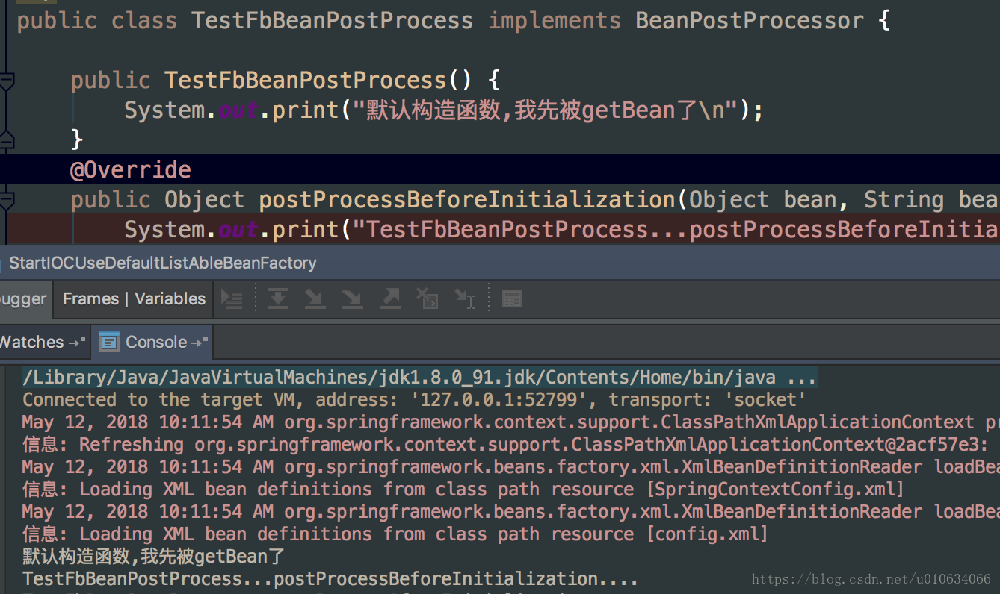

# (转)Spring源码分析(七)扩展接口BeanPostProcessors源码分析

BeanPostProcessors在spring中是一个非常重要的扩展接口，它使得我们可以在创建bean实例的前后做一些自己的处理;接下来我们就从源码层面来分析一下它是如何发挥作用的；

## 一、bean的生成过程


## 二、BeanPostProcessors简要说明
我们看下BeanPostProcessors的接口
```java
public interface BeanPostProcessor {
    //在初始化之前调用
    Object postProcessBeforeInitialization(Object bean, String beanName) throws BeansException;
    //在初始化之后调用
    Object postProcessAfterInitialization(Object bean, String beanName) throws BeansException;

}
```
如果这个接口的某个实现类被注册到某个容器，那么该容器的每个Bean在调用初始化方法之前，都会获得该接口实现类的一个回调。容器调用接口定义的方法时会将该受管Bean的实例和名字通过参数传入方法，进过处理后通过方法的返回值返回给容器。也就是回调了 **postProcessBeforeInitialization** 方法

要使用BeanPostProcessor回调，就必须先在容器中注册实现该接口的类，那么如何注册呢？BeanFactory和ApplicationContext容器的注册方式不大一样：若使用BeanFactory，则必须要显示的调用其addBeanPostProcessor()方法进行注册，参数为BeanPostProcessor实现类的实例；如果是使用ApplicationContext，那么容器会在配置文件在中自动寻找实现了BeanPostProcessor接口的Bean，然后自动注册，我们要做的只是配置一个BeanPostProcessor实现类的Bean就可以了。

假如我们使用了多个的BeanPostProcessor的实现类，那么如何确定处理顺序呢？其实只要实现Ordered接口，设置order属性就可以很轻松的确定不同实现类的处理顺序了; 
接口中的两个方法都要将传入的bean返回，而不能返回null，如果返回的是null那么我们通过getBean方法将得不到目标

根据上面的描述我们可以详细说下其中的两个问题

## 三、ApplicationContext容器是怎样注册BeanPostProcessor的？
AbstractApplicationContext中的refresh方法中有一个registerBeanPostProcessors方法
```java
@Override
    public void refresh() throws BeansException, IllegalStateException {
    //省略....
        // Register bean processors that intercept bean creation.
        registerBeanPostProcessors(beanFactory);
    //省略....
        /**
        * 1.实例化剩余的所有非延迟加载单例对象
        * 2.为什么说是剩余的？因为在上面的registerBeanPostProcessors中已经把所有BeanPostProcessors所有对象都已经实例化过了;
        * 3.这加载的时候会判断bean是不是 FactoryBean类型的
        *   3.1如果是FactoryBean类型，则getBean(&beanName),这里是把FactoryBean本身的对象给实例化了，而没有调它的getObject方法；
        *      3.1.1 还要判断是不是SmartFactoryBean类型的，SmartFactoryBean继承了FactoryBean接口；但是它多了一个    boolean isEagerInit();方法；这个方法就是判断是否需要通过FactoryBean的getObject()生成实例；
        *   3.2如果不是FactoryBean类型，直接getBean就行了；
        * 其实我们在上一篇分享 FactoryBean的时候，有调用BeanPostProcessors的后置方法，但是很不理解这里为啥还要执行一次，因为讲道理在之前就应该执行过，TODO...看文章....
        * 4.还要判断是不是SmartInitializingSingleton接口，这个接口有个afterSingletonsInstantiated方法；
        * 循环所以bean判断是不是这个类型的，只要是这个类型就调用afterSingletonsInstantiated方法；
        */
        finishBeanFactoryInitialization(beanFactory);
                //省略..
        }
```

### 代码入口
```java
public static void registerBeanPostProcessors(
            ConfigurableListableBeanFactory beanFactory, AbstractApplicationContext applicationContext) {
        /**
        *1.代码走到了这里的时候其实 BeanDefinition数据已经被加载了，只是bean还没有被实例化
        所以这个是去容器里面找到所有类型为BeanPostProcessor的beanName
        */
        String[] postProcessorNames = beanFactory.getBeanNamesForType(BeanPostProcessor.class, true, false);

        //记录所有的beanProcessor数量，在这之前也可能注册了一部分Spring内部的BeanPostProcessors接口，例如：ApplicationContextAwareProcessor
        int beanProcessorTargetCount = beanFactory.getBeanPostProcessorCount() + 1 + postProcessorNames.length;
        //貌似只是记录日志用的
        beanFactory.addBeanPostProcessor(new BeanPostProcessorChecker(beanFactory, beanProcessorTargetCount));

        // 优先级最高的BeanPostProcessors，这类最先调用；需要实现PriorityOrdered接口
        List<BeanPostProcessor> priorityOrderedPostProcessors = new ArrayList<BeanPostProcessor>();
        //内部BeanPostProcessors
        List<BeanPostProcessor> internalPostProcessors = new ArrayList<BeanPostProcessor>();
        //继承了Ordered接口，优先级币上面低一点
        List<String> orderedPostProcessorNames = new ArrayList<String>();
        //这就是普通的了，优先级最低
        List<String> nonOrderedPostProcessorNames = new ArrayList<String>();
        //下面的这些代码就是遍历所有postProcessorNames，按优先级排序；类型PriorityOrdered>Ordered>普通；在这个类型基础上，还要对他们的order属性就行排序；
        for (String ppName : postProcessorNames) {
            if (beanFactory.isTypeMatch(ppName, PriorityOrdered.class)) {
                BeanPostProcessor pp = beanFactory.getBean(ppName, BeanPostProcessor.class);
                priorityOrderedPostProcessors.add(pp);
                if (pp instanceof MergedBeanDefinitionPostProcessor) {
                    internalPostProcessors.add(pp);
                }
            }
            else if (beanFactory.isTypeMatch(ppName, Ordered.class)) {
                orderedPostProcessorNames.add(ppName);
            }
            else {
                nonOrderedPostProcessorNames.add(ppName);
            }
        }

        // First, register the BeanPostProcessors that implement PriorityOrdered.
        sortPostProcessors(beanFactory, priorityOrderedPostProcessors);
        registerBeanPostProcessors(beanFactory, priorityOrderedPostProcessors);

        // Next, register the BeanPostProcessors that implement Ordered.
        List<BeanPostProcessor> orderedPostProcessors = new ArrayList<BeanPostProcessor>();
        for (String ppName : orderedPostProcessorNames) {
            BeanPostProcessor pp = beanFactory.getBean(ppName, BeanPostProcessor.class);
            orderedPostProcessors.add(pp);
            if (pp instanceof MergedBeanDefinitionPostProcessor) {
                internalPostProcessors.add(pp);
            }
        }
        sortPostProcessors(beanFactory, orderedPostProcessors);
        registerBeanPostProcessors(beanFactory, orderedPostProcessors);

        // Now, register all regular BeanPostProcessors.
        List<BeanPostProcessor> nonOrderedPostProcessors = new ArrayList<BeanPostProcessor>();
        for (String ppName : nonOrderedPostProcessorNames) {
        //这里要注意一下了，看到没有，这个时候已经调用了getBean来生成实例对象了；
            BeanPostProcessor pp = beanFactory.getBean(ppName, BeanPostProcessor.class);
            nonOrderedPostProcessors.add(pp);
            if (pp instanceof MergedBeanDefinitionPostProcessor) {
                internalPostProcessors.add(pp);
            }
        }
        registerBeanPostProcessors(beanFactory, nonOrderedPostProcessors);

        // 排序
        sortPostProcessors(beanFactory, internalPostProcessors);
        //注册
        registerBeanPostProcessors(beanFactory, internalPostProcessors);

        // 加入ApplicationListenerDetector
        beanFactory.addBeanPostProcessor(new ApplicationListenerDetector(applicationContext));
    }

    /**
     * 注册 BeanPostProcessor beans.
     * 容器中beanPostProcessors是一个ArrayList来持有这些BeanPostProcessors
     */
    private static void registerBeanPostProcessors(
            ConfigurableListableBeanFactory beanFactory, List<BeanPostProcessor> postProcessors) {

        for (BeanPostProcessor postProcessor : postProcessors) {
            beanFactory.addBeanPostProcessor(postProcessor);
        }
    }
@Override
    public void addBeanPostProcessor(BeanPostProcessor beanPostProcessor) {
        Assert.notNull(beanPostProcessor, "BeanPostProcessor must not be null");
        this.beanPostProcessors.remove(beanPostProcessor);
        this.beanPostProcessors.add(beanPostProcessor);
        //将是否 hasInstantiationAwareBeanPostProcessors设置为true 
        //关于InstantiationAwareBeanPostProcessor作用请看
        //https://blog.csdn.net/u010634066/article/details/80321854
        if (beanPostProcessor instanceof InstantiationAwareBeanPostProcessor) {
            this.hasInstantiationAwareBeanPostProcessors = true;
        }
        if (beanPostProcessor instanceof DestructionAwareBeanPostProcessor) {
            this.hasDestructionAwareBeanPostProcessors = true;
        }
    }
```

### answer
ok，代码分析完了，那么这个答案也就很明显了。我们组织一下语言总结一下： 
1. Spring加载完了所有的BeanDefinition之后，找到所有类型为BeanPostProcessors的BeanDefinition对象; 
2. 根据得到的类型是否实现了PriorityOrdered>Ordered>无继承Ordered；在这个优先级基础上，每个实现了Ordered接口的(PriorityOrdered也实现了Ordered)都有一个order属性，还要根据order来进行排序；例如有三个类
```java
class PriorityOrderTest implements,BeanPostProcessor, PriorityOrdered 

class OrderTest implements,BeanPostProcessor, Ordered 

class NoneTest implements,BeanPostProcessor 
```
然后PriorityOrderTest有两个实例 
P1；p1.getOrder()=1 
P2；p2.getOrder()=2 
OrderTest 也有两个实例 
O1；o1.getOrder()=3 
O2；o2.getOrder()=4 
None一个实例 
n1:n1.getOrder()=100; 
那么最终调用的顺序是 p2>p1>o2>o1>n1

3.把BeanPostProcessors注册到beanFactory的时候，注册是是BeanPostProcessors实例！,因为提前调用了getBean()方法得到了BeanPostProcessors实例; 



## 四、什么时候调用BeanPostProcessors的方法呢？
调用的地方比较多，还有很多Spring内部的接口，还有其他的比如MergedBeanDefinitionPostProcessor等也继承了BeanPostProcessors接口的扩展接口， 
我们这里先只分析我们自己继承这个BeanPostProcessors接口的实例是什么时候被调用的；

### 代码入口
第一个调用的地方
```java
protected Object doCreateBean(final String beanName, final RootBeanDefinition mbd, final Object[] args)
            throws BeanCreationException {
            //省略...
            populateBean(beanName, mbd, instanceWrapper);
            if (exposedObject != null) {
            //BeanPostProcessors两个方法都在这里面
                exposedObject = initializeBean(beanName, exposedObject, mbd);
            }
            //省略....
}

protected Object initializeBean(final String beanName, final Object bean, RootBeanDefinition mbd) {
    //省略....
if (mbd == null || !mbd.isSynthetic()) {
    //初始化之前
            wrappedBean = applyBeanPostProcessorsBeforeInitialization(wrappedBean, beanName);
        }

        try {//初始化
            invokeInitMethods(beanName, wrappedBean, mbd);
        }
        //初始化之后
if (mbd == null || !mbd.isSynthetic()) {
            wrappedBean = applyBeanPostProcessorsAfterInitialization(wrappedBean, beanName);
        }
    //省略...

//注意 每一个实例对象触发这个的时候 都是执行所有的BeanPostProcessors实例对象
@Override
    public Object applyBeanPostProcessorsAfterInitialization(Object existingBean, String beanName)
            throws BeansException {

        Object result = existingBean;
        for (BeanPostProcessor beanProcessor : getBeanPostProcessors()) {
        //这里是循环
        //  result =BeanPostProcessor调用执行方法；返回的对象还是result，只是有可能被某个BeanPostProcessor加强了 beanProcessor.postProcessAfterInitialization(result, beanName);
            if (result == null) {
                return result;
            }
        }
        return result;
    }
```
通过这个代码可以清晰的知道调用时间；那我们重新理一下注册和使用 
1. Spring识别BeanPostProcessors，通过提前getBean拿到实例，getBean也会触发接口的两个方法，但是这个时候当前BeanPostProcessors实例还没有被注册进去; 
2. 注册获取到的BeanPostProcessors实例; 
3. 后面只要有对象调用getBean就会触发BeanPostProcessors的方法； 
不管是BeanPostProcessors.getBean(); 
还是finishBeanFactoryInitialization()注册剩余的实例都会触发；

### 第二个调用的地方FactoryBeanRegistrySupport
在 [上面文章](springSourceCode_analysis_6_80287736.md#getObjectForBeanInstance)中
```java
protected Object getObjectForBeanInstance(){
    //省略..
    /**
    *能执行这个方法是因为 当bean时FactoryBean的时候并且 beanName没有前缀 & ;则调用下面的方法
    */
        object = getObjectFromFactoryBean(factory, beanName, !synthetic);
    //省略...
}
```

FactoryBeanRegistrySupport.getObjectFromFactoryBean
```java
protected Object getObjectFromFactoryBean(FactoryBean<?> factory, String beanName, boolean shouldPostProcess) {
    //省略...
    /**
    * 最终调用了applyBeanPostProcessorsAfterInitialization方法；
    */
    object = postProcessObjectFromFactoryBean(object, beanName);
    //省略...
    }
```
想一想为什么要在这里执行一下postProcessAfterInitialization方法呢? 
在第一种情况的时候，我们知道只要getBean()操作都会触发两个接口的两个方法；并且容器会帮我们把非延迟加载的单例对象都给初始化；但是如果我们的对象是FactoryBean对象呢?容器主动帮我们加载的是 FactoryBean本身的对象，而不是通过FactoryBean的getObject的对象； 
我们在getObject方法也是实例化的一个过程，所以也要调用postProcessAfterInitialization方法；

## 五、总结
1. BeanPostProcessors注册发生在容器启动的时候;自动注册BeanPostProcessors类型；

2. 只要调用getBean初始化对象都会触发BeanPostProcessors接口的两个方法,并且是所有BeanPostProcessors实例都会触发；

3. 如果是FactoryBean类型，容器不会帮我们自动初始化它产生的实例 
除非是SmartFactoryBean实例，并且它的isEagerInit()返回的是true;IOC容器才会也帮我们调用它的getObject方法来生成实例;

## 六、后续
分析这篇源码的时候遇到了其他的一些需要单独分析的问题，先占个坑

1. SmartFactoryBean的使用
2. Spring InstantiationAwareBeanPostProcessor接口的分析
[Spring扩展接口InstantiationAwareBeanPostProcessor解析](springSourceCode_analysis_11_80321854.md)
