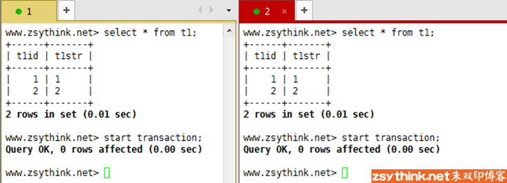
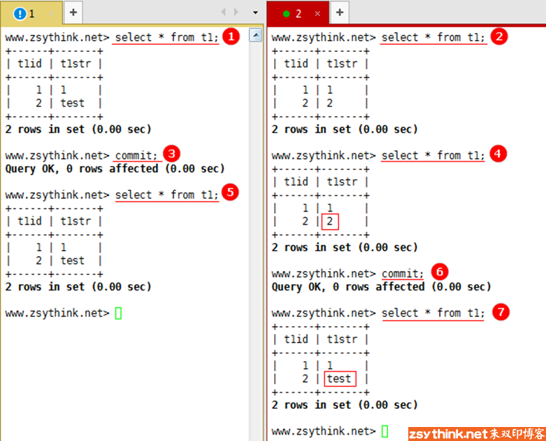
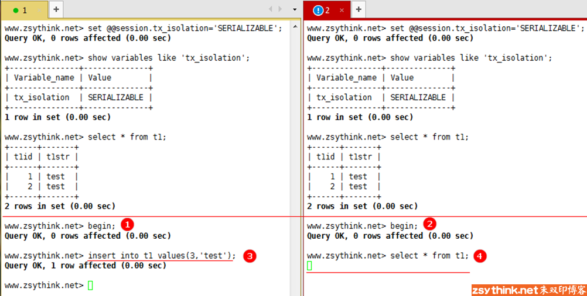
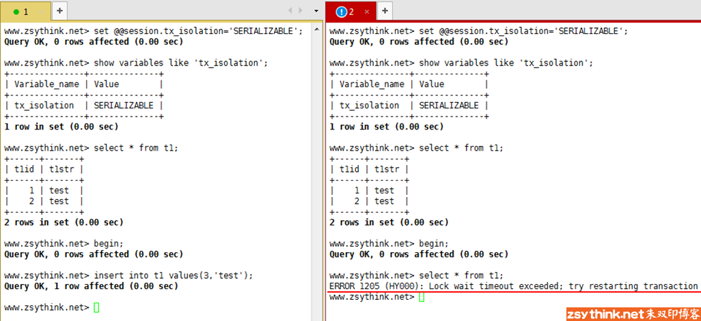
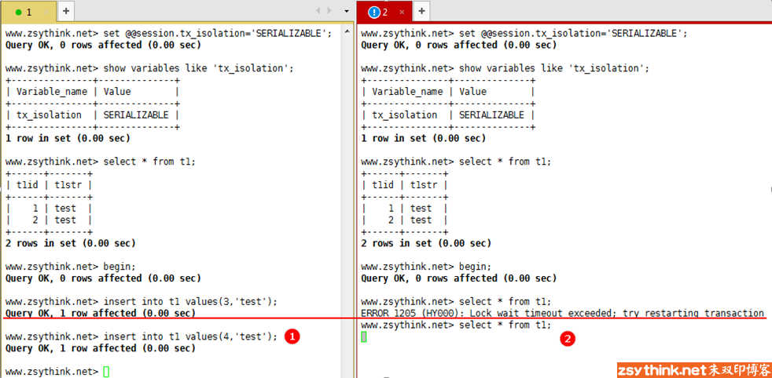
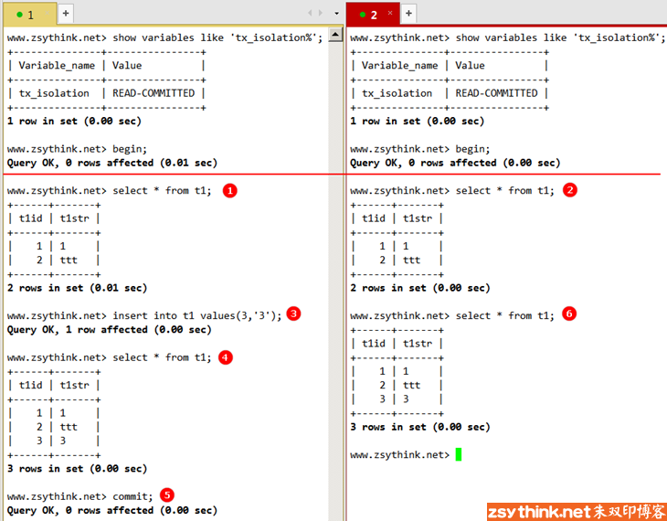
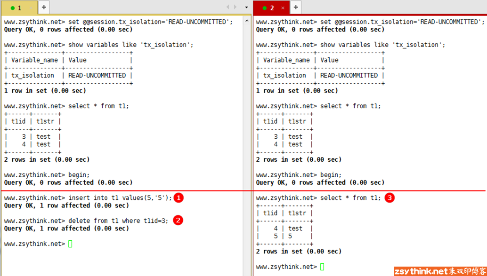

# mysql/mariadb知识点总结：事务隔离级别

> 转:http://www.zsythink.net/archives/1233

这篇文章将会总结mysql中innodb的事务隔离级别，以及幻读、脏读、不可重读的区别。

之前的文章已经总结了事务的相关概念以及事务控制语句，如需参考可点击下列直达链接。

[mysql/mariadb知识点总结（20）：事务控制语句 (事务总结之二)](http://www.zsythink.net/archives/1216)

[mysql/mariadb知识点总结（19）：事务相关概念 (事务总结之一)](http://www.zsythink.net/archives/1204)

在本博客中，"mysql"是一个系列文章，这些文章主要对mysql/mariadb的常用知识点进行了总结，每一篇博客总结的知识点有所不同，具体内容可参考mysql文章列表。

mysql文章列表直达链接：[mysql知识点总结](http://www.zsythink.net/archives/tag/mysql/)

 

## 事务隔离级别概述

mysql中，innodb所提供的事务符合ACID的要求，而事务通过事务日志中的redo log和undo log满足了原子性、一致性、持久性，事务还会通过锁机制满足隔离性，在innodb存储引擎中，有不同的隔离级别，它们有着不同的隔离性。

 

什么是事务的隔离级别？如果只是从概念上理解的话可能比较模糊，咱们直接看看不同隔离级别下的实际表现是什么样子的，再结合理论去理解，就会明了很多。首先，打开两个终端，同时连接到当前数据库，如下图所示，我们对两个回话进行编号，并且以颜色区分，1号会话使用黄色进行标识，2号会话使用红色进行标识。

使用show processlist语句，可以看到，已经有两个线程链接到当前数据库。

两个会话使用相同的数据库。

两个会话中同时各自开启一个事务。

由于下面的所有操作会在两个会话中来回切换，所以，为了方便描述，我们为每个操作的顺序进行编号，例如下图中，我们先在会话1的事务1中执行了更新操作，然后在事务1中执行了查询操作，最后又在会话2中的事务2中执行了查询操作，按照操作顺序，为各个操作进行了顺序编号。

从上图可以看到，在事务1中显示的数据已经发生了改变，第2条数据对应的字符串已经变为test，事务2中显示的数据未发生改变，没错，你肯定会说，那是因为事务1还没有提交，所以，事务2中还无法看到被修改的数据，那么，我们将会话1中的事务提交试试看，看看事务1提交后，事务2中的数据会不会发生改变。

那么，在事务提交之前，我们现在两个会话中再次查询一次，两个事务中的数据显示如下图中的操作1与操作2的显示结果。

然后我们执行上图中的第3步，将事务1中的修改操作进行提交，在事务2中再次查看t1表中的数据（第4步），经过查看发现，t1表中的第2条数据对应的字符串仍然没有发生改变，这种情况可能和我们一厢情愿想象的状况有些不同，在不了解事务的隔离级别之前，你可能会认为，当上图中的事务1提交以后，在事务2中再次查询同一张表的数据时，应该会看到事务1中的修改，但是实际上并没有，在会话2没有提交之前，从t1表中查询出的数据一直都是不变的，直到会话2提交以后，再次查询t1表的数据，才发现t1表的第2条数据对应的字符串已经发生了改变，出现这种现象，是因为mysql默认的隔离级别造成的，而不同的隔离级别会体现出不同的隔离效果，所以，事务的隔离级别，决定了各个事务之间的隔离性，我想，看到这里，你已经对事务的隔离性有了一个大概的了解，但是具体有几个隔离级别，每个隔离级别下有哪些特性，我们慢慢总结。

 

此处，我们先列出innodb中事务的所有隔离级别，然后再逐个了解它们，事务的隔离级别一共有如下4种。

**READ-UNCOMMITTED** : 此隔离级别翻译为 "读未提交"。

**READ-COMMITTED** : 此隔离级别翻译为 "读已提交" 或者 "读提交"。

**REPEATABLE-READ** : 此隔离级别翻译为 "可重复读" 或者 "可重读"。

**SERIALIZABLE** : 此隔离级别翻译为"串行化"。

 

而mysql默认设置的隔离级别为REPEATABLE-READ，即 "可重读"。使用如下语句可以查看当前设置的隔离级别

show variables like 'tx_isolation';

如下图所示，默认设置的隔离级别为可重读。

如果需要修改my.cnf配置文件，则可通过如下参数配置mysql的事务隔离级别，注意，不是使用tx_isolation，而是使用transaction_isolation

transaction_isolation=REPEATABLE-READ

   

## 隔离级别：可重读

我们先来总结一下可重读隔离级别的特性，仍然以刚才文章开头的示例为例，下图中，再回话1与回话2中同时开启两个事务，在事务1的事务中修改了t1表的数据以后（将第二条数据的t1str的值修改为test），事务2中查看到的数据仍然是事务1修改之前的数据，即使事务1提交了，在事务2没有提交之前，事务2中查看到的数据都是相同的，比如t1表中的第2条数据，不管事务1是否提交，在事务2没有提交之前，这条数据对于事务2来说一直都是没有发生改变的，这条数据在事务2中是可以重复的被读到，所以，这种隔离级别被称为"可重读"。

 

但是，你可能会有个问题，之前说过，事务的隔离性是由锁来实现的，那么，当上图中的事务1中执行更新语句时，事务1中应该对数据增加了写锁，但是在事务2中，仍然可以进行查询操作，即进行读操作，可是写锁是排他锁，在事务1中已经添加了写锁的情况下，为什么事务2还可以读取呢？这是因为innodb采用了"一致性非锁定读"的机制提高了数据库并发性。一致性非锁定读表示在如果当前行被施加了排他锁，那么当需要读取行数据时，则不会等待行上的锁的释放，而是会去读取一个快照数据，如下图所示

上图展示了innodb中一致性非锁定读的过程。之所以称其为非锁定读，是因为它不需要等待被访问的行上的排他锁的释放。而上图中的快照的实现是由事务日志所对应的undo段来完成，其实快照就是该行所对应的之前的版本的数据，即历史数据，一行记录可能有不止一个快照数据。并不是所有隔离级别都使用了一致性非锁定读，在"可重读"和"读提交"的隔离级别下，innodb存储引擎使用了一致性非锁定读，但是在这两个隔离级别中，对于快照数据的定义也不相同，在"可重读"隔离级别下，快照数据是指当前事务开始时数据的样子，所以，在刚才的示例中，事务2中t1表对应的第二条记录的t1str的值一直都是2，因为在事务2开始的时候，其值就是2，这也是其可重读的特性，但是在"读提交"的隔离级别下，由于对于快照的定义不同，所以显示的现象也不同，这在做"读提交"隔离级别的实验时我们自然就会明白。

 

在可重读的隔离级别下，可能会出现"幻读"的问题，那么什么是幻读，我们一起来看一下。

当前的隔离级别仍然是"可重读"，现在来看一个幻读的示例，根据序号顺序查看下图中的操作即可。

从上图可以看出，从上图中的第5步开始，数据其实就已经发生了改变，到第7步时，事务2还是无法看到数据的改变，但是当事务2更新数据以后，发现莫名其妙的多出了一条数据。在同一个事务中，执行两次同样的sql，第二次的sql会返回之前不存在的行，或者之前出现的数据不见了，这种现象被称之为"幻读"。

注意：上例中第8步执行的update语句并没有指定任何条件，相当于更新表中的所有行的对应字段，如果你指定了条件，并且没有更新到"隐藏"的行，那么可能无法看到幻读现象

## 隔离级别：串行化

所以，经过上述实验我们可以发现，事务处于REPEATABLE-READ :"可重复读" 级别时，会出现幻读的情况，而在之前，我们已经提到过，不同的隔离级别，所引入的问题会有所不同，隔离性也有所不同，那么，有没有一种隔离级别，能够解决幻读的问题呢？SERIALIZABLE : "串行化"隔离级别就不会出现幻读的问题，我们来试试将事务的隔离级别设置为串行化时，事务是怎样工作的。

 

首先，我们将两个会话中的事务的隔离级别都设置为SERIALIZABLE : "串行化"。

如上图所示，当将两个会话中的事务隔离级别同时设置为串行化以后，分别在两个会话中开启了事务1与事务2，如上图中的第1步和第2步所示，然后，进行第3步，在事务1中插入了一条数据，此时，执行第4步，在事务2中查询表t1的数据，可以，第4步好像被"卡"住了，多等一会儿，发现第4步并未执行成功，而是报了一个错误，如下图。

从报错信息可以发现，事务2中的锁请求超时了，我们之前提到，事务的隔离性是由锁来实现的，当我们使用串行化的隔离级别时，由于事务1先对t1表施加了写锁，所以当事务2对t1表请求读锁时，会被阻塞，那么，出现请求锁超时的情况，也就算是比较正常了，所以，此时，我们是无法在事务2中读到t1表的数据的。

 

那么，我们换一种实验方法，我们在事务1中插入一条数据，然后在事务2中执行查询t1表的语句，此时事务2中的查询语句会被阻塞，这时，我们提交事务1，看看会发生什么情况。

首先，我们在事务1中插入一条数据，然后在事务2中执行查询t1表的语句，如下图，此时事务2中的查询语句被阻塞。

趁着事务2中的查询语句被阻塞的时候，将事务1进行提交，如下图所示。

当在事务2中执行查询语句时，查询被阻塞，此时事务1被提交，当事务1被提交后的一瞬间，事务2中的语句已经查询出结果，从返回结果可以看出，这个查询语句被阻塞了31秒左右的时间，当事务1中的写锁释放时，事务2才读出了数据。从上述实验上来看，当事务处于串行化隔离级别时，是不可能出现幻读的情况的，因为如果另一个事务中对表添加了写锁，那么在当前事务中是无法读到数据的，必须等到另一个事务提交，另一个事务释放了对表的写锁，当前事务才能进行申请读锁，使用串行化的隔离级别不会出现幻读的情况，但是，聪明如你一定发现了，当事务的隔离级别设置为串行化时，数据库失去了并发的能力，所以，我们很少将隔离级别设置为串行化，因为这种隔离性过于严格了。

 
 

## 隔离级别：读已提交

现在，我们已经了解了两种隔离级别，可重读与串行化，而且，我们已经了解到，串行化隔离级别的隔离性是最强的，没有并发能力，可重读隔离级别的隔离性稍微次之，但是比较串行化而言，并发能力较好，不过存在"幻读"的问题。

那么，有了之前的基础，再去理解另外两个隔离级别就容易了，我们先来聊聊"读提交"。

同样，在两个会话中同时开启两个事务，在事务1中修改t1表中的第二条数据，如下图中的1、2步所示，此时，事务1并未提交，所以如第3步所示，在事务2中并无法看到事务1中的修改，而当事务1提交以后，事务2中即可看到事务1中的修改，换句话说，就是事务2能够读到事务1提交后的更改，这种隔离级别被称为"读提交"。

 

在"读提交"的隔离级别下，也会出现"幻读"的问题，示例如下。

在上述示例中，事务1向t1表中插入了一行数据，在事务1提交以后，事务2中即可看到，但是事务2还没有提交，在事务2中执行两次相同的查询语句，莫名其妙的多出了一行，出现了"幻读"的情况。

在读已提交的隔离级别下，除了会出现幻读的情况，还会出现不可重读的情况。"不可重读"表示"不一定可重读"，不要理解为"一定不可重读"。什么叫"不一定可重读"呢？

仍然以刚才的第一个示例为例，下图中的第3步中，获取到的第2条记录对应的t1str字段值为"test":，而在同一个事务中，第5步所查出第二条记录对应的t1str字段却变成了"ttt"，所以，当我们想要再次重复读到刚才的"test"，就变成了"不可重读"。

其实，"不可重读"与"幻读"的表象都非常相似，都是在同一个事务中，并没有操作某些数据，可是这些数据却莫名的被改变了，或者突然多出了某些数据，又或者突然少了某些数据，这些状况好像都能用"幻象"这个词去理解，所以我一开始总是分不清到底什么是幻读，而且，mysql官方文档中也把不可重读归为幻读，只是大家为了更加的细化它们的区别，把他们分成了"不可重读"与"幻读"，如果我们实在无法分清他们，我们可以这样理解，"幻读"的重点在于莫名其妙的增加了或减少了某些数据，"不可重读"的重点在于莫名的情况下，数据被修改更新了。

那么我们再来总结一下"读提交"这个隔离级别，在"读提交"隔离级别下，回出现"不可重读"，"幻读"的问题，比"可重读"隔离级别的问题更多，但是它的并发能力比"可重读"更强，我们似乎发现了一个规律，隔离级别的隔离性越低，并发能力就越强，存在的问题就越多，那么现在，我们只剩下最后一个隔离级别没有了解了，那就是"读未提交"。它的并发能力更强吗，它会有更多的问题吗？我们来看看。

 
 

## 隔离级别：读未提交

老规矩，我们在两个会话中同时开启两个事务，然后进行实验。

此时，我们将两个会话的事务隔离级别同时设置为读未提交，然后在两个会话中各自开启一个事务，然后在事务1中插入一条数据，并且删除一条数据，如下图中的第1步与第2步所示。

第1、2步执行完毕以后，事务1并未提交，此时执行步骤3，在事务2中查看t1表中的数据，是可以看到事务1中所做出的修改的。

所以，我们可以发现，在读未提交这个隔离级别下，即使别的事务所做的修改并未提交，我们也能看到其修改的数据。

当前事务能够看到别的事务中未提交的数据，我们称这种现象为"脏读"，上例中，事务1并未提交，但是其所作出的修改已经能在事务2中查看到，由于事务1中的修改有可能被回滚，或者数据有可能继续被修改，所以事务2中看到数据是飘忽不定的，并不是最终的数据，并不是提交后的数据，是"脏"的，但是事务2中仍然能看到这些数据，所以，这种显现被称之为脏读，当事务的隔离级别处于"读未提交"时，其并发性能是最强的，但是其隔离性与安全性是最差的。

 

聪明如你一定想到了，当事务处于"读未提交"这种隔离级别时，会出现"脏读"的情况，同时，也会出现"不可重读"，"幻读"的问题。

   

## 脏读、幻读、不可重读的区别

现在，我们是不是更容易把脏读、幻读、不可重读混淆了呢？

我们一起来总结一下它们之前的区别：

**脏读**：当前事务可以查看到别的事务未提交的数据（侧重点在于别的事务未提交）。

**幻读**：幻读的表象与不可重读的表象都让人"懵逼"，很容易搞混，但是如果非要细分的话，幻读的侧重点在于新增和删除。表示在同一事务中，使用相同的查询语句，第二次查询时，莫名的多出了一些之前不存在数据，或者莫名的不见了一些数据。

**不可重读**：不可重读的侧重点在于更新修改数据。表示在同一事务中，查询相同的数据范围时，同一个数据资源莫名的改变了。

 
 

## 不同的隔离级别所拥有的问题

经过上文的举例，我们已经了解了各个事务隔离级别的表象与问题，那么，我们来总结一下。

首先，我们明白了一个道理，事务的隔离级别越高，隔离性越强，所拥有的问题越少，并发能力越弱，所以，我们可以用如下表格进行总结

