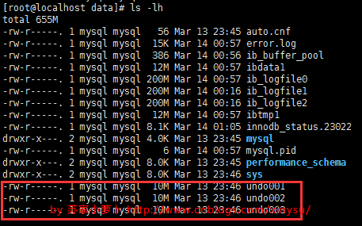

# mysql的undo log和redo log

> 转载：https://www.cnblogs.com/wyy123/p/7880077.html


在数据库系统中，既有存放数据的文件，也有存放日志的文件。日志在内存中也是有缓存Log buffer，也有磁盘文件log file，本文主要描述存放日志的文件。

​    MySQL中的日志文件，有这么两类常常讨论到：undo日志与redo日志。

# **1 undo**

## **1.1 undo是什么**

undo日志用于存放数据修改被修改前的值，假设修改 tba 表中 id=2的行数据，把Name='B' 修改为Name = 'B2' ，那么undo日志就会用来存放Name='B'的记录，如果这个修改出现异常，可以使用undo日志来实现回滚操作，保证事务的一致性。

对数据的变更操作，主要来自 INSERT UPDATE DELETE，而UNDO LOG中分为两种类型，一种是 INSERT_UNDO（INSERT操作），记录插入的唯一键值；一种是 UPDATE_UNDO（包含UPDATE及DELETE操作），记录修改的唯一键值以及old column记录。

| Id   | Name |
| ---- | ---- |
| 1    | A    |
| 2    | B    |
| 3    | C    |
| 4    | D    |

## **1.2 undo参数**

MySQL跟undo有关的参数设置有这些：

```mysql
 1 mysql> show global variables like '%undo%';
 2 +--------------------------+------------+
 3 | Variable_name            | Value      |
 4 +--------------------------+------------+
 5 | innodb_max_undo_log_size | 1073741824 |
 6 | innodb_undo_directory    | ./         |
 7 | innodb_undo_log_truncate | OFF        |
 8 | innodb_undo_logs         | 128        |
 9 | innodb_undo_tablespaces  | 3          |
10 +--------------------------+------------+
11  
12 mysql> show global variables like '%truncate%';
13 +--------------------------------------+-------+
14 | Variable_name                        | Value |
15 +--------------------------------------+-------+
16 | innodb_purge_rseg_truncate_frequency | 128   |
17 | innodb_undo_log_truncate             | OFF   |
18 +--------------------------------------+-------+
```

- **innodb_max_undo_log_size**

​    控制最大undo tablespace文件的大小，当启动了innodb_undo_log_truncate 时，undo tablespace 超过innodb_max_undo_log_size 阀值时才会去尝试truncate。该值默认大小为1G，truncate后的大小默认为10M。

- **innodb_undo_tablespaces** 

​    设置undo独立表空间个数，范围为0-128， 默认为0，0表示表示不开启独立undo表空间 且 undo日志存储在ibdata文件中。该参数只能在最开始初始化MySQL实例的时候指定，如果实例已创建，这个参数是不能变动的，如果在数据库配置文 件 .cnf 中指定innodb_undo_tablespaces 的个数大于实例创建时的指定个数，则会启动失败，提示该参数设置有误。


​    如果设置了该参数为n（n>0），那么就会在undo目录下创建n个undo文件（undo001，undo002 ...... undo n），每个文件默认大小为10M.



**什么时候需要来设置这个参数呢？**

​    当DB写压力较大时，可以设置独立UNDO表空间，把UNDO LOG从ibdata文件中分离开来，指定 innodb_undo_directory目录存放，可以制定到高速磁盘上，加快UNDO LOG 的读写性能。

- **innodb_undo_log_truncate**

   InnoDB的purge线程，根据innodb_undo_log_truncate设置开启或关闭、innodb_max_undo_log_size的参数值，以及truncate的频率来进行空间回收和 undo file 的重新初始化。

   **该参数生效的前提是，已设置独立表空间且独立表空间个数大于等于2个。**

   purge线程在truncate undo log file的过程中，需要检查该文件上是否还有活动事务，如果没有，需要把该undo log file标记为不可分配，这个时候，undo log 都会记录到其他文件上，所以至少需要2个独立表空间文件，才能进行truncate 操作，标注不可分配后，会创建一个独立的文件undo\_<space_id>\_trunc.log，记录现在正在truncate 某个undo log文件，然后开始初始化undo log file到10M，操作结束后，删除表示truncate动作的 undo\_<space_id>\_trunc.log 文件，这个文件保证了即使在truncate过程中发生了故障重启数据库服务，重启后，服务发现这个文件，也会继续完成truncate操作，删除文件结束后，标识该undo log file可分配。

- **innodb_purge_rseg_truncate_frequency**

  用于控制purge回滚段的频度，默认为128。假设设置为n，则说明，当Innodb Purge操作的协调线程 purge事务128次时，就会触发一次History purge，检查当前的undo log 表空间状态是否会触发truncate。

## **1.3 undo空间管理**

如果需要设置独立表空间，需要在初始化数据库实例的时候，指定独立表空间的数量。

UNDO内部由多个回滚段组成，即 Rollback segment，一共有128个，保存在ibdata系统表空间中，分别从resg slot0 - resg slot127，每一个resg slot，也就是每一个回滚段，内部由1024个undo segment 组成。

回滚段（rollback segment）分配如下：

- slot 0 ，预留给系统表空间；
- slot 1- 32，预留给临时表空间，每次数据库重启的时候，都会重建临时表空间；
- slot33-127，如果有独立表空间，则预留给UNDO独立表空间；如果没有，则预留给系统表空间；

回滚段中除去32个提供给临时表事务使用，剩下的 128-32=96个回滚段，可执行 96*1024 个并发事务操作，每个事务占用一个 undo segment slot，注意，如果事务中有临时表事务，还会在临时表空间中的 undo segment slot 再占用一个 undo segment slot，即占用2个undo segment slot。如果错误日志中有：`Cannot find a free slot for an undo log。`则说明并发的事务太多了，需要考虑下是否要分流业务。

回滚段（rollback segment ）采用 轮询调度的方式来分配使用，如果设置了独立表空间，那么就不会使用系统表空间回滚段中undo segment，而是使用独立表空间的，同时，如果回顾段正在 Truncate操作，则不分配。


# **2 redo**

## **2.1 redo是什么**

​    当数据库对数据做修改的时候，需要把数据页从磁盘读到buffer pool中，然后在buffer pool中进行修改，那么这个时候buffer pool中的数据页就与磁盘上的数据页内容不一致，称buffer pool的数据页为dirty page 脏数据，如果这个时候发生非正常的DB服务重启，那么这些数据还没在内存，并没有同步到磁盘文件中（注意，同步到磁盘文件是个随机IO），也就是会发生数据丢失，如果这个时候，能够在有一个文件，当buffer pool 中的data page变更结束后，把相应修改记录记录到这个文件（注意，记录日志是顺序IO），那么当DB服务发生crash的情况，恢复DB的时候，也可以根据这个文件的记录内容，重新应用到磁盘文件，数据保持一致。

​    这个文件就是redo log ，用于记录 数据修改后的记录，顺序记录。它可以带来这些好处：

- 当buffer pool中的dirty page 还没有刷新到磁盘的时候，发生crash，启动服务后，可通过redo log 找到需要重新刷新到磁盘文件的记录；
- buffer pool中的数据直接flush到disk file，是一个随机IO，效率较差，而把buffer pool中的数据记录到redo log，是一个顺序IO，可以提高事务提交的速度；

​    假设修改 tba 表中 id=2的行数据，把Name='B' 修改为Name = 'B2' ，那么redo日志就会用来存放Name='B2'的记录，如果这个修改在flush 到磁盘文件时出现异常，可以使用redo log实现重做操作，保证事务的持久性。

| Id   | Name |
| ---- | ---- |
| 1    | A    |
| 2    | B    |
| 3    | C    |
| 4    | D    |

 

​    这里注意下redo log 跟binary log 的区别，redo log 是存储引擎层产生的，而binary log是数据库层产生的。假设一个大事务，对tba做10万行的记录插入，在这个过程中，一直不断的往redo log顺序记录，而binary log不会记录，知道这个事务提交，才会一次写入到binary log文件中。binary log的记录格式有3种：row，statement跟mixed，不同格式记录形式不一样。

## **2.2** **redo** **参数**

- **innodb_log_files_in_group**

redo log 文件的个数，命名方式如：ib_logfile0，iblogfile1... iblogfilen。默认2个，最大100个。

- **innodb_log_file_size**

文件设置大小，默认值为 48M，最大值为512G，注意最大值指的是整个 redo log系列文件之和，即（innodb_log_files_in_group * innodb_log_file_size ）不能大于最大值512G。

- **innodb_log_group_home_dir**

文件存放路径

- **innodb_log_buffer_size**

Redo Log 缓存区，默认8M，可设置1-8M。延迟事务日志写入磁盘，把redo log 放到该缓冲区，然后根据 innodb_flush_log_at_trx_commit参数的设置，再把日志从buffer 中flush 到磁盘中。

- **innodb_flush_log_at_trx_commit**

- innodb_flush_log_at_trx_commit=1，每次commit都会把redo log从redo log buffer写入到system，并fsync刷新到磁盘文件中。
- innodb_flush_log_at_trx_commit=2，每次事务提交时MySQL会把日志从redo log buffer写入到system，但只写入到file system buffer，由系统内部来fsync到磁盘文件。如果数据库实例crash，不会丢失redo log，但是如果服务器crash，由于file system buffer还来不及fsync到磁盘文件，所以会丢失这一部分的数据。
- innodb_flush_log_at_trx_commit=0，事务发生过程，日志一直激励在redo log buffer中，跟其他设置一样，但是在事务提交时，不产生redo 写操作，而是MySQL内部每秒操作一次，从redo log buffer，把数据写入到系统中去。如果发生crash，即丢失1s内的事务修改操作。

- 注意：由于进程调度策略问题,这个“每秒执行一次 flush(刷到磁盘)操作”并不是保证100%的“每秒”。

 

## **2.3** **redo** **空间管理**

​    Redo log文件以`ib_logfile[number]`命名，Redo log 以顺序的方式写入文件文件，写满时则回溯到第一个文件，进行覆盖写。（但在做redo checkpoint时，也会更新第一个日志文件的头部checkpoint标记，所以严格来讲也不算顺序写）。

实际上redo log有两部分组成：redo log buffer 跟redo log file。buffer pool中把数据修改情况记录到redo log buffer，出现以下情况，再把redo log刷下到redo log file：

- Redo log buffer空间不足
- 事务提交（依赖innodb_flush_log_at_trx_commit参数设置）
- 后台线程
- 做checkpoint
- 实例shutdown
- binlog切换

# **3 undo及redo如何记录事务**

## **3.1 Undo + Redo事务的简化过程**

  假设有A、B两个数据，值分别为1,2，开始一个事务，事务的操作内容为：把1修改为3，2修改为4，那么实际的记录如下（简化）：

  A.事务开始.
  B.记录A=1到undo log.
  C.修改A=3.
  D.记录A=3到redo log.
  E.记录B=2到undo log.
  F.修改B=4.
  G.记录B=4到redo log.
  H.将redo log写入磁盘。

  I.事务提交

## **3.2  IO影响**

  Undo + Redo的设计主要考虑的是提升IO性能，增大数据库吞吐量。可以看出，B D E G H，均是新增操作，但是B D E G 是缓冲到buffer区，只有G是增加了IO操作，为了保证Redo Log能够有比较好的IO性能，InnoDB 的 Redo Log的设计有以下几个特点：

 

  A. 尽量保持Redo Log存储在一段连续的空间上。因此在系统第一次启动时就会将日志文件的空间完全分配。 以顺序追加的方式记录Redo Log,通过顺序IO来改善性能。

  B. 批量写入日志。日志并不是直接写入文件，而是先写入redo log buffer.当需要将日志刷新到磁盘时 (如事务提交),将许多日志一起写入磁盘.

  C. 并发的事务共享Redo Log的存储空间，它们的Redo Log按语句的执行顺序，依次交替的记录在一起，
     以减少日志占用的空间。例如,Redo Log中的记录内容可能是这样的：
     记录1: <trx1, insert …>
     记录2: <trx2, update …>
     记录3: <trx1, delete …>
     记录4: <trx3, update …>
     记录5: <trx2, insert …>
  D. 因为C的原因,当一个事务将Redo Log写入磁盘时，也会将其他未提交的事务的日志写入磁盘。

  E. Redo Log上只进行顺序追加的操作，当一个事务需要回滚时，它的Redo Log记录也不会从Redo Log中删除掉。

## **3.3 恢复**

前面说到未提交的事务和回滚了的事务也会记录Redo Log，因此在进行恢复时,这些事务要进行特殊的的处理。有2种不同的恢复策略：

  A. 进行恢复时，只重做已经提交了的事务。
  B. 进行恢复时，重做所有事务包括未提交的事务和回滚了的事务。然后通过Undo Log回滚那些未提交的事务。 

  **MySQL数据库InnoDB存储引擎使用了B策略,** InnoDB存储引擎中的恢复机制有几个特点： 

  A. 在重做Redo Log时，并**不关心事务性**。 恢复时，没有BEGIN，也没有COMMIT,ROLLBACK的行为。也不关心每个日志是哪个事务的。尽管事务ID等事务相关的内容会记入Redo Log，这些内容只是被当作要操作的数据的一部分。

  B. 使用B策略就必须要将Undo Log持久化，而且必须要在写Redo Log之前将对应的Undo Log写入磁盘。Undo和Redo Log的这种关联，使得持久化变得复杂起来。为了降低复杂度，InnoDB将Undo Log看作数据，因此记录Undo Log的操作也会记录到redo log中。这样undo log就可以象数据一样缓存起来，而不用在redo log之前写入磁盘了。

​     包含Undo Log操作的Redo Log，看起来是这样的：
​     记录1: <trx1, **Undo log insert** <undo_insert …>>
​     记录2: <trx1, insert …>
​     记录3: <trx2, **Undo log insert** <undo_update …>>
​     记录4: <trx2, update …>
​     记录5: <trx3, **Undo log insert** <undo_delete …>>
​     记录6: <trx3, delete …>
  C. 到这里，还有一个问题没有弄清楚。既然Redo没有事务性，那岂不是会重新执行被回滚了的事务？
​     确实是这样。同时Innodb也会将事务回滚时的操作也记录到redo log中。回滚操作本质上也是
​     对数据进行修改，因此回滚时对数据的操作也会记录到Redo Log中。
​     一个回滚了的事务的Redo Log，看起来是这样的：
​     记录1: <trx1, Undo log insert <undo_insert …>>
​     记录2: <trx1, **insert A**…>
​     记录3: <trx1, Undo log insert <undo_update …>>
​     记录4: <trx1, **update B**…>
​     记录5: <trx1, Undo log insert <undo_delete …>>
​     记录6: <trx1, **delete C**…>
​     记录7: <trx1, **insert C**>
​     记录8: <trx1, **update B** to old value>

​     记录9: <trx1, **delete A>**

​     一个被回滚了的事务在恢复时的操作就是先redo再undo，因此不会破坏数据的一致性。