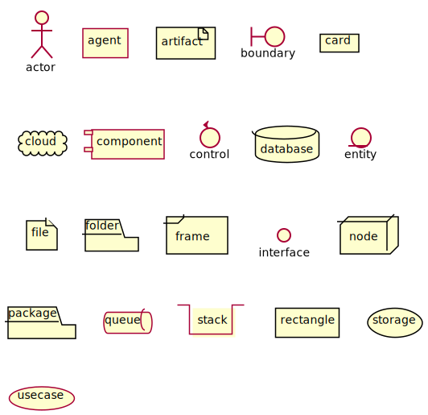
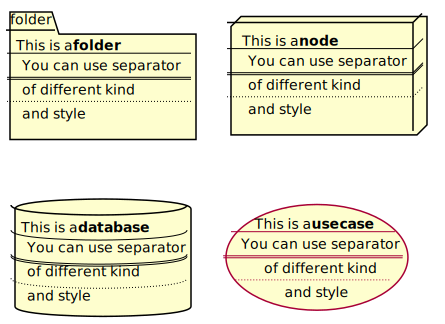
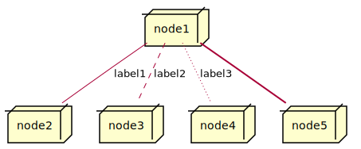
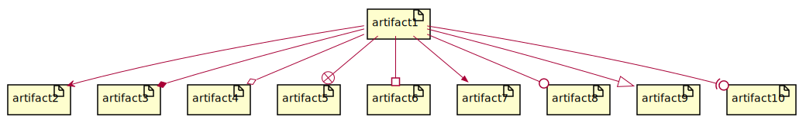
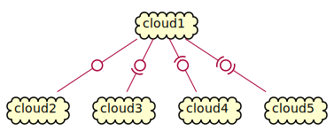
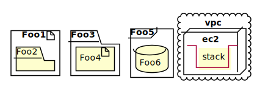
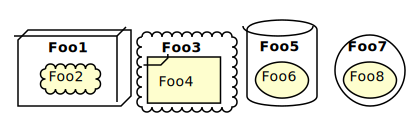
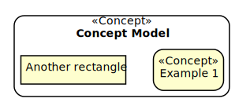

# Deployment Diagram 部署图

## Declaring element 基本元素


```
@startuml
actor actor
agent agent
artifact artifact
boundary boundary
card card
cloud cloud
component component
control control
database database
entity entity
file file
folder folder
frame frame
interface  interface
node node
package package
queue queue
stack stack
rectangle rectangle
storage storage
usecase usecase
@enduml
```





You can optionaly put text using bracket `[]` for a long description.

你可以通过 `[]` 包裹方式填充更多详细信息。


```
@startuml
folder folder [
This is a <b>folder
----
You can use separator
====
of different kind
....
and style
]

node node [
This is a <b>node
----
You can use separator
====
of different kind
....
and style
]

database database [
This is a <b>database
----
You can use separator
====
of different kind
....
and style
]

usecase usecase [
This is a <b>usecase
----
You can use separator
====
of different kind
....
and style
]

@enduml
```





## Linking 链接


You can create simple links between elements with or without labels:

你可以非常简单地通过各色各样的连线将多个元素连接起来。


```
@startuml

node node1
node node2
node node3
node node4
node node5
node1 -- node2 : label1
node1 .. node3 : label2
node1 ~~ node4 : label3
node1 == node5

@enduml
```





It is possible to use several types of links:

你还可以使用更多类型的链接。


```
@startuml

artifact artifact1
artifact artifact2
artifact artifact3
artifact artifact4
artifact artifact5
artifact artifact6
artifact artifact7
artifact artifact8
artifact artifact9
artifact artifact10
artifact1 --> artifact2
artifact1 --* artifact3
artifact1 --o artifact4
artifact1 --+ artifact5
artifact1 --# artifact6
artifact1 -->> artifact7
artifact1 --0 artifact8
artifact1 --^ artifact9
artifact1 --(0 artifact10

@enduml
```





You can also have the following types:


```
@startuml

cloud cloud1
cloud cloud2
cloud cloud3
cloud cloud4
cloud cloud5
cloud1 -0- cloud2
cloud1 -0)- cloud3
cloud1 -(0- cloud4
cloud1 -(0)- cloud5

@enduml
```





## Packages 包


There is a limit of three levels.

包最大限制是 3 级。


```
@startuml
artifact Foo1 {
  folder Foo2
}

folder Foo3 {
  artifact Foo4
}

frame Foo5 {
  database Foo6
}

cloud vpc {
  node ec2 {
  stack stack
  }
}

@enduml
```





```
@startuml
node Foo1 {
 cloud Foo2 
}

cloud Foo3 {
  frame Foo4
}

database Foo5  {
  storage Foo6
}

storage Foo7 {
  storage Foo8
}
@enduml
```





## Round corner 圆角


```
@startuml
skinparam rectangle {
  roundCorner<<Concept>> 25
}

rectangle "Concept Model" <<Concept>> {
  rectangle "Example 1" <<Concept>> as ex1
  rectangle "Another rectangle"
}
@enduml
```




