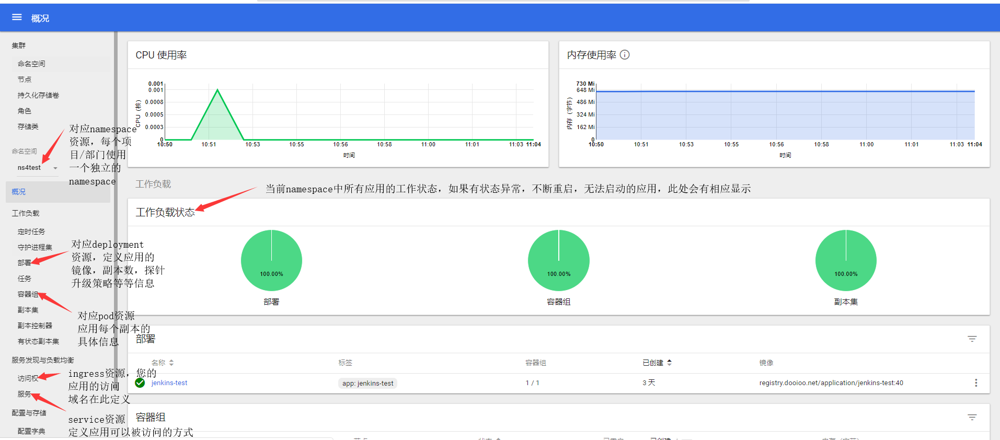
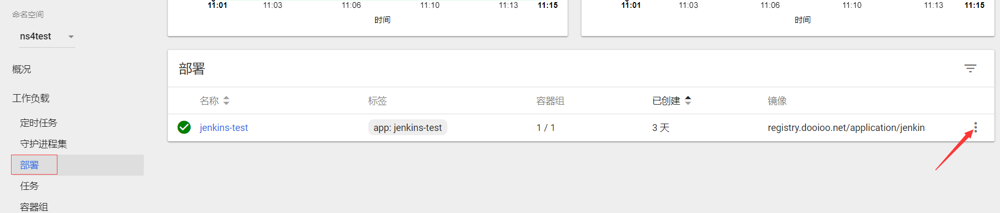
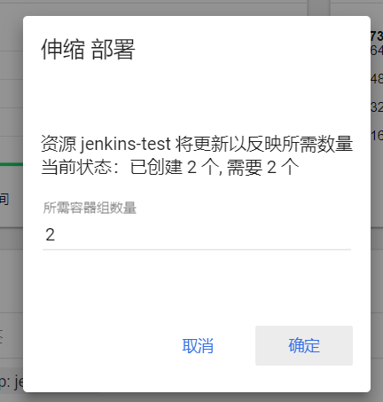
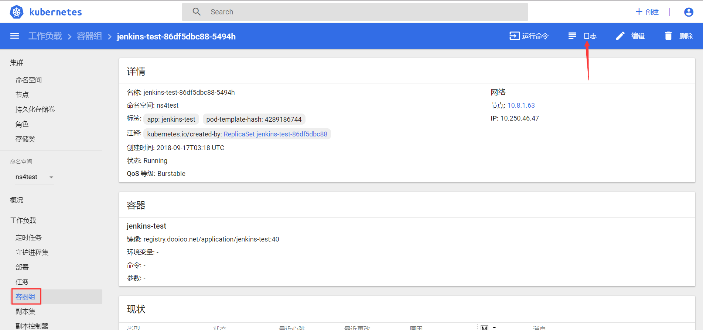
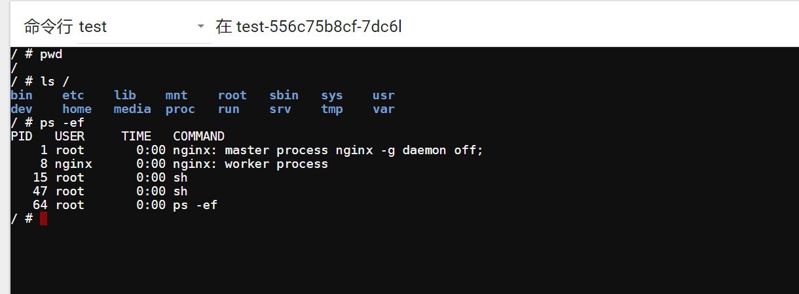
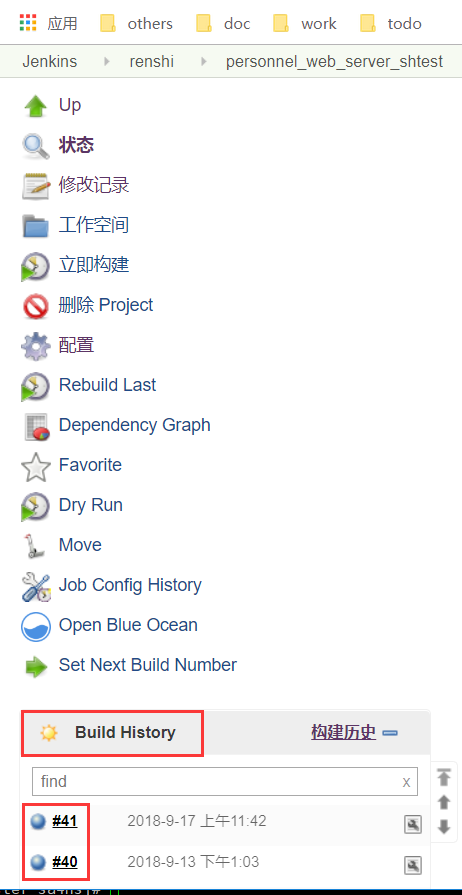
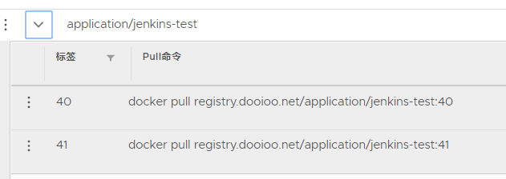
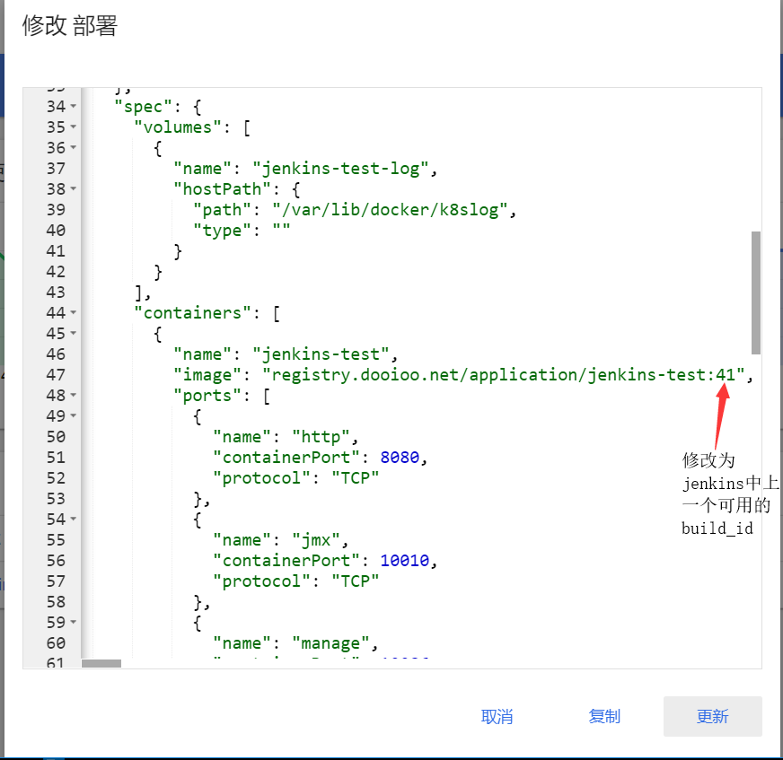
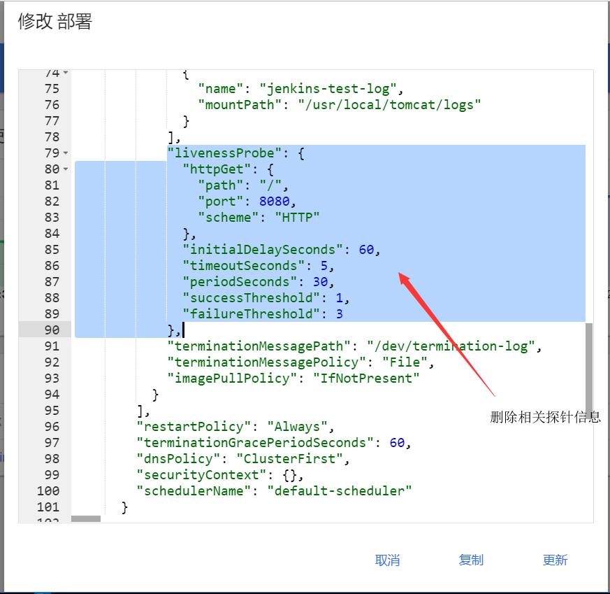

# K8s Dashboard使用

## Dashboard使用说明

dashboard是k8s社区提供的一个页面管理工具，目前已支持绝大多数k8s命令行的图形化操作，可以用来对部署在k8s集群中的应用进行常规维护。

测试环境：`https://k8sui.test.ke.com`

集成环境：`https://k8sui.shoff.ke.com`

生产环境：`https://k8sui.dooioo.com`

每个部门在每个环境上**首次**使用新版发布方式之前，会需要联系op为您创建如下信息：

- 镜像库中的一个项目，用于存放此部门的所有应用镜像
- K8S中的一个namespace，用于填写部署脚本中的PROJECT信息
- 可以管理此namespace的kubeconfig文件，用于登陆dashboard

## 名词解释

命名空间:k8s中的namespace资源，不同部门，项目的应用会被发布在不同的namespace中。

部署:k8s中的deployment资源，一般会定义一个应用使用的镜像、需要运行的副本数、健康检查方式、滚动升级策略等信息。

容器组：k8s中的pod资源，定义具体某一个应用副本的信息。Deployment通过启动和回收replicaset（副本集）进行应用pod的数量控制，镜像更新等工作。

服务：k8s中的service资源，定义应用的访问方式，目前统一定义为tcp的8080端口，如果您的应用使用别的端口会导致健康检查失败而不断重启。

访问权：k8s中的ingress资源，定义http服务的暴露方式，包含访问http应用使用的主机名信息，也包含一些特殊选项如转发参数，是否启动https加密，加密使用的证书等信息。

## 功能示例

### 修改副本数

由于目前容器环境硬件资源相对紧张，我们也还没有做资源配额，请谨慎修改副本数量。

### 查看控制台日志

### 应用内执行命令

由于默认健康探针和容器主程序关闭后容器自动重启的机制存在，您无法在容器内实现修改配置重启应用的操作。您的操作应该仅限于查看文件和容器内非console打印的日志，使用一些诊断工具确认应用运行信息(如果基础镜像中没有找到您需要的诊断工具，您可以联系op团队，我们会酌情添加)。如果您的应用支持不重启的情况下修改配置，您也可以修改相关文件达到目的，但基于容器无状态的特性(重启后丢失所有本地配置)，我们 **强烈不建议** 您进行这样的操作。

操作和[查看控制台日志](http://doc.io/common-knowledge/kubernetes-dashboard/dashboard.html#查看控制台日志)类似，点击`运行命令`按钮即可。

### 重启应用

如果您的应用相关配置是从远端读取的，例如从配置中心获取配置后运行，当您修改了配置中心中保存的配置后想要进行应用重启，您可以任意选择如下三种方式:

- 进入[容器内部](http://doc.io/common-knowledge/kubernetes-dashboard/dashboard.html#应用内执行命令)，kill您的应用进程触发容器级别的重启。
- 在`容器组`中找到您的应用pod点击删除，触发pod级别的重建。请特别注意是删除`容器组`中的资源，而不是删除`部署`中资源，如果不慎删除了`部署`中的资源，您需要重新发布。
- 在jenkins中进行一次完整的发布。

### 修改部署应用的yaml文件

如果您对k8s的相关概念和yaml语法有所了解，您可以修改应用的yaml文件实现自定义功能，请注意：

- 这些配置会在您下一次发布时被基于模板生成的新配置覆盖

  如果您对yaml模板有些修改建议，欢迎联系op团队。

- 修改yaml文件会触发滚动升级

  您的应用会按预定的方式滚动升级所有的副本，无论修改涉不涉及版本号，只要yaml文件有变动，应用的所有副本都会被重启/升级。

#### 版本回退

应用部署在进行镜像打包时会对此镜像增加一个版本tag，默认为jenkins的build_id，即构建历史中递增的数字：

每个成功的jenkins构建，会在镜像库中生成一个相同版本号的镜像。

如果发布的应用发现功能缺陷，可以通过直接修改yaml文件中的镜像版本号实现回退，不再需要回退代码重新发布，请注意

- 如果除了代码外还调整了其他信息，如应用名，命令行参数等发布脚本调用的变量信息，则不可以使用此方法回退。
- 下次执行的完整发布流程依然会覆盖掉您自定义的镜像版本。
- 如果您修改了脚本默认的版本号规则`VERSION=$BUILD_ID`，也不适用此回退方式。

#### 禁用默认健康探针

某些情况下，您的应用可能因为依赖的外部资源(数据库，消息队列，注册中心等)不可用或配置不正确而导致应用持续报错重启，报错信息包含liveness probe字样，此时您可以暂时禁用健康探针信息以进一步进行排查，请注意此处修改不支持注释，如果要恢复为初始状态请重新发布一次应用。

