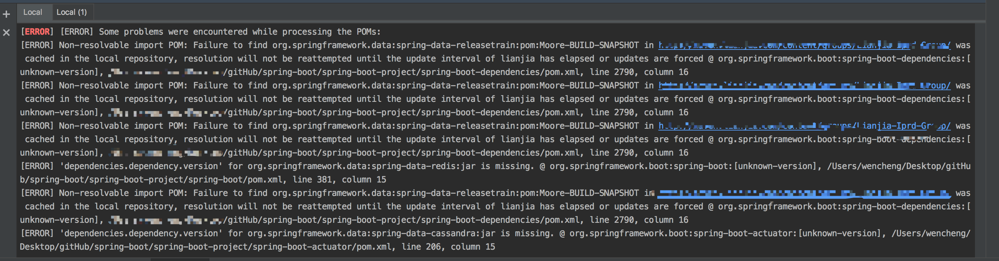
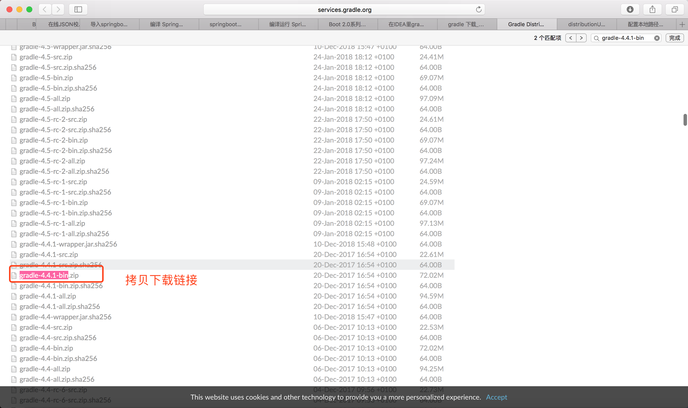
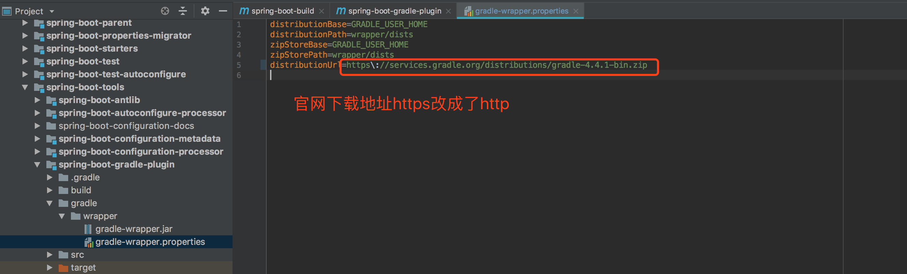
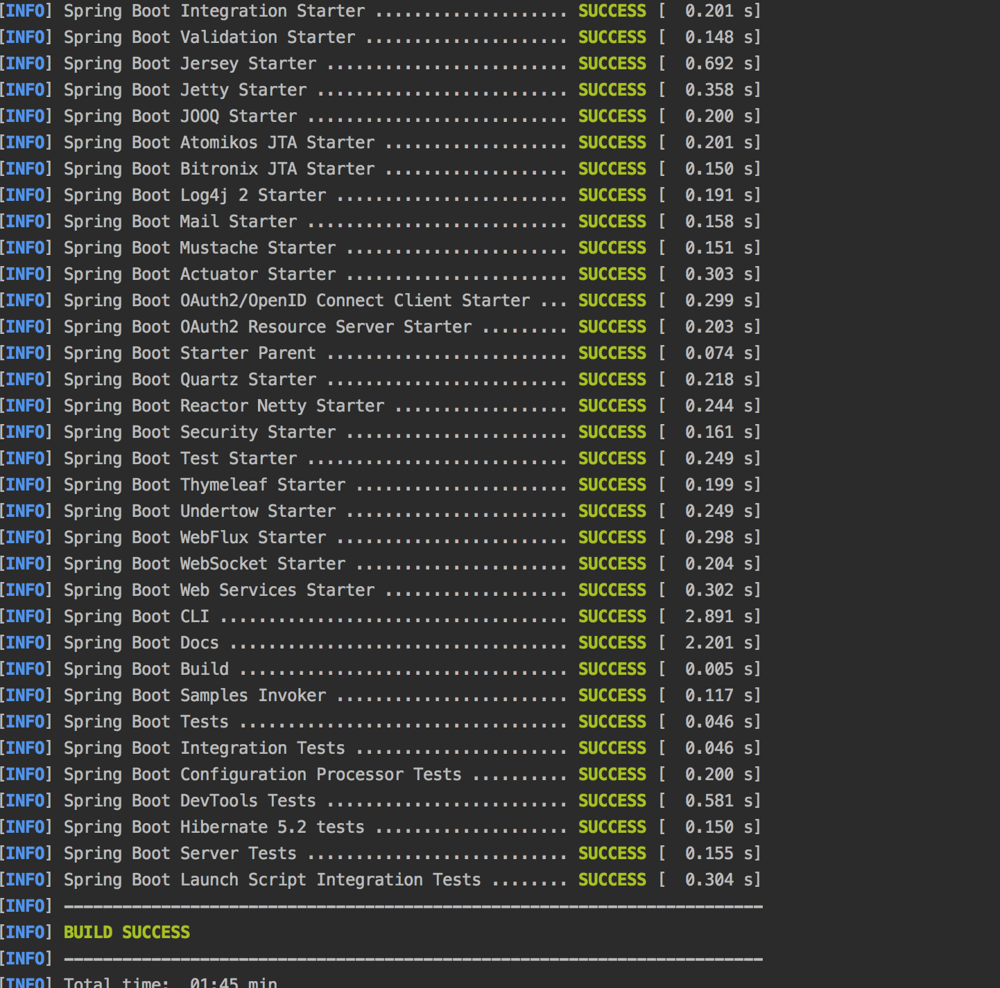

# Idea中springboot源码构建


###1、从官方仓库 <https://github.com/spring-projects/spring-boot>  `Fork` 出属于自己的仓库。


## 源码编译

`导入`IDEA`源码视图如：

### 2、导入idea，报错

#### 问题1、mvn版本的问题

> `Spring Boot` 官方建议使用 `./mvnw clean install` 或者标准的 `mvn clean install` 命令来编译源代码，如果要使用标准的 `mvn` 命令的话，`Maven` 的版本要求在`3.5.0`或以上。


#### 问题2、master代码构建过程中，`org.springframework.data:spring-data-releasetrain:pom:Moore-BUILD-SNAPSHOT` 找不到 `org.springframework.boot:spring-boot-dependencies:[unknown-version]`

提示如下图所示：<br/>



于是切换成其他 `RELEASE` 版本。


#### 问题3、`mvn clean install -DskipTests -Pfast` 过程中提示 `spring-boot-gradle-plugin`错误

*cd* 到 `spring-boot-project/spring-boot-tools/spring-boot-gradle-plugin`  模块下，`mvn package` 命令中提示 *https://services.gradle.org/distributions/gradle-4.4.1-bin.zip* 下载不下来。到官网中拷贝其下载链接，如下图所示。



其 *https://services.gradle.org/distributions/gradle-4.4.1-bin.zip* 已经从 `https` 改成了 `http`。只需要修改器下载链接即可。如下图所示。<br/>

下载过程比较慢，可以配置本地路径。配置如下：<br/>

gradle-wrapper.properties 配置本地路径:

```properties
distributionBase=GRADLE_USER_HOME
distributionPath=wrapper/dists
zipStoreBase=GRADLE_USER_HOME
zipStorePath=wrapper/dists
#distributionUrl=https\://services.gradle.org/distributions/gradle-4.1-all.zip
distributionUrl=file\:///D:/gradle/gradle-4.1-all.zip
```

下载完成后继续构建，提示如下错误。

```bash
[INFO] Scanning for projects...
[INFO] 
[INFO] ---------< org.springframework.boot:spring-boot-gradle-plugin >---------
[INFO] Building Spring Boot Gradle Plugin 2.1.3.RELEASE
[INFO] --------------------------------[ pom ]---------------------------------
[INFO] 
[INFO] --- maven-checkstyle-plugin:3.0.0:check (checkstyle-validation) @ spring-boot-gradle-plugin ---
[INFO] 
[INFO] --- spring-javaformat-maven-plugin:0.0.6:validate (default) @ spring-boot-gradle-plugin ---
[INFO] 
[INFO] --- build-helper-maven-plugin:3.0.0:regex-property (regex-property) @ spring-boot-gradle-plugin ---
[INFO] 
[INFO] --- maven-enforcer-plugin:3.0.0-M2:enforce (enforce-rules) @ spring-boot-gradle-plugin ---
[INFO] 
[INFO] --- maven-dependency-plugin:3.1.1:copy-dependencies (copy-compile-dependencies) @ spring-boot-gradle-plugin ---
[INFO] org.springframework:spring-core:jar:5.1.5.RELEASE already exists in destination.
[INFO] org.jetbrains.kotlin:kotlin-stdlib:jar:1.2.20 already exists in destination.
[INFO] io.spring.gradle:dependency-management-plugin:jar:1.0.6.RELEASE already exists in destination.
[INFO] org.jetbrains.kotlin:kotlin-gradle-plugin:jar:1.2.20 already exists in destination.
[INFO] org.springframework.boot:spring-boot-loader-tools:jar:2.1.3.RELEASE already exists in destination.
[INFO] org.springframework:spring-jcl:jar:5.1.5.RELEASE already exists in destination.
[INFO] org.jetbrains.kotlin:kotlin-gradle-plugin-api:jar:1.2.20 already exists in destination.
[INFO] org.apache.commons:commons-compress:jar:1.18 already exists in destination.
[INFO] org.jetbrains:annotations:jar:13.0 already exists in destination.
[INFO] 
[INFO] --- maven-dependency-plugin:3.1.1:copy-dependencies (copy-test-dependencies) @ spring-boot-gradle-plugin ---
[INFO] org.jetbrains.kotlin:kotlin-compiler-embeddable:jar:1.2.20 already exists in destination.
[INFO] org.assertj:assertj-core:jar:3.11.1 already exists in destination.
[INFO] org.jetbrains.kotlin:kotlin-android-extensions:jar:1.2.20 already exists in destination.
[INFO] org.springframework:spring-jcl:jar:5.1.5.RELEASE already exists in destination.
[INFO] net.bytebuddy:byte-buddy-agent:jar:1.9.10 already exists in destination.
[INFO] org.hamcrest:hamcrest-library:jar:1.3 already exists in destination.
[INFO] org.apache.commons:commons-compress:jar:1.18 already exists in destination.
[INFO] org.jetbrains.kotlin:kotlin-annotation-processing-gradle:jar:1.2.20 already exists in destination.
[INFO] org.mockito:mockito-core:jar:2.23.4 already exists in destination.
[INFO] org.objenesis:objenesis:jar:2.6 already exists in destination.
[INFO] org.jetbrains.kotlin:kotlin-compiler-runner:jar:1.2.20 already exists in destination.
[INFO] org.jetbrains.kotlin:kotlin-script-runtime:jar:1.2.20 already exists in destination.
[INFO] org.jetbrains.kotlin:kotlin-build-common:jar:1.2.20 already exists in destination.
[INFO] org.jetbrains.kotlin:kotlin-gradle-plugin:jar:1.2.20 already exists in destination.
[INFO] org.hamcrest:hamcrest-core:jar:1.3 already exists in destination.
[INFO] org.jetbrains.kotlin:kotlin-gradle-plugin-api:jar:1.2.20 already exists in destination.
[INFO] junit:junit:jar:4.12 already exists in destination.
[INFO] org.springframework:spring-core:jar:5.1.5.RELEASE already exists in destination.
[INFO] org.springframework:spring-test:jar:5.1.5.RELEASE already exists in destination.
[INFO] org.jetbrains.kotlin:kotlin-stdlib:jar:1.2.20 already exists in destination.
[INFO] net.bytebuddy:byte-buddy:jar:1.9.10 already exists in destination.
[INFO] io.spring.gradle:dependency-management-plugin:jar:1.0.6.RELEASE already exists in destination.
[INFO] org.springframework.boot:spring-boot-loader-tools:jar:2.1.3.RELEASE already exists in destination.
[INFO] org.jetbrains.kotlin:kotlin-daemon-client:jar:1.2.20 already exists in destination.
[INFO] org.jetbrains:annotations:jar:13.0 already exists in destination.
[INFO] org.jetbrains.kotlin:kotlin-reflect:jar:1.2.20 already exists in destination.
[INFO] 
[INFO] --- flatten-maven-plugin:1.0.1:flatten (flatten) @ spring-boot-gradle-plugin ---
[INFO] Generating flattened POM of project org.springframework.boot:spring-boot-gradle-plugin:pom:2.1.3.RELEASE...
[INFO] 
[INFO] --- exec-maven-plugin:1.6.0:exec (gradle) @ spring-boot-gradle-plugin ---
Downloading http://services.gradle.org/distributions/gradle-4.4.1-bin.zip
........................................................................
Unzipping /Users/wencheng/.gradle/wrapper/dists/gradle-4.4.1-bin/esnon9g7th47txqoadk69q7bv/gradle-4.4.1-bin.zip to /Users/wencheng/.gradle/wrapper/dists/gradle-4.4.1-bin/esnon9g7th47txqoadk69q7bv
Set executable permissions for: /Users/wencheng/.gradle/wrapper/dists/gradle-4.4.1-bin/esnon9g7th47txqoadk69q7bv/gradle-4.4.1/bin/gradle
Generating JAR file 'gradle-api-4.4.1.jar'
Generating JAR file 'gradle-test-kit-4.4.1.jar'
:clean
:compileJava
:processResources
:classes
:jar
:javadoc
:javadocJar
:sourcesJar
:assemble
:checkFormatMain
:checkFormatTest
:checkFormat
:compileTestJava
:processTestResources
:testClasses
:test

org.springframework.boot.gradle.docs.GettingStartedDocumentationTests > typicalPluginsAppliesExceptedPlugins [Groovy DSL] PASSED

org.springframework.boot.gradle.docs.GettingStartedDocumentationTests > typicalPluginsAppliesExceptedPlugins [Kotlin DSL] FAILED
    java.lang.RuntimeException at GettingStartedDocumentationTests.java:44
        Caused by: java.lang.IllegalStateException at GettingStartedDocumentationTests.java:44
            Caused by: org.gradle.tooling.GradleConnectionException at GettingStartedDocumentationTests.java:44
                Caused by: javax.net.ssl.SSLHandshakeException

org.springframework.boot.gradle.docs.IntegratingWithActuatorDocumentationTests > buildInfoCustomValues [Groovy DSL] PASSED

org.springframework.boot.gradle.docs.IntegratingWithActuatorDocumentationTests > basicBuildInfo [Groovy DSL] PASSED

org.springframework.boot.gradle.docs.IntegratingWithActuatorDocumentationTests > buildInfoAdditional [Groovy DSL] PASSED

org.springframework.boot.gradle.docs.IntegratingWithActuatorDocumentationTests > buildInfoCustomValues [Kotlin DSL] FAILED
    java.lang.RuntimeException at IntegratingWithActuatorDocumentationTests.java:58
        Caused by: java.lang.IllegalStateException at IntegratingWithActuatorDocumentationTests.java:58
            Caused by: org.gradle.tooling.GradleConnectionException at IntegratingWithActuatorDocumentationTests.java:58
                Caused by: javax.net.ssl.SSLHandshakeException

org.springframework.boot.gradle.docs.IntegratingWithActuatorDocumentationTests > basicBuildInfo [Kotlin DSL] FAILED
    java.lang.RuntimeException at IntegratingWithActuatorDocumentationTests.java:49
        Caused by: java.lang.IllegalStateException at IntegratingWithActuatorDocumentationTests.java:49
            Caused by: org.gradle.tooling.GradleConnectionException at IntegratingWithActuatorDocumentationTests.java:49
                Caused by: javax.net.ssl.SSLHandshakeException

org.springframework.boot.gradle.docs.IntegratingWithActuatorDocumentationTests > buildInfoAdditional [Kotlin DSL] FAILED
    java.lang.RuntimeException at IntegratingWithActuatorDocumentationTests.java:73
        Caused by: java.lang.IllegalStateException at IntegratingWithActuatorDocumentationTests.java:73
            Caused by: org.gradle.tooling.GradleConnectionException at IntegratingWithActuatorDocumentationTests.java:73
                Caused by: javax.net.ssl.SSLHandshakeException

org.springframework.boot.gradle.docs.ManagingDependenciesDocumentationTests > dependenciesExampleEvaluatesSuccessfully [Groovy DSL] PASSED

org.springframework.boot.gradle.docs.ManagingDependenciesDocumentationTests > dependencyManagementInIsolationWithPluginsBlock [Groovy DSL] SKIPPED

org.springframework.boot.gradle.docs.ManagingDependenciesDocumentationTests > dependencyManagementInIsolation [Groovy DSL] PASSED

org.springframework.boot.gradle.docs.ManagingDependenciesDocumentationTests > customManagedVersions [Groovy DSL] PASSED

org.springframework.boot.gradle.docs.ManagingDependenciesDocumentationTests > dependenciesExampleEvaluatesSuccessfully [Kotlin DSL] FAILED
    java.lang.RuntimeException at ManagingDependenciesDocumentationTests.java:45
        Caused by: java.lang.IllegalStateException at ManagingDependenciesDocumentationTests.java:45
            Caused by: org.gradle.tooling.GradleConnectionException at ManagingDependenciesDocumentationTests.java:45
                Caused by: javax.net.ssl.SSLHandshakeException

org.springframework.boot.gradle.docs.ManagingDependenciesDocumentationTests > dependencyManagementInIsolationWithPluginsBlock [Kotlin DSL] FAILED
    java.lang.RuntimeException at ManagingDependenciesDocumentationTests.java:68
        Caused by: java.lang.IllegalStateException at ManagingDependenciesDocumentationTests.java:68
            Caused by: org.gradle.tooling.GradleConnectionException at ManagingDependenciesDocumentationTests.java:68
                Caused by: javax.net.ssl.SSLHandshakeException

org.springframework.boot.gradle.docs.ManagingDependenciesDocumentationTests > dependencyManagementInIsolation [Kotlin DSL] FAILED
    java.lang.RuntimeException at ManagingDependenciesDocumentationTests.java:59
        Caused by: java.lang.IllegalStateException at ManagingDependenciesDocumentationTests.java:59
            Caused by: org.gradle.tooling.GradleConnectionException at ManagingDependenciesDocumentationTests.java:59
                Caused by: javax.net.ssl.SSLHandshakeException

org.springframework.boot.gradle.docs.ManagingDependenciesDocumentationTests > customManagedVersions [Kotlin DSL] FAILED
    java.lang.RuntimeException at ManagingDependenciesDocumentationTests.java:52
        Caused by: java.lang.IllegalStateException at ManagingDependenciesDocumentationTests.java:52
            Caused by: org.gradle.tooling.GradleConnectionException at ManagingDependenciesDocumentationTests.java:52
                Caused by: javax.net.ssl.SSLHandshakeException

org.springframework.boot.gradle.docs.PackagingDocumentationTests > applicationPluginMainClass [Groovy DSL] PASSED

org.springframework.boot.gradle.docs.PackagingDocumentationTests > warContainerDependencyEvaluatesSuccessfully [Groovy DSL] PASSED

org.springframework.boot.gradle.docs.PackagingDocumentationTests > bootWarPropertiesLauncher [Groovy DSL] PASSED

Process finished with exit code 137 (interrupted by signal 9: SIGKILL)
```

解决办法：删除其 `test` 包。继续构建，构建成功。


在 `spring-boot` 根目录下执行 `mvn clean install -DskipTests -Pfast`，构建成功。

