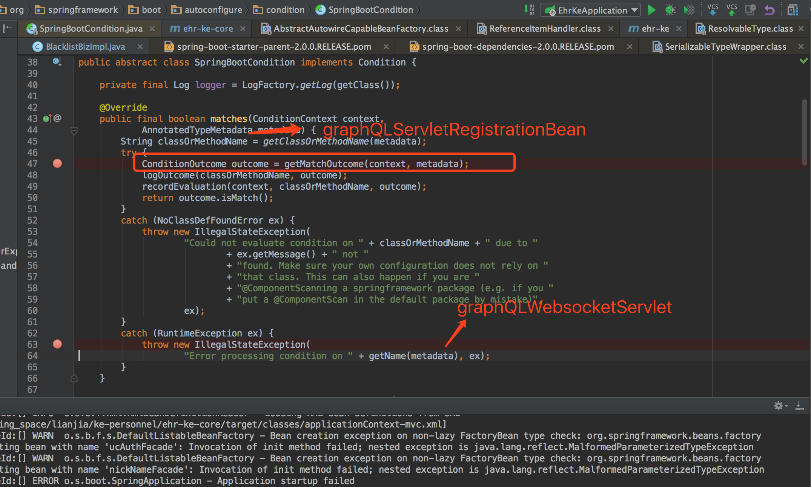
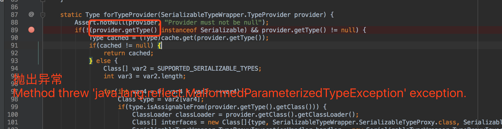
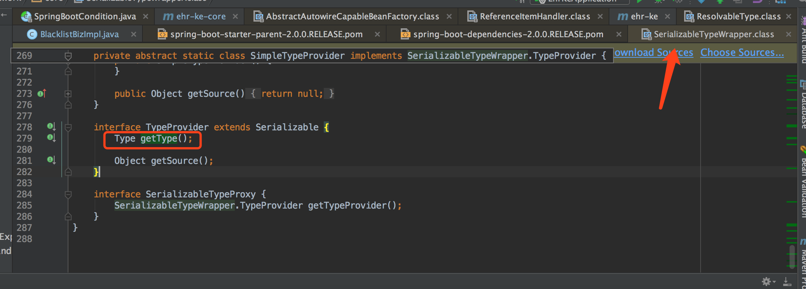
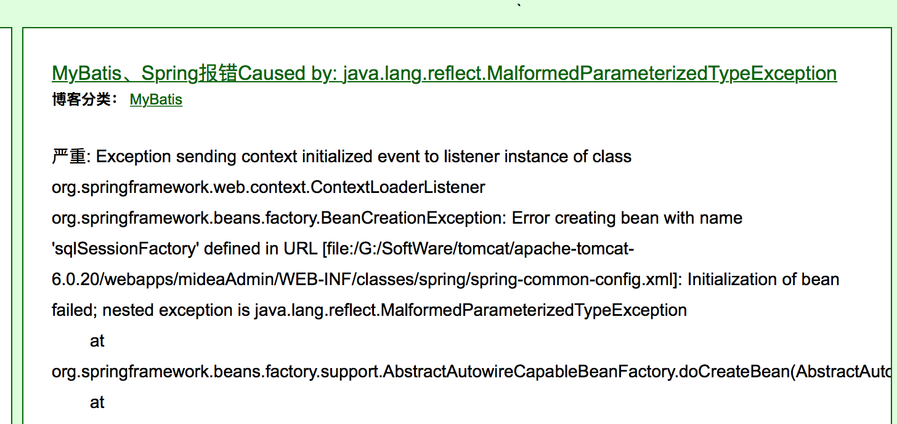
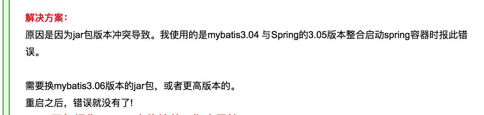
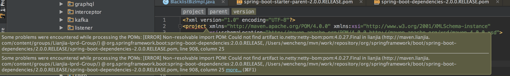

### 1、springboot 整合 graphql的过程中的问题

在实际项目中 `graphql` 使用的依赖。如下：<br/>

```xml
<dependency>
    <groupId>com.graphql-java</groupId>
    <artifactId>graphql-spring-boot-starter</artifactId>
    <version>4.0.0</version>
</dependency>
<dependency>
    <groupId>com.graphql-java</groupId>
    <artifactId>graphql-java-tools</artifactId>
    <version>4.3.0</version>
</dependency>
<dependency>
    <groupId>com.graphql-java</groupId>
    <artifactId>graphiql-spring-boot-starter</artifactId>
    <version>4.0.0</version>
</dependency>
```

在 `spring-boot-graphql` 的 *demo* 项目中使用的依赖。如下：<br/>

```xml
<dependency>
    <groupId>com.graphql-java</groupId>
    <artifactId>graphql-spring-boot-starter</artifactId>
    <version>5.0.2</version>
</dependency>
<dependency>
    <groupId>com.graphql-java</groupId>
    <artifactId>graphql-java-tools</artifactId>
    <version>5.2.4</version>
</dependency>
<dependency>
    <groupId>com.graphql-java</groupId>
    <artifactId>graphiql-spring-boot-starter</artifactId>
    <version>5.0.2</version>
</dependency>
```

于是将实际项目的依赖也同步和 *demo* 一致，发现运行过程中出现如下问题。

```reStructuredText
2019-02-20 18:18:22.183 [main] traceId:[] ERROR o.s.boot.SpringApplication - Application startup failed
java.lang.IllegalStateException: Error processing condition on com.oembedler.moon.graphql.boot.GraphQLWebAutoConfiguration.graphQLWebsocketServlet
	at org.springframework.boot.autoconfigure.condition.SpringBootCondition.matches(SpringBootCondition.java:64)
	at org.springframework.context.annotation.ConditionEvaluator.shouldSkip(ConditionEvaluator.java:102)
	at org.springframework.context.annotation.ConfigurationClassBeanDefinitionReader.loadBeanDefinitionsForBeanMethod(ConfigurationClassBeanDefinitionReader.java:179)
	at org.springframework.context.annotation.ConfigurationClassBeanDefinitionReader.loadBeanDefinitionsForConfigurationClass(ConfigurationClassBeanDefinitionReader.java:140)
	at org.springframework.context.annotation.ConfigurationClassBeanDefinitionReader.loadBeanDefinitions(ConfigurationClassBeanDefinitionReader.java:116)
	at org.springframework.context.annotation.ConfigurationClassPostProcessor.processConfigBeanDefinitions(ConfigurationClassPostProcessor.java:320)
	at org.springframework.context.annotation.ConfigurationClassPostProcessor.postProcessBeanDefinitionRegistry(ConfigurationClassPostProcessor.java:228)
	at org.springframework.context.support.PostProcessorRegistrationDelegate.invokeBeanDefinitionRegistryPostProcessors(PostProcessorRegistrationDelegate.java:272)
	at org.springframework.context.support.PostProcessorRegistrationDelegate.invokeBeanFactoryPostProcessors(PostProcessorRegistrationDelegate.java:92)
	at org.springframework.context.support.AbstractApplicationContext.invokeBeanFactoryPostProcessors(AbstractApplicationContext.java:687)
	at org.springframework.context.support.AbstractApplicationContext.refresh(AbstractApplicationContext.java:525)
	at org.springframework.boot.context.embedded.EmbeddedWebApplicationContext.refresh(EmbeddedWebApplicationContext.java:122)
	at org.springframework.boot.SpringApplication.refresh(SpringApplication.java:693)
	at org.springframework.boot.SpringApplication.refreshContext(SpringApplication.java:360)
	at org.springframework.boot.SpringApplication.run(SpringApplication.java:303)
	at org.springframework.boot.SpringApplication.run(SpringApplication.java:1118)
	at org.springframework.boot.SpringApplication.run(SpringApplication.java:1107)
```

发现在执行 `org.springframework.boot.autoconfigure.condition.SpringBootCondition#matches`  方法时抛出异常，于是进入跟踪，发现 `classOrMethodName` 对应为 `graphQLServletRegistrationBean` 会出现异常，其 `getName` 方法返回结果为 `graphQLWebsocketServlet`，截图如下。<br/>



继续跟踪，经过一点点的跟踪，发现，最终在 `org.springframework.core.SerializableTypeWrapper#forTypeProvider` 方法中，方法 `provider.getType()` 出现异常。截图如下。<br/>



`org.springframework.core.SerializableTypeWrapper.TypeProvider` 是一个接口。截图如下。<br/>



猜想应该是类加载过程中出现了问题。而类加载出现问题，我理解的情况如下：<br/>

- 不同类加载器加载的类（非双亲委派模型），类无法共享。`instanceof` 关键字返回 *false*。
- 通过 `Class.forName()` 方法实例化类，加载不到类。但是这里不是这种情况，对应的类已被加载，其 `provider` 已经是一个实例了，但是在运行其 `getType` 方法时，发生异常。
- 在网上查询，发现可能是不同版本的 `jar` 包之间相互兼容性的问题。 `Caused by: java.lang.reflect.MalformedParameterizedTypeException` 对应的类似问题连接。https://zhouhaitao.iteye.com/blog/1998048 


到这里，猜想是因为两个项目的 `spring-boot-starter-parent` 的版本不一致导致的问题，于是将实际项目中的 `spring-boot-starter-parent` 升级为 `2.0.0.RELEASE`。但是就出现了第二个问题。*maven* 依赖的 `parent` 更新导致项目错误。


### 2、maven 依赖的 parent 更新导致项目出现问题

将 `spring-boot-starter-parent` 的版本 `1.5.14.RELEASE` 更新为 `2.0.0.RELEASE`，提示如下错误。

```reStructuredText
[ERROR]   The project com.ke.ehr.personnel:ehr-ke:1.0.0-SNAPSHOT (/Users/wencheng/Desktop/working_space/lianjia/ke-personnel/pom.xml) has 1 error
[ERROR]     Non-resolvable import POM: Could not find artifact io.netty:netty-bom:pom:4.0.27.Final in lianjia (http://maven.lianjia.com/content/groups/Lianjia-Iprd-Group/) @ org.springframework.boot:spring-boot-dependencies:2.0.0.RELEASE, /Users/wencheng/mvn/work/repository/org/springframework/boot/spring-boot-dependencies/2.0.0.RELEASE/spring-boot-dependencies-2.0.0.RELEASE.pom, line 908, column 25 -> [Help 2]
```

截图如下：<br/>



于是最后解决办法是，在项目中添加对应的依赖。如下：<br/>

```xml
<dependency>
    <groupId>io.netty</groupId>
    <artifactId>netty-bom</artifactId>
    <version>4.1.22.Final</version>
    <type>pom</type>
    <scope>import</scope>
</dependency>
```

问题暂时解决了，但是为什么出现这个问题，可能是由于 *maven* 防火墙的问题。可以通过修改 `setting.xml` 文件或者跟公司管理网络的运维人员进行沟通解决。

