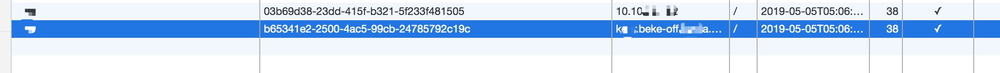

# Shiro之前后端分离权限验证返回302错误

> 背景：在解决了上一个 `shiro cas-client` 端登录重复重定向问题后，跳转到首页后，前端除了静态资源的 `http status` 返回 **200** 外，其他请求后端服务的接口全部都返回 **302 Found**。

**302 Found**是由于请求的资源被重定向后返回的，在本项目中，大部分(可以说，**99%** 以上都是因为 `shiro` 框架验证登录导致的)，之前为此解决了 `OPTIONS` 请求不检验登录态的问题。

通过 `debug`，在 `org.apache.coyote.Response#setStatus` **line 194**处打了断点后，发现 `http status` **302** 设置是在 方法 `org.apache.catalina.connector.Response#sendRedirect` **line 1334**处设置的。代码如下：<br/>

```java
public static final int SC_FOUND = 302

@Override
public void sendRedirect(String location) throws IOException {
    sendRedirect(location, SC_FOUND);
}
```

其方法是 `spring mvc` 默认调用的。


下面是在网上对这个问题解决比较有准对性的几个链接：

- [springBoot前后端分离项目中shiro的302跳转](https://blog.csdn.net/qq_27521215/article/details/81195634)
- [shiro引发的问题（302 Found）](https://blog.csdn.net/leaves_story/article/details/79913012)


最后，说一下本项目中 **302** 问题的原因。原因很简单，既不是前端的锅，也不是后端的锅。



前端请求写死了一个 `ip`，但是等使用的是域名，所以增加了两个不同域名的 `cookie`。

域名对应 `cookie` 在 `redis` 缓存中的结果。如下：<br/>


`ip` 对应的 `cookie` 在 `redis` 缓存中的结果。如下：<br/>


问题待明天确认解决。😄😄