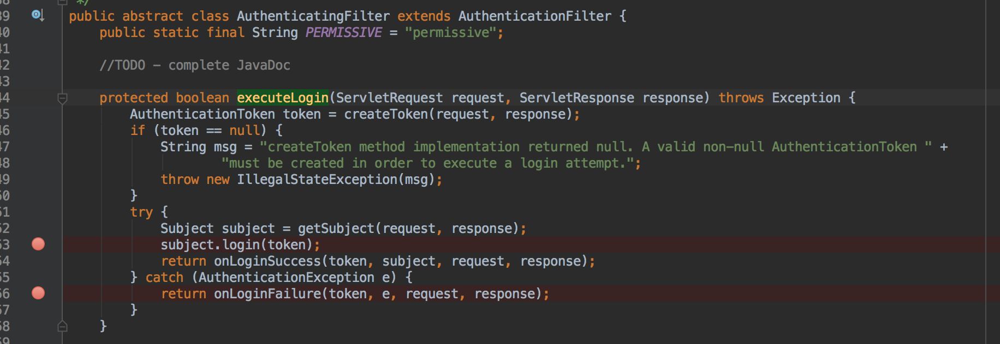

# Shiro集成CAS登录成功跳转地址问题

> 背景：在解决了上面 `shiro` 登录成功后 **302** 问题后，今天又出现了另外一个问题。我通过浏览器通过 `cas server` 端登录成功后跳转的首页是正常的，但是同事登录成功后调转都是配置的 **404** 页面。

## 通过日志定位问题和远程 `debug` 对比排查问题

### 日志排查

通过日志排查发现，除了我之外，其他人登录后都是跳转到配置的 `org.apache.shiro.cas.CasFilter#failureUrl`，但是使用相同的用户登录校验走的是相同的逻辑，但是我和其他人得到了不同的结果。<br/>

所以排除了用户权限校验逻辑中的问题。<br/>


### 远程 `debug` 排查

在 `CasFilter` 中的回调处理中打了断点，如下图所示：<br/>



结果发现 `subject.login(token)` 正常执行，于是跟踪 `onLoginSuccess` 方法。

```java
@Override
protected boolean onLoginSuccess(AuthenticationToken token, Subject subject, ServletRequest request,
                                 ServletResponse response) throws Exception {
    issueSuccessRedirect(request, response);
    return false;
}

protected void issueSuccessRedirect(ServletRequest request, ServletResponse response) throws Exception {
    WebUtils.redirectToSavedRequest(request, response, getSuccessUrl());
}
```

上面都没有问题，`getSuccessUrl()` 方法也正确返回了配置的**successUrl**，于是继续跟踪。

```java
public static void redirectToSavedRequest(ServletRequest request, ServletResponse response, String fallbackUrl)
        throws IOException {
    String successUrl = null;
    boolean contextRelative = true;
    SavedRequest savedRequest = WebUtils.getAndClearSavedRequest(request);
    if (savedRequest != null && savedRequest.getMethod().equalsIgnoreCase(AccessControlFilter.GET_METHOD)) {
        successUrl = savedRequest.getRequestUrl();
        contextRelative = false;
    }

    if (successUrl == null) {
        successUrl = fallbackUrl;
    }

    if (successUrl == null) {
        throw new IllegalStateException("Success URL not available via saved request or via the " +
                "successUrlFallback method parameter. One of these must be non-null for " +
                "issueSuccessRedirect() to work.");
    }

    WebUtils.issueRedirect(request, response, successUrl, null, contextRelative);
}
```

发现问题出在了上面的一段代码中，如果 `session` 中存在 `SavedRequest` ，则将之前缓存的 `request` 的 `uri` 会覆盖调配置的 `successUrl`。问题发现了。解决就简单了。<br/>

自己继承 `CasFilter` 重新其 `AuthenticationFilter#issueSuccessRedirect()` 方法。代码如下：<br/>

```java
//重写issueSuccessRedirect，直接跳转我们设置的SuccessUrl
@Override
protected void issueSuccessRedirect(ServletRequest request, ServletResponse response) throws Exception {

    WebUtils.issueRedirect(request, response, this.getSuccessUrl(), null, true);
}
```


## 问题解决，思考框架为什么这么做

问题解决了，接下来思考框架为什么要这么做。

上面 `org.apache.shiro.web.util.WebUtils#getAndClearSavedRequest` 的方法获取 `SavedRequest` 的实现如下：<br/>

```java
public static SavedRequest getAndClearSavedRequest(ServletRequest request) {
    SavedRequest savedRequest = getSavedRequest(request);
    if (savedRequest != null) {
        Subject subject = SecurityUtils.getSubject();
        Session session = subject.getSession();
        session.removeAttribute(SAVED_REQUEST_KEY);
    }
    return savedRequest;
}
```

其实就是从 `session` 根据对应的 `key` 获取到 `SavedRequet`。那么是什么时候设置的呢。

根据对应的 `key` 全局搜索发现，最后设置的方法是 `org.apache.shiro.web.util.WebUtils#saveRequest`，同样查询对应的调用方法，其调用在 `org.apache.shiro.web.filter.AccessControlFilter#saveRequest`。实现如下：<br/>

```java
protected void saveRequest(ServletRequest request) {
    WebUtils.saveRequest(request);
}
```

继续搜索上面方法的调用，发现在 `org.apache.shiro.web.filter.AccessControlFilter#saveRequestAndRedirectToLogin` 方法中调用。实现如下：<br/>

```java
protected void saveRequestAndRedirectToLogin(ServletRequest request, ServletResponse response) throws IOException {
    saveRequest(request);
    redirectToLogin(request, response);
}
```

继续搜索，发现最终的调用触发方法。`org.apache.shiro.web.filter.authc.FormAuthenticationFilter#onAccessDenied`。`FormAuthenticationFilter` 对应 `shiro` 中 `authc` 的默认实现。实现如下：<br/>

```java
protected boolean onAccessDenied(ServletRequest request, ServletResponse response) throws Exception {
    if (isLoginRequest(request, response)) {
        if (isLoginSubmission(request, response)) {
            if (log.isTraceEnabled()) {
                log.trace("Login submission detected.  Attempting to execute login.");
            }
            return executeLogin(request, response);
        } else {
            if (log.isTraceEnabled()) {
                log.trace("Login page view.");
            }
            //allow them to see the login page ;)
            return true;
        }
    } else {
        if (log.isTraceEnabled()) {
            log.trace("Attempting to access a path which requires authentication.  Forwarding to the " +
                    "Authentication url [" + getLoginUrl() + "]");
        }

        saveRequestAndRedirectToLogin(request, response);
        return false;
    }
}
```

大概逻辑是，在发起请求时，会通过 `autch` 进行校验，校验登录态失败后，会调用其 `onAccessDenied()` 方法，`onAccessDenied()` 方法内部主要逻辑是：(都是基于登录校验失败后，执行访问拒绝方法)

- 如果是登录请求，则执行登录请求
- 如果不是登录请求，则路由到**登录**的 `url`。(路由前，会先保存其请求方法，方便登录成功后回调时，继续调用之前的请求 `url`)，即，登录前请求的 `url`，登录校验成功后继续请求之前的 `url`。