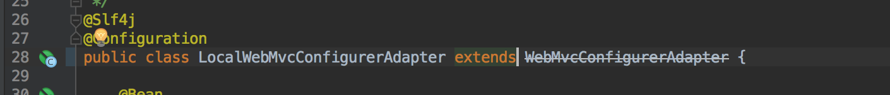
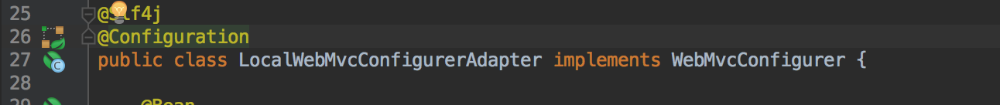

# Q2_WebMvcConfigurerAdapter 过时

`springboot 2.0` 之后，Springboot中配置WebMvcConfigurerAdapter的时候发现这个类过时了。发现官方在 **spring5** 弃用了

`WebMvcConfigurerAdapter`，因为 `springboot2.0` 使用的 **spring5**，所以会出现过时。如下图所示。 

但是这个问题也很好解决，我们只需要实现 WebMvcConfigurer接口就可以了。如下图所示。 

