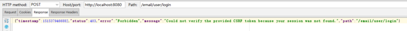
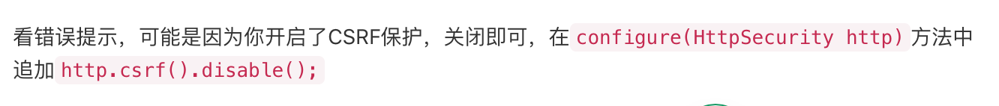

# Q4_Actuator与Spring security 安全性校验调整


## 相同问题引用

### 错误描述

有两个controller，一个是所有用户可以访问的@RequestMapping("user"),还有一个是管理员可以访问的@RequestMapping("admin")。

`/user/login` 是 `UserController` 中的登录 **url**。所有操作（除登录注销）都要登录之后才能进行。

现在想用 **springboot** 结合 **spring security** 实现权限管理。系统是前后端分离的，**controller** 中返回数据，不返回页面,**WebMvcConfig** 也没有配置什么。

但 `/user/login`，**post** 怎么也不通。报 **403** 错误。这是错误信息。<br/>



```json
{"timestamp":1515379466882,"status":403,"error":"Forbidden","message":"Could not verify the provided CSRF token because your session was not found.","path":"/email/user/login"}
```

这是WebSecurityConfig

```java
@Configuration
@EnableWebSecurity
public class WebSecurityConfig extends WebSecurityConfigurerAdapter {

    @Bean
    UserDetailsService customUserService() { //注册UserDetailsService 的bean
        return new CustomUserService();
    }

    @Override
    protected void configure(HttpSecurity http) throws Exception {
        http.authorizeRequests()
                .antMatchers("/**").access("hasRole('ROLE_USER')")
                .antMatchers("/admin/**").access("hasRole('ROLE_ADMIN')")
                .anyRequest().authenticated().and() // access after login
//                .rememberMe().tokenValiditySeconds(60 * 60 * 24 * 7).key("").and()
                .formLogin().loginProcessingUrl("user/login").permitAll().and()
                .logout().permitAll();
    }

    @Override
    protected void configure(AuthenticationManagerBuilder auth) throws Exception {
        auth.userDetailsService(customUserService());
    }
}
```

这是CustomUserService

```java
@Service
public class CustomUserService implements UserDetailsService {

    @Autowired
    private UserService userService;

    @Override
    public UserDetails loadUserByUsername(String s) throws UsernameNotFoundException {
        System.out.println("loadUser " + s);
        User user = userService.getUserByUsername(s);
        if (user == null || user.getIsDel() == 1) {
            throw new UsernameNotFoundException("user not exist");
        }
        List<GrantedAuthority> auths = new ArrayList<>();
        for (Role role : user.getRoles()) {
            auths.add(new SimpleGrantedAuthority(role.getName())); //不同用户会返回不同的role.name：ROLE_USER, ROLE_ADMIN
        }
        return new org.springframework.security.core.userdetails.User(s , user.getPwd(), auths);
    }
}
```

最后即使我在WebSecurity中什么也不配置，默认应该是不需要验证session吧。
仍然不行。

```java
protected void configure(HttpSecurity http) throws Exception {
}
```


### 错误原因

错误原因如下：<br/>




## 参考

- [[springboot中使用spring security，登录url就出现403错误](https://segmentfault.com/q/1010000012743613)]