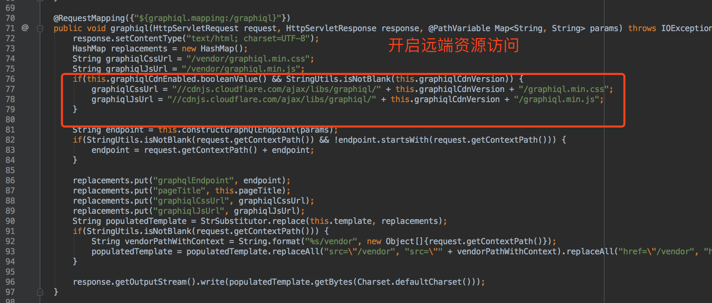
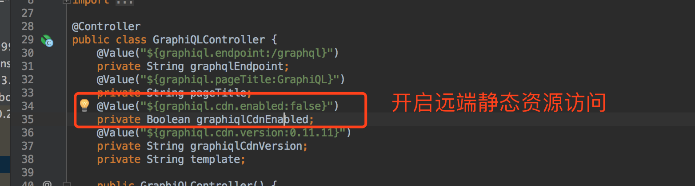
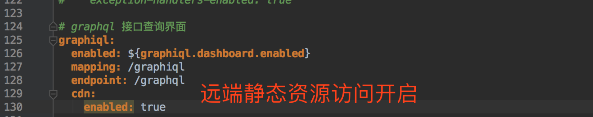
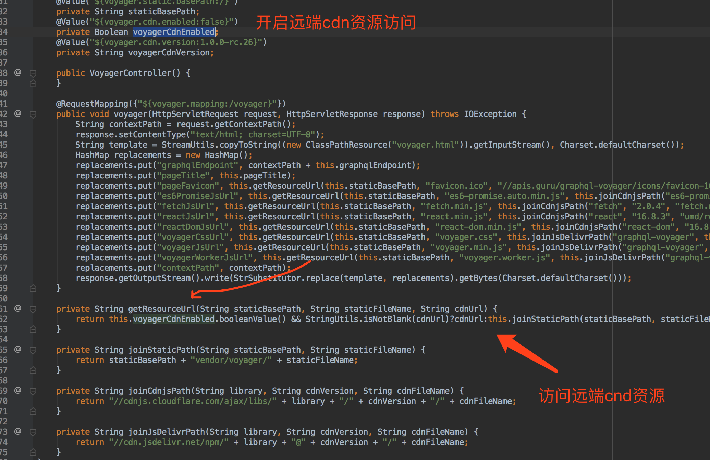
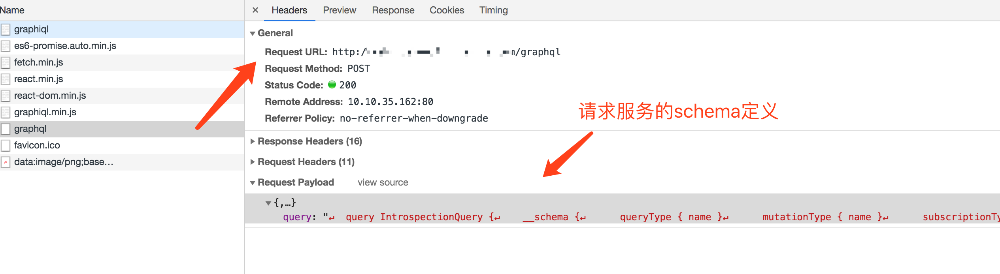

# Q6_graphqil & voyager 调整

> 项目背景：项目前端分离，是开发意义上的前后端分离。后端将所有的没有匹配的 ***url*** 统一拦截，指向唯一的静态模板文件文件(html)中。在模板文件中定义实际加载的 ***js*** 以及 ***css*** 引用。

以及以上背景，后端配置如下：<br/>

```java
@RequestMapping("/**")
public String index(HttpServletRequest request) {
    return "index";
}
```

后端静态资源模板配置如下：<br/>

```html
<!DOCTYPE html>
<html>
<head>
    <meta content="text/html; charset=UTF-8"/>
    <script>
    </script>
    <title>标题</title>
    <link href="/static/manifest.css" rel="stylesheet"/>
    <link href="/static/app.css" rel="stylesheet"/>
</head>
<body>
<div id="app"></div>
<script src="/static/manifest.js"></script>
<script src="/static/vendor.js"></script>
<script src="/static/main.js"></script>
<script src="/static/app.js"></script>
</body>
</html>
```


后端通过 `@RequestMapping(/**)` 来拦截静态资源请求，会导致 `springboot` 通过 `org.springframework.web.servlet.config.annotation.WebMvcConfigurer#addResourceHandlers` 来定义前端静态资源映射失效。

这是一个很大的坑。不光导致 `springboot` 默认的静态资源加载路径失效，也导致引入其他框架来展示后端资源定义都可能失效。例如：**swagger**。


因此配置 `graphiql` 和 `voyager` 过程中也出现了同样的问题。

`graphiql` 和 `voyager` 有些版本中会有请求直接访问自己系统内的静态资源，但是所有的静态资源请求都会被  `@RequestMapping(/**)`  拦截，指向指定的模板文件中，导致其 ***js*** 脚本执行失败。页面就无法加载。


## 解决方案

### 方案1：在@RequestMapping 中的 url 定义中写入正则匹配规则

使用 `{:正则表达式}` 定义的规则，代码如下：排除 **url** "/voyager" 或 "/voyager/\*\*" 以外的请求。<br/>

```java
@RequestMapping("/{:^(?!voyager)(?!index).*$}")
public String indexIgnorePath(HttpServletRequest request) {
    return "index";
}

@RequestMapping("/{:^(?!vendor)(?!index).*$}/**")
public String indexIgnorePaths(HttpServletRequest request) {
    return "index";
}
```


### 方案2：不访问系统内的静态资源

**方案1** 代码耦合度高，且配置复杂，复用性极低，新增一个 **url** 可能会导致之前的配置好的 **url** 映射出问题。正则表达式可读性底。

因此可以找一个不需要引入本地静态资源的依赖。


#### graphiql 配置

##### 版本 4.0.0

当前项目中的配置。如下：<br/>

```xml
<dependency>
    <groupId>com.graphql-java</groupId>
    <artifactId>graphiql-spring-boot-starter</artifactId>
    <version>4.0.0</version>
</dependency>
```

其实现也比较简单。代码如下：<br/>

```java
@Controller
public class GraphiQLController {
    @Value("${graphiql.endpoint:/graphql}")
    private String graphqlEndpoint;
    @Value("${graphiql.pageTitle:GraphiQL}")
    private String pageTitle;

    public GraphiQLController() {
    }

    @RequestMapping({"${graphiql.mapping:/graphiql}"})
    public void graphiql(HttpServletResponse response) throws IOException {
        response.setContentType("text/html; charset=UTF-8");
        String template = StreamUtils.copyToString((new ClassPathResource("graphiql.html")).getInputStream(), Charset.defaultCharset());
        HashMap replacements = new HashMap();
        replacements.put("graphqlEndpoint", this.graphqlEndpoint);
        replacements.put("pageTitle", this.pageTitle);
        response.getOutputStream().write(StrSubstitutor.replace(template, replacements).getBytes(Charset.defaultCharset()));
    }
}
```


##### 版本5.0.2 的问题

```xml
<!-- https://mvnrepository.com/artifact/com.graphql-java/graphiql-spring-boot-starter -->
<dependency>
    <groupId>com.graphql-java</groupId>
    <artifactId>graphiql-spring-boot-starter</artifactId>
    <version>5.0.2</version>
</dependency>
```

其代码主要逻辑如下图：<br/>








通过代码查看，`5.0.2` 版本虽然支持访问远端静态资源访问，但是加载后的静态资源有部分静态资源依赖还是从本地获取，这就导致页面加载不出来。因此使用版本较低的依赖。


#### voyager 配置

##### 版本 5.8.0

当前项目中的配置。如下：<br/>

```xml
<!-- https://mvnrepository.com/artifact/com.graphql-java-kickstart/voyager-spring-boot-starter -->
<dependency>
    <groupId>com.graphql-java-kickstart</groupId>
    <artifactId>voyager-spring-boot-starter</artifactId>
    <version>5.8.0</version>
</dependency>
```

代码实现如下：<br/>



其内部所有静态资源都可以直接访问远端cdn。只需开启即可。<br/>

```yaml
# graphql voyager 展示
voyager:
  enabled: true
  mapping: /voyager
  endpoint: /graphql
  cdn:
    enabled: true
```


## 总结

1. 不管是依赖 `graphiql`、 `voyager` 的版本是多少，其都不影响后端 `graphql` 的运行，其内部实现都是通过向后端服务发送查询其 **schema** 的定义。如下图所示：<br/>
2. 基于 **1** 的总结，其实后端也可以不用依赖 `graphiql` 和 `voyager`，可以让前端修改好其 **js** 访问后端服务地址即可。


 **graphql starter** 依赖地址：https://github.com/graphql-java-kickstart/graphql-spring-boot.git

