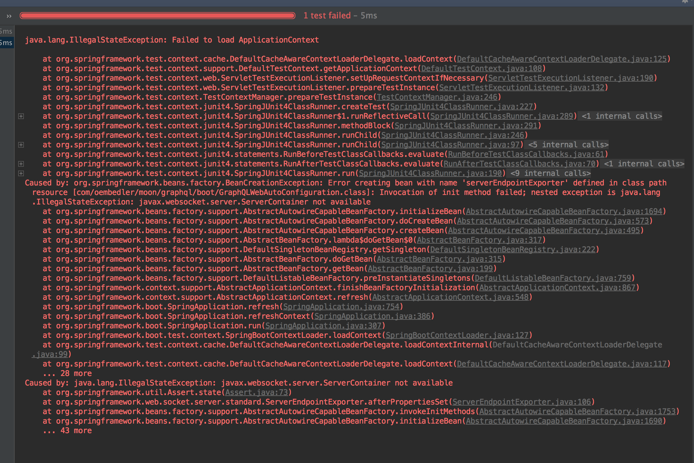

# Q8_整合websocket后运行测试类报错：javax.websocket.server.ServerContainer not available

> 背景：

在引入 `GraphQL stater` 后，单元测试就提示如下错误：<br/> 

错误原因提示：<br/>

```bash
Caused by: java.lang.IllegalStateException: javax.websocket.server.ServerContainer not available
```


原因：引入的 `GraphQL stater` 版本是`5.0.2`，引入了 `subscriptionExecutionStrategy`，内部实现是 `websocket`，因此单元测试的时候也需要指定一个 `websocket` 的端口。通过一同方式指定一个随机的 `websocket` 端口。 

```java
@SpringBootTest(webEnvironment = SpringBootTest.WebEnvironment.DEFINED_PORT)
```

