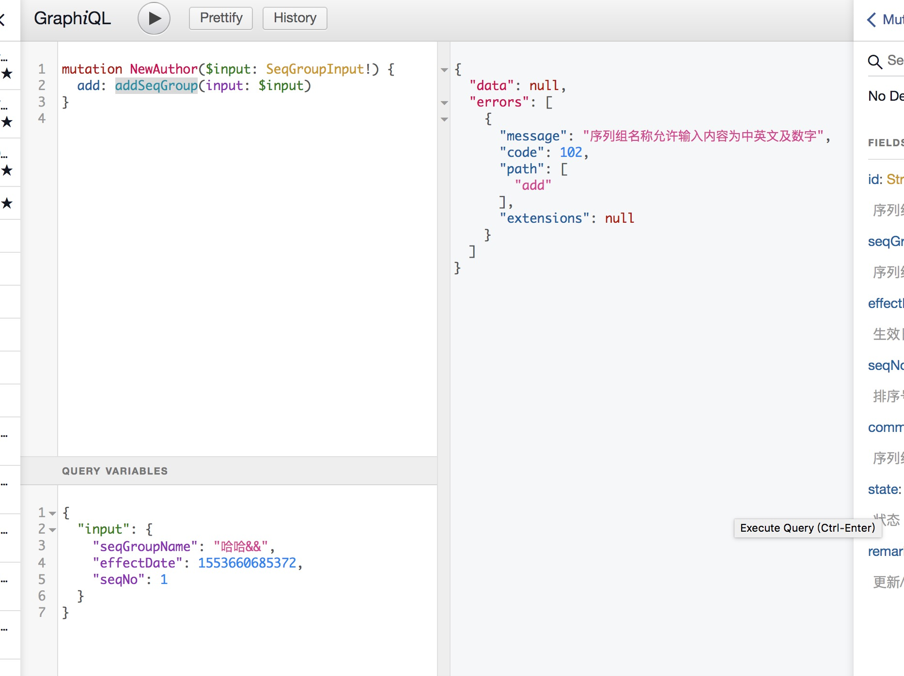
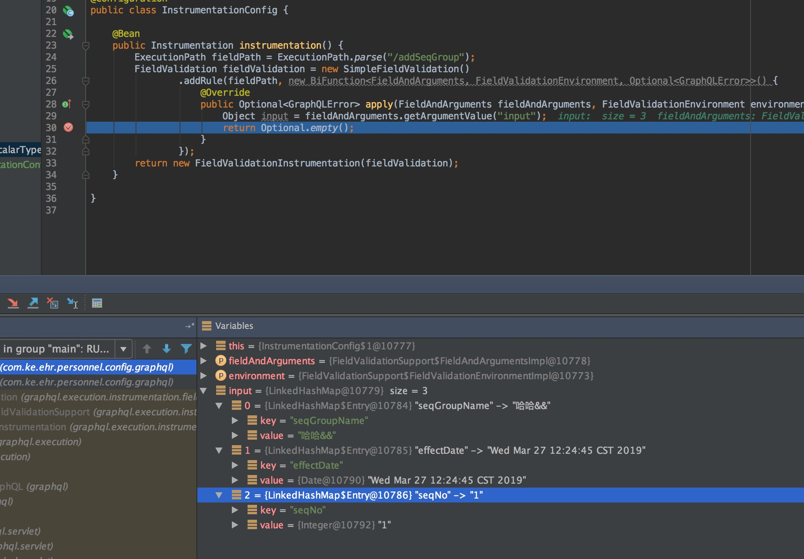

# 使用spring validation完成数据后端校验

参考链接([ 徐靖峰|个人博客](https://www.cnkirito.moe/))：<https://www.cnkirito.moe/spring-validation/>

>背景：项目准备将 `restful` 请求方式改造成 `graphql` 请求方式，项目是面向 B 端的，PC 端提交表单参数内容非常多，参数校验也比较多。

## `restful` 与 `graphql` 请求参数校验对比

使用 `spring mvc` 的 `restful` 请求，`spring mvc`  框架 中 `WebDataBinder`  可以将 `request` 中的参数自动绑定到 `POJO` 对象中，可以使用 `spring validation` 完成后端校验。

但是 `graphql` 请求方式，使用的是 `graphql` 官方语法定义的 `graphql-tools` 来进行参数解析和绑定。示例如下：<br/>



`graphql`  将 `variables` 参数解析为 `linkedHashMap`，`graphql` 定义了`Instrumentation` 可以在 `graphql` 执行的各个阶段进行拦截处理，类似 `spring` 的 `Interceptor`，因为定义参数校验的方式可以如下：<br/>

```java
import graphql.GraphQLError;
import graphql.execution.ExecutionPath;
import graphql.execution.instrumentation.fieldvalidation.*;
import graphql.execution.instrumentation.fieldvalidation.FieldValidation;
import org.springframework.context.annotation.Bean;
import org.springframework.context.annotation.Configuration;

import graphql.execution.instrumentation.Instrumentation;
import java.util.Optional;
import java.util.function.BiFunction;

/**
 *
 * @author wencheng
 * @date 2019/3/27
 */
@Configuration
public class InstrumentationConfig {

    @Bean
    public Instrumentation instrumentation() {
        // 参数校验的请求路径，这里对应于 addSeqGroup 方法
        ExecutionPath fieldPath = ExecutionPath.parse("/addSeqGroup");
        FieldValidation fieldValidation = new SimpleFieldValidation()
                .addRule(fieldPath, new BiFunction<FieldAndArguments, FieldValidationEnvironment, Optional<GraphQLError>>() {
                    @Override
                    public Optional<GraphQLError> apply(FieldAndArguments fieldAndArguments, FieldValidationEnvironment environment) {
                        // 获取到对应请求路径的方法的参数后，下面就需要自己定义参数校验规则了
                        Object input = fieldAndArguments.getArgumentValue("input");
                        return Optional.empty();
                    }
                });
        return new FieldValidationInstrumentation(fieldValidation);
    }

}
```

使用上面 `graphql` 定义的参数校验方式，很繁琐，也不容易复用。因此还是希望通过之前 `spring mvc` 的 `validation` 方式来校验。而且 `graphql` 也不关注参数校验和权限校验，只关注对应的资源获取。


## 通过 `spring aop` 方式